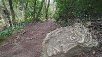
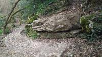

# :round_pushpin: Biot 

## Trail

- [Trail à :round_pushpin: Biot : Le tour du sanglier !](https://www.cyber-neurones.org/2019/10/trail-a-biot-le-tour-du-sanglier/) :date: 2019-10
   - Distance : 14,7 km / 433 m D+

- [Trail à Biot : Le Mega Tour du :boar: Sanglier ! ( Version Mega )](https://www.cyber-neurones.org/2020/08/trail-a-biot-le-mega-tour-du-sanglier-version-mega/) :date: 2020-08
   - Distance : 21,6 km / 680 m D+

- [Trail à Biot : L’Extra Tour du :boar: Sanglier ! ( Version ETS )](https://www.cyber-neurones.org/2020/08/trail-a-biot-lextra-tour-du-sanglier-version-ets/) :date: 2020-08
   - Distance : 20,1 km / 657 m D+

- [Trail à Biot : Le Grand Tour du :boar: Sanglier , le GTS pour les pros !](https://www.cyber-neurones.org/2020/05/trail-a-biot-le-grand-tour-du-sanglier-le-gts-pour-les-pros/) :date: 2020-05
   - Distance : 16,9 km / 526 m D+

## Vélo

- [BIOT et les pistes cyclables](https://www.cyber-neurones.org/2016/02/biot-et-les-pistes-cyclables/) :date: 2016-02

## Inondation

J'ai beaucoup suivi les réunions d'informations sur les inondations.

- [NAIAD : Atelier participatif du jeudi 20 Décembre 2018, IMREDD Nice](https://www.cyber-neurones.org/2019/02/naiad-atelier-participatif-du-eudi-20-decembre-2018-imredd-nice/) :date: 2019-02

- [NAIAD2020 : Premier post sur Twitter concernant la Brague.](https://www.cyber-neurones.org/2018/09/naiad2020-premier-post-sur-twitter-concernant-la-brague/) :date: 2018-09

- [Sénat : Aménagement de l’autoroute A8 : buses de l’Autoroute ( par Dominique Estrosi Sassone )](https://www.cyber-neurones.org/2018/06/senat-buses-de-lautoroute/) :date: 2018-06

- [BIOT PPRI](https://www.cyber-neurones.org/2018/02/biot-ppri-lien-nouvelle-carte-et-documents/) :date: 2018-02

- [BIOT nouveau PPRI](https://www.cyber-neurones.org/2017/05/biot-nouveau-plan-de-prevention-des-risques-dinondation-ppri/) :date: 2017-05

- [Biot Réunion du 31 : Porter à connaissance de la nouvelle cartographie des zones inondables](https://www.cyber-neurones.org/2017/02/biot-reunion-du-31-porter-a-connaissance-de-la-nouvelle-cartographie-des-zones-inondables/) :date: 2017-02

- [BIOT, Présentation du porter à connaissance par la Direction Départementale des Territoires et de la Mer. J’y étais pour vous !](https://www.cyber-neurones.org/2016/09/biot-presentation-du-porter-a-connaissance-par-la-direction-departementale-des-territoires-et-de-la-mer-jy-etais-pour-vous/) :date: 2016-09

- [BIOT : PLU Réunion Diagnostic , j’y étais pour vous](https://www.cyber-neurones.org/2016/09/biot-plu-reunion-diagnostic-jy-etais-pour-vous/) :date: 2016-09

- [Réunion d’information de l’ASEB-AM au Campus SophiaTech, j’y étais pour vous](https://www.cyber-neurones.org/2016/04/reunion-dinformation-de-laseb-am-au-campus-sophiatech-jy-etais-pour-vous/) :date: 2016-04

- [BIOT : PLU : Reunion n°4 : Biot de demain : synthèse et hiérarchisation des enjeux. J’y étais pour vous](https://www.cyber-neurones.org/2016/03/biot-plu-reunion-n4-biot-de-demain-synthese-et-hierarchisation-des-enjeux-jy-etais-pour-vous/) :date: 2016-03

- [BIOT : PLU : Reunion n°2 : Habitat (équipement, logement), Environnement et Cadre de vie. J’y étais pour vous](https://www.cyber-neurones.org/2016/03/biot-plu-reunion-n2-habitat-equipement-logement-environnement-et-cadre-de-vie-jy-etais-pour-vous/) :date: 2016-03

- [Réunion publique à l’OSTREA, j’y étais pour vous](https://www.cyber-neurones.org/2015/12/reunion-publique-a-lostrea-jy-etais-pour-vous/) :date: 2015-12

- [Réunion publique sur les inondations – Espace des Arts à Biot – j’y étais pour vous](https://www.cyber-neurones.org/2015/12/reunion-publique-sur-les-inondations-espace-des-arts-jy-etais-pour-vous/) :date: 2015-12

## Réunion 

- [Biot : Rénion du quartier n°2](https://www.cyber-neurones.org/2017/09/biot-renion-du-quartier-n2/)

- [Conseil de quartier à Biot n°2: j’y étais pour vous](https://www.cyber-neurones.org/2016/11/conseil-de-quartier-a-biot-n2-jy-etais-pour-vous/)

## Autre

- [Encore un accident au pont Brejnev à Biot !](https://www.cyber-neurones.org/2016/06/encore-un-accident-au-pont-brejnev-a-biot/)

