## Compétitions

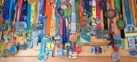

- [Strava](https://www.strava.com/athletes/12487918) : Profil privé. :lock:

- [ITRA](https://itra.run/RunnerSpace/ARIAS.Frederic/1260843) : Profil public. :unlock:

- [J'aime courrir](https://www.jaimecourir.fr/) : Profil privé . :lock:

- [BeTrail](https://www.betrail.run/runner/arias.frederic/overview) : Profil public . :unlock:

- [kikourou](http://www.kikourou.net/) : Profil public : farias . :unlock:

- [RunTrail](https://www.runtrail.fr/profile/a00f98e45772)  Profil public : Frederic A . :unlock:

### 2023

#### Marathon des Maures

- :date: 2023-05-28
- Dossard : 4086
- TRaining IMPulse : 606
- :link: [Wordpress](https://www.cyber-neurones.org/2023/05/marathon-des-maures-edition-2023/)
- :link: [runtrail.fr](https://www.runtrail.fr/profile/a00f98e45772/badge/171420)

- :runner: Trail, Marathon, 42,59 km, 2106m :mountain: D+, :watch:  07:27:11 :round_pushpin: Collobrières 

- :triangular_flag_on_post: :fr: FFA :
   - wait ...

- :triangular_flag_on_post: :star: ITRA :
    - Course n°18
    - Ranking 
    - iTRA Score : 
    - :checkered_flag: Finisher Level : 

- Nombre de participation : 1 

#### Jeux de Sophia-Antipolis

##### Cross 9 km

- :date: 2023-05-23
- Dossard : 104
- TRaining IMPulse : 132
- :link: [Wordpress](https://www.cyber-neurones.org/2023/05/jeux-de-sophia-2023/) 

- :runner: Cross, 8,8 km, 167m :mountain: D+, :watch: 00:47:26 :round_pushpin: Sophia-Antipolis

##### Velo Pont-du-Loup vers Col de L'Ecre

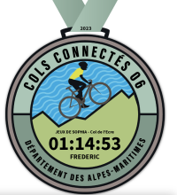

- :date: 2023-07-07
- Dossard : 5061
- TRaining IMPulse : 182
- :link: [Wordpress](https://www.cyber-neurones.org/2023/05/jeux-de-sophia-2023/)

- :bike: Velo de course, 18,8 km, 915m :mountain: D+, :watch: 01:15:02 :round_pushpin: Pont-du-Loup

##### Trail 18 km

- :date: 2023-06-06
- Dossard : 282
- TRaining IMPulse : 246
- :link: [Wordpress](https://www.cyber-neurones.org/2023/05/jeux-de-sophia-2023/)

- :runner: Trail, 18,8 km, 528m :mountain: D+, :watch: 02:20:11 :round_pushpin: Sophia-Antipolis

#### Marathon de la Vésubie

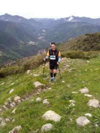

- :date: 2023-05-20
- Dossard : 404 
- TRaining IMPulse : 684
- :link: [Wordpress](https://www.cyber-neurones.org/2023/05/trail-marathon-de-la-vesubie-edition-2023/)
- :link: [runtrail.fr](https://www.runtrail.fr/profile/a00f98e45772/badge/171423)

- :runner: Trail, Marathon, 41 km, 2400m :mountain: D+, :watch: 07:05:15  :round_pushpin: Roquebilière  

- :triangular_flag_on_post: :fr: FFA :
    - Course n°89
    - 78 (68M - 12M2)
    - 7h07'01''
    - :round_pushpin: 	Roquebilliere

- :triangular_flag_on_post: :star: ITRA :
    - Course n°17
    - Ranking 77 / 89
    - Mountain Point : 7
    - ITRA Point : 2
    - iTRA Score : 
    - :checkered_flag: Finisher Level : 7

- Nombre de participation : 1 (2eme Edition)

#### Ventoux Gravel Trans Massifs : Dentelles & Sommets 

- :date: 2023-05-06
- TRaining IMPulse : 644
- :link: [Wordpress](https://www.cyber-neurones.org/2023/05/ventoux-gravel-trans-massifs-edition-2023/)

- :bicyclist: Gravel, 114 km, 3300 m :mountain: D+, :watch: 10:15:47. :round_pushpin: Bédouin

- Nombre de participation : 1 (1er Edition)

#### Semi-marathon de :round_pushpin: Nice 

- :date: 2023-04-30
- TRaining IMPulse : 241
- :link: [Wordpress](https://www.cyber-neurones.org/2023/04/semi-marathon-de-nice-edition-2023/)

- :runner: Course, 21 km, 90m :mountain: D+, :watch: 01:51:30.

- :triangular_flag_on_post: :fr: FFA : 
     - Course n°88
     - 1390 (1149M - 133M2) 
     - :watch: 1h51'28'' 
     - :round_pushpin:  Nice 

#### Trail des baous de Saint-Jeannet – Parcours de 13 km

- :date: 2023-03-19
- TRaining IMPulse : 232
- :link: [Wordpress](https://www.cyber-neurones.org/2023/03/trail-des-baous-de-saint-jeannet-parcours-de-13-km-edition-2023/)

- :runner: Trail, 13 km, 670m :mountain: D+, :watch: 01:38:34.

#### Ergysport Trail du Ventoux : Origine 46 km 

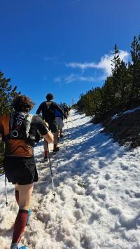

- :date: 2023-03-12
- TRaining IMPulse : 827
- :link: [Wordpress](https://www.cyber-neurones.org/2023/03/trail-du-ventoux-origine-46-km-edition-2023/)

- :runner: Trail, 46 km, 2690m :mountain: D+, :watch: 07:31:53.

- :triangular_flag_on_post: :fr: FFA : 
     - Course n°87
     - 746 (658M - 118M2) 
     - :watch: 7h31'40''
     -   :round_pushpin: Bedoin

- :triangular_flag_on_post: :star: ITRA : 
    - Course n°16
    - Ranking 746 / 1074  
    - iTRA Score : 449 
    - :checkered_flag: Finisher Level : 282

#### Balcon de la Roya 

- :date: 2023-03-05
- TRaining IMPulse : 345
- :link: [Wordpress](https://www.cyber-neurones.org/2023/03/trail-balcon-de-la-roya-edition-2023/)

- :runner: Trail, 16 km, 1057m :mountain: D+, 02:16:15

- :triangular_flag_on_post: :fr: FFA :  
    - Course n°86
    - 52 (49M - 7M2) 
    - 2h16'23''
    - :round_pushpin: Breil-Sur-Roya

#### Trаіl dеs Сrêtеs de :round_pushpin: Gréolières-les-neiges 

- :date: 2023-02-05
- TRaining IMPulse : 188
- :link: [Wordpress](https://www.cyber-neurones.org/2023/02/tr%d0%b0%d1%96l-d%d0%b5s-%d1%81ret%d0%b5s-de-greolieres-les-neiges-edition-2023/)

- :runner: Trail, 11 km, 600m :mountain: D+, 01:38:37

#### Urban Trail de :round_pushpin: Cannes : Version 26 km 

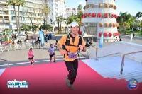

- :date: 2023-01-29
- TRaining IMPulse : 383
- :link: [Wordpress](https://www.cyber-neurones.org/2023/01/urban-trail-de-cannes-edition-2023-version-26-km-le-vrai/)

- :runner: Trail, 26 km, 686 m :mountain: D+, 02:42:48

- :triangular_flag_on_post: :fr: FFA :
    - Course n°85
    - 154 (135M - 18M2) 
    -:watch:  2h42'50''
    - :round_pushpin: Cannes

### 2022

#### Cross Amnesty de :round_pushpin: Valbonne 

- :date: 2022-12-11
- TRaining IMPulse : 189
- :link: [Wordpress](https://www.cyber-neurones.org/2022/12/cross-amnesty-de-valbonne-edition-2022/)

- :runner: Cross, 11 km, 296 m :mountain: D+, 00:59:30

- :triangular_flag_on_post: :fr: FFA : 
    - Course n°84
    - 51 (46M - 13M2) 
    - :watch: 59'31''
    - :round_pushpin: Valbonne

#### Courir pour une fleur à :round_pushpin: Antibes 

- :date: 2022-10-16
- TRaining IMPulse : 132
- :link: [Wordpress](https://www.cyber-neurones.org/2022/10/courir-pour-une-fleur-a-antibes-edition-2022/)

- :runner: Course, 10 km, 109 m :mountain: D+, 00:48:27

- :triangular_flag_on_post: :fr: FFA : 
    - Course n°83
    - 312 (267M - 38M2) 
    - :watch: 48'55'' (48'19'')
   - :round_pushpin: Antibes

####  Trail Per Cami : Parcours découverte de 13 km

- :date: 2022-09-04
- TRaining IMPulse : 304

- :link: [Wordpress](https://www.cyber-neurones.org/2022/09/trail-per-cami-parcours-decouverte-de-13-km-edition-2022/)

- :runner: Tail, 13 km, 1043 m :mountain: D+, :watch: 02:19:12

- :triangular_flag_on_post: :fr: FFA : 
    - Course n°82
    - 32 (28M - 7M2) 
    - :watch: 2h19'13''
    - :round_pushpin: Belvedere

#### Trail Mounte Cala à :round_pushpin: Gréolières-les-Neiges

- :date: 2022-07-03
- TRaining IMPulse : 234

- :link: [Wordpress](https://www.cyber-neurones.org/2022/07/trail-mounte-cala-a-greolieres-les-neiges-edition-2022/)

- :runner: Trail, 12 km, 1072 m :mountain: D+, :watch: 02:54:56

#### Traversée des Dentelles de Montmirail

- :date: 26-06-2022
- TRaining IMPulse : 921
- :link: [Wordpress](https://www.cyber-neurones.org/2022/06/trail-traversee-des-dentelles-de-montmirail-ou-marathon-de-gigondas-ou-marathon-des-dentelles-edition-2022/)

- :runner: Trail, 42 km, 2168 m :mountain: D+, :watch: 07:30:11

- :triangular_flag_on_post: :fr: FFA : 
    - Course n°81
    - 197 (168M - 24M2) 
    - :watch: 7h30'24'' 
    - :round_pushpin: Gigondas

#### Trail de Rimplas

- :date: 2022-05-28
- TRaining IMPulse : 459

- :link: [Wordpress](https://www.cyber-neurones.org/2022/05/trail-de-rimplas-2022-superbe-organisation/)

- :runner: Trail, 20 km, 1669 m :mountain: D+, :watch: 04:18:29

- :triangular_flag_on_post: :fr: FFA : 
    - Course n°80
    - 31 (25M - 4M2) 
    - :watch: 4h18'28''
    - :round_pushpin: Rimplas

#### Trail de :round_pushpin: Biot

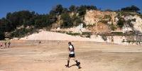

- :date: 2022-05-15
- TRaining IMPulse : 268

- :link: [Wordpress](https://www.cyber-neurones.org/2022/05/trail-de-biot-edition-2022/)

- :runner: Trail, 16 km, 398 m :mountain: D+, :watch: 01:41:21

#### Calvaire d’Antibes

- :date: 2022-04-27
- TRaining IMPulse : 149

- :link: [Wordpress](https://www.cyber-neurones.org/2022/04/calvaire-dantibes-edition-2022/)

- :runner: Course, 10 km, 205 m :mountain: D+, :watch: 00:53:19

- :triangular_flag_on_post: :fr: FFA : 
    - Course n°79
    - 132 (115M - 24M2)  
    - :watch: 53'21''
    - :round_pushpin: Antibes

#### Trail des merveilles à :round_pushpin: Breil-sur-roya

- :date: 2022-03-06
- TRaining IMPulse : 647

- :link: [Wordpress](https://www.cyber-neurones.org/2022/03/trail-des-merveilles-a-breil-sur-roya/)

- :runner: Trail, 33 km, 2068 m :mountain: D+, :watch: 05:29:01

- :triangular_flag_on_post: :fr: FFA :  
    - Course n°78
    - 96 (87M - 15M2) 
    - :watch: 5h29'16''
    - :round_pushpin:  Breil-sur-roya

### 2021 

#### Cross Amnesty à :round_pushpin: Valbonne

- :date: 2021-12-12
- TRaining IMPulse : 171

- :triangular_flag_on_post: :fr: FFA : 
    - Course n°77
    - 116 (89M - 15M2) 
    - :watch:  1h15'53''
    - :round_pushpin: Valbonne

#### Trail de l'Ours à :round_pushpin: Levens

- :date: 2021-11-28
- TRaining IMPulse : 731

- :link: [Wordpress](https://www.cyber-neurones.org/2021/11/trail-de-lours-a-levens/)

- :runner: Trail, 30 km, 2062 m :mountain: D+, :watch: 05:39:34

- :triangular_flag_on_post: :fr: FFA : 
    - Course n°76
    - 146 (131M - 14M2) 
    - :watch: 5h39'42'' (5h39'31'')
    - :round_pushpin:  Levens

#### Grasse Running Days 2021 : Trail de 24 km

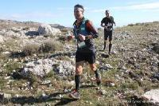

- :date: 2021-11-06
- TRaining IMPulse : 580

- :link: [Wordpress](https://www.cyber-neurones.org/2021/11/grasse-running-days-2021/)

- :runner: Trail, 24 km, 1181 m :mountain: D+, :watch: 03:15:33

- :triangular_flag_on_post: :fr: FFA : 
    - Course n°75
    - 117 (110M - 22M2) 
    - :watch: 3h15'55''
    - :round_pushpin: Grasse

#### Semi-marathon de :round_pushpin: Nice

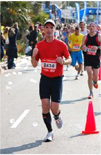

- :date: 2021-09-26
- TRaining IMPulse : 282

- :link: [Wordpress](https://www.cyber-neurones.org/2021/09/semi-marathon-de-nice-edition-2021/)

- :runner: Course, 21 km, 166 m :mountain: D+, :watch: 01:50:13

- :triangular_flag_on_post: :fr: FFA :   
    - Course n°74
    - 519 (460M - 66M2) 
    - :watch: 1h51'55'' (1h50'13'')
    - :round_pushpin: Nice

#### Urban Trail de :round_pushpin: Cannes 

- :date: 2021-09-12
- TRaining IMPulse : 501

- :link: [Wordpress](https://www.cyber-neurones.org/2021/09/urban-trail-de-cannes-edition-2021/)

- :runner: Trail, 27 km, 758 m :mountain: D+,  :watch: 03:09:51

- :triangular_flag_on_post: :fr: FFA :   
    - Course n°73
    - 130 (109M - 24M2) 
    - :watch: 3h09'50''
   - :round_pushpin: Cannes

#### Eco-Trail de :round_pushpin: Carros

- :date: 2021-06-12
- TRaining IMPulse : 207

- :link: [Wordpress](https://www.cyber-neurones.org/2021/06/eco-trail-de-carros-une-bonne-reprise/)

- :runner: Trail, 8 km, 516 m :mountain: D+, :watch: 01:06:26

- :triangular_flag_on_post: :fr: FFA : 
    - Course n°72
    - 96 (80M - 14M2) 
    - :watch: 1h06'24''
   - :round_pushpin: Carros

#### Calvaire Antibois Connecté à :round_pushpin: Antibes

##### Session n°1

- :date: 2021-04-18
- TRaining IMPulse : 133

##### Session n°2

- :date: 2021-04-07
- TRaining IMPulse : 159

- :link: [Wordpress](https://www.cyber-neurones.org/2021/04/calvaire-antibois-connecte-2021/)

- :runner: Course, 10 km,  201 m :mountain: D+, :watch:  00:53:20

### 2020 

#### EcoTrail de :round_pushpin: Montauroux 19 km

- :date: 2020-09-27
- TRaining IMPulse : 420

- :link: [Wordpress](https://www.cyber-neurones.org/2020/09/ecotrail-de-montauroux-19-km-edition-2020/)

- :runner: Trail, 20 km, 870 m :mountain: D+, :watch: 02:34:52

- :triangular_flag_on_post: :fr: FFA : 
    - Course n°71
    - 86 (79M - 13M2) 
    - :watch: 2h34'51''
   - :round_pushpin: Montauroux

####  UTCAM MERCANTOUR 45 km

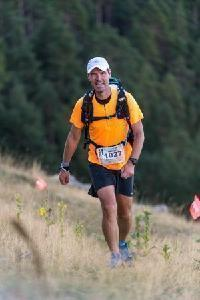

- :date: 2020-09-05
- TRaining IMPulse : 800

- :link: [Wordpress](https://www.cyber-neurones.org/2020/09/trail-utcam-trail-cote-dazur-mercantour-version-45-km-edition-2020/)

- :runner: Trail, 45 km, 3244 m :mountain: D+, :watch: 10:33:19

- :triangular_flag_on_post: :fr: FFA :  
    - Course n°70
    - 264 (220M - 30M2) 
    - :watch: 10h33'09''
   - :round_pushpin: Nice

- :triangular_flag_on_post: :star: ITRA : 
   - Course n°15
   - Ranking : 264 / 327 
   - Ranking Gender : 220 / 268 
   - iTRA SCORE : 400 
   - iTRA POINT : 3
   - Mountain Points : 10
   - :checkered_flag: Finisher Level : 360

#### Urban Trail de :round_pushpin: Cannes

- :date: 2020-01-26
- TRaining IMPulse : 463

- :link: [Wordpress](https://www.cyber-neurones.org/2020/01/urban-trail-de-cannes-edition-2020/)

- :runner: Trail, 26 km ,  689 m :mountain: D+, :watch: 03:01:13

- :triangular_flag_on_post: :fr:  FFA : 
    - Course n°69
    - 492 (408M - 79M2) 
    - :watch: 3h01'18'' (3h01'18'')
   - :round_pushpin: Cannes

#### PROM Classic à :round_pushpin: Nice 

- :date: 2020-01-05
- TRaining IMPulse : 158

- :link: [Wordpress](https://www.cyber-neurones.org/2020/01/prom-classic-edition-2020/)

- :runner: Course

- :triangular_flag_on_post: :fr: FFA :   
   - Course n°68
   - 3021 (2515M - 349M2) 
   - :watch:  57'24'' (51'01'')
   - :round_pushpin: Nice

### 2019

#### Trail de la Turbie : Pèlerinage de Laghet – 20 km

- :date: 2019-12-15
- TRaining IMPulse : 493

- :link: [Wordpress](https://www.cyber-neurones.org/2019/12/trail-de-la-turbie-pelerinage-de-laghet-20-km-edition-2019/)

- :runner: Trail, 20 km, 1059 m :mountain: D+, :watch: 03:06:45

#### Semi-Marathon des Alpes-Maritimes à :round_pushpin: Nice 

- :date: 2019-11-03
- TRaining IMPulse : 276

- :link: [Wordpress](https://www.cyber-neurones.org/2019/11/marathon-des-alpes-maritimes-edition-2019/)

- :runner: Course, 21 km, 

- :triangular_flag_on_post: :fr: FFA : 
   - Course n°67
   - 1573 (1288M - 419V1) 
   - :watch: 2h00'15'' (1h57'00'')
   - :round_pushpin: Antibes

#### Courir pour une Fleur à :round_pushpin: Antibes

- :date: 2019-10-13
- TRaining IMPulse : 328

- :link: [Wordpress](https://www.cyber-neurones.org/2019/10/courir-pour-une-fleur-a-antibes-edition-2019/)

- :runner: Course, 21 km, :watch: 01:57:15

- :triangular_flag_on_post: :fr: FFA : 
   - Course n°66
   - 530  (467M - 199V1) 
   - :watch: 1h57'56'' (1h57'09'')
   - :round_pushpin: Antibes

#### Trail de :round_pushpin: Tourrettes-sur-Loup 

- :date: 2019-09-22
- TRaining IMPulse : 437

- :link: [Wordpress](https://www.cyber-neurones.org/2019/09/trail-de-tourrettes-sur-loup-edition-2019/)

- :runner: Trail, 18 km, 1052 m :mountain: D+, :watch: 02:31:34

- :triangular_flag_on_post: :fr: FFA :  
   - Course n°65
   - 158  (140M - 39V1) 
   - :watch: 2h31'35''
   - :round_pushpin:  Tourrettes Sur Loup

#### UTMB CCC :sweat: Abandon au kilomètre 71 :sweat:

- :date: 30-08-2019
- TRaining IMPulse : 956

- :link: [Wordpress](https://www.cyber-neurones.org/2019/09/utmb-ccc-abandon-au-kilometre-71-des-regrets/)

- :link: [Wordpress](https://www.cyber-neurones.org/2019/08/utmb-ccc-contenu-de-mon-sac-a-dos/)

- :runner: Trail, **73 km, 4254 m :mountain: D+** :trophy: , :watch: 17:22:15

- :triangular_flag_on_post: :star: ITRA :  
    - Course n°14
    - :black_circle: **98 km / 6150 :mountain: m+**
    - :black_circle: DNF
    - :black_circle: DNF 

#### Trail de UBAYE Elite

- :date: 2019-08-11
- TRaining IMPulse : 639

- :link: [Wordpress](https://www.cyber-neurones.org/2019/08/trail-de-ubaye-elite-a-barcelonnette-edition-2019/)

- :runner: Trail, 41 km, 2522 m :mountain: D+, :watch:  07:05:09

- :triangular_flag_on_post: :fr: FFA :  
   - Course n°64
   - 265 (238M - 79V1) 
   - :watch:  7h05'06'' 
   - :round_pushpin: Barcelonnette

- :triangular_flag_on_post: :star: ITRA :  
    - Course n°13
    - :black_circle: 40 km / 2420 :mountain: m+ 
    - :watch:   7:05:06  
    - :black_circle: Ranking : 265 / 386 
    - :black_circle: Ranking Gender :  238 / 343 
    - :black_circle: iTRA Score : 461 
    - :black_circle: iTRA Points : 2
    - :black_circle: Moutain Points : 8
    - :black_circle:  :checkered_flag: Finisher Level : 310 .

#### Trail de :round_pushpin: Valberg

- :date: 2019-06-30
- TRaining IMPulse : 484

- :link: [Wordpress](https://www.cyber-neurones.org/2019/06/trail-de-valberg-edition-2019/)

- :runner: Trail, 29 km, 1635 m :mountain: D+, :watch: 05:23:16

#### Trail Var Verdon

- :date: 2019-06-23
- TRaining IMPulse : 382

- :link: [Wordpress](https://www.cyber-neurones.org/2019/06/trail-var-verdon-30-km-edition-2019/)

- :runner: Trail, 31 km, 1785 m :mountain: D+, :watch: 06:25:27

- :triangular_flag_on_post: :fr: FFA :  
    - Course n°63
    - 222 (183M - 54V1) 
    - :watch: 6h25'26'' 
    - :round_pushpin: Aiguines

- :triangular_flag_on_post: :star: ITRA :
    - Course n°12
    - :black_circle:  30 km / 1560 :mountain: m+ 
    - :watch:  6:25:26 
    - :black_circle:  222 / 243 
    - :black_circle: 185 / 197 
    - :black_circle:  iTRA Score 371 
    - :black_circle: iTRA Points : 2
    - :black_circle: Moutain Points : 6
    - :black_circle:  :checkered_flag: Finisher Level : 300 .

#### Jeux de Sophia

##### Trail

- :date:        11 juin 2019
- :heavy_check_mark: Dossard  : 219
- Trail, 15 km,  :watch:       1:44:57
- Classement général :         92/132
- :link: [Trail](https://www.cyber-neurones.org/2019/06/trail-de-15-km-des-jeux-de-sophia/)

##### Course d'orientation

- :date:        20 juin 2019
- :link: [Course d'orientation & Course](https://www.cyber-neurones.org/2019/05/jeux-de-sophia-2019/)

##### Cross

- :date:                  22 mai 2019
- :heavy_check_mark: Dossard  : 705
- Cross, 9 km,  :watch:     50:37
- Classement général :  109/171

#### Trail des Gorges de l’Ardèche :smiley: 

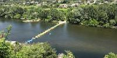

- :date: 2019-05-05
- TRaining IMPulse : 753

- :link: [Wordpress](https://www.cyber-neurones.org/2019/05/trail-des-gorges-de-lardeche-gtga-mais-finalement-la-tga/)

- :runner: Trail, 44 km, 1882 m :mountain: D+, :watch: 07:54:20

- :triangular_flag_on_post: :fr:  FFA  : 
    - Course n°62
    - 171 (143M - 53V1) 
    - :watch: 10h54'28'' ( 07h54'20'' ) 
    - :round_pushpin: Saint Martin D'ardeche

- :triangular_flag_on_post: :star: ITRA : 
    - Course n°11
    - :black_circle: 37 km / 1590 :mountain: m+ 
    - :watch:  10:54:28  
    - :black_circle: Ranking : 171 / 201  
    - :black_circle: Ranking Gender : 144 / 164
    - :black_circle:  iTRA Score : 298 
    - :black_circle:  iTRA Points : 2
    - :black_circle:  Moutain Points : 4 
    - :black_circle:  :checkered_flag: Finisher Level : 310 .

#### 16 ème CO’Tour de Sophia 

- :link: [Wordpress](https://www.cyber-neurones.org/2019/05/16-eme-cotour-de-sophia/)

- :runner: Course d'orientation en 5 étapes.

#### Urban Trail de Biot 

- :date: 2019-05-12
- TRaining IMPulse : 285

- :link: [Wordpress](https://www.cyber-neurones.org/2019/05/urban-trail-de-biot-edition-2019/)

- :runner: Trail, 17 km, 472 m :mountain: D+, :watch: 01:51:41

- :triangular_flag_on_post: :fr: FFA : 
   - Course n°61
   - 65 (56M - 21V1) 
   - :watch: 1h50'40'' 
   - :round_pushpin: Biot 

#### Semi-Marathon de :round_pushpin: Nice

- :date: 2019-05-05
- TRaining IMPulse : 287

- :link: [Wordpress](https://www.cyber-neurones.org/2019/05/semi-marathon-de-nice-edition-2019/)

- :runner: Course, 21 km, 162 m :mountain: D+, :watch:  01:57:04

- :triangular_flag_on_post: :fr: FFA :  
   - Course n°60
   - 1573 (1288M - 419V1) 
   - :watch:  2h00'15'' (1h57'00'') 
   - :round_pushpin: Nice

#### Raid Vallis Bona

- :link: [Wordpress](https://www.cyber-neurones.org/2019/04/raid-vallis-bona-edition-2019/)

- :runner: Course d'orientation, :bow_and_arrow: Tir à l'arc, Lancée de buche, Rameur, ....

#### Urban Trail de :round_pushpin: Cannes

- :date: 2019-01-13
- TRaining IMPulse : 437

- :link: [Wordpress](https://www.cyber-neurones.org/2019/01/urban-trail-de-cannes-edition-2019/)

- :runner: Trail, 26 km, 706 m :mountain: D+, :watch: 03:07:25

- :triangular_flag_on_post: :fr:  FFA :  
   - Course n°59
   - 621  (504M - 201V1)  
   - :watch: 3h07'23'' 
   - :round_pushpin: Cannes

#### PROM Classic :round_pushpin: Nice

- :date: 2019-01-06
- TRaining IMPulse : 183

- :link: [Wordpress](https://www.cyber-neurones.org/2019/01/prom-classic-edition-2019/)

- :runner: Course, 10 km, 

- :triangular_flag_on_post: :fr:  FFA : 
   - Course n°58
   - 2017 (1775M - 499V1) 
   - :watch:  52'06'' (49'16'') 
   - :round_pushpin:  Nice

### 2018

#### Courir pour une fleur à :round_pushpin: Antibes

- :date: 2018-10-14
- TRaining IMPulse : 328

- :link: [Wordpress](https://www.cyber-neurones.org/2018/10/courir-pour-une-fleur-edition-2018/)

- :runner: Course, 21 km, 242 m :mountain: D+,  :watch: 02:01:06

- :triangular_flag_on_post: :fr: FFA :    
   - Course n°57
   - 662  (580M - 202V1) 
   - :watch: 2h02'47'' 
   - :round_pushpin: Antibes

#### Trail UTMB OCC au départ de :round_pushpin: Orsière – Version de 56 km

- :date: 30-08-2018
- TRaining IMPulse : 1005 :trophy:

- :link: [Wordpress](https://www.cyber-neurones.org/2018/09/trail-utmb-occ-au-depart-de-orsiere-version-de-56-km/)

- :runner: Trail, 60 km, 3492 m :mountain: D+,  :watch: 11:19:38

- :triangular_flag_on_post: :fr: FFA :  
    - Course n°56
    - 969 (775M - 268V1) 
    - :watch:  11h19'45''  
    - :round_pushpin:  Chamonix Mont Blanc

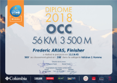

- :triangular_flag_on_post: :star: ITRA : 
    - Course n°10
    - 56 km / 3450 :mountain: m+ 
    - :watch:  11:19:45 
    - :black_circle: Ranking :  969 / 1572 
    - :black_circle: Ranking Gender :  776 / 1185  
    - iTRA Score :  418 
    - :black_circle:  iTRA Points : 4
    - :black_circle:  Moutain Points : 8
    - :black_circle:  :checkered_flag: Finisher Level : 340

#### Trail des Mélèzes – Version 25 km au départ de :round_pushpin: Colmars

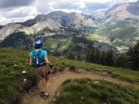

- :date: 2018-07-22
- TRaining IMPulse : 533

- :link: [Wordpress](https://www.cyber-neurones.org/2018/07/trail-des-melezes-version-25-km-au-depart-de-colmars/)

- :runner: Trail, 28 km, 1964 m :mountain: D+, :watch: 05:28:56

- :triangular_flag_on_post: :fr: FFA :  
    - Course n°55
    - 172  (143M - 45V1) 
    - :watch:  5h28'42''  
    - :round_pushpin:  Beauvezer

#### Trail : HTV : High Trail Vanoise :sweat: Abandon au kilomètre 51 :sweat:

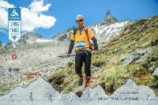

- :date: 2018-07-07
- TRaining IMPulse : 746

- :link: [Wordpress](https://www.cyber-neurones.org/2018/07/trail-high-trail-vanoise-2018/)

- :link: [Materiel](https://www.cyber-neurones.org/2018/07/materiel-pour-high-trail-vanoise/)

- :runner: Trail, **51 km, 3716 m :mountain: D+**,  :watch: 11:39:46

- :triangular_flag_on_post: :star: ITRA :
    - Course n°9
    - **70 km / 5350 :mountain: m+**
    - :black_circle: DNF
    - :black_circle: DNF
    - :black_circle:  iTRA Points : 4
    - :black_circle:  Moutain Points : 11

#### Foulée Biotoise

- :date: 2018-07-01
- TRaining IMPulse : 151

- :link: [Wordpress](https://www.cyber-neurones.org/2018/07/foulee-biotoise-2018/)

- :runner: Course, :watch: 49:48:00

#### Ultra-Trail Var Verdon

- :date: 2018-06-23
- TRaining IMPulse : 913

- :link: [Wordpress](https://www.cyber-neurones.org/2018/06/ultra-trail-var-verdon-edition-2018/)

- :runner: Trail, 66 km, 3315 m :mountain: D+, :watch: 12:28:56

- :triangular_flag_on_post: :star: ITRA :
    - Course n°8
    -  60 km / 3400 :mountain: m+  
    - :watch: 12:28:36  
    - :black_circle: Ranking  111 / 179   
    - :black_circle: Ranking Gender 103 / 161 
    - iTRA Score 437 
    - :black_circle:  iTRA Points : 4
    - :black_circle:  Moutain Points : 7

#### Trail La chaussée des Géants – Thueyts Ardèche

- :date: 2018-06-02
- TRaining IMPulse : 823

- :link: [Wordpress](https://www.cyber-neurones.org/2018/06/trail-la-chaussee-des-geants-thueyts-ardeche-edition-2018/)

- :runner: Trail, 50 km,  2782 m :mountain: D+,  :watch: 09:02:35

- :triangular_flag_on_post: :fr: FFA :  
    - Course n°54
    - 157  (151M - 50V1) 
    - :watch: 9h02'21'' 
    - :round_pushpin: Thueyts

- :triangular_flag_on_post: :star: ITRA : 
    - Course n°7
    - 49 km / 2870 :mountain: m+ 
    - :watch:   9:02:21  
    - :black_circle: Ranking : 157 / 200 
    - :black_circle: Ranking Gender : 151 / 187  
    - iTRA Score : 435 
    - :black_circle:  iTRA Points : 3
    - :black_circle:  Moutain Points : 7
    - :black_circle: :checkered_flag: Finisher Level : 370 

#### Jeux de Sophia - Edition 2018

- :link: [Wordpress](https://www.cyber-neurones.org/2018/05/jeux-de-sophia-2018/)

- :bow_and_arrow: Tir à l'arc, :runner: Trail, :mountain_biking_man: VTT, Karting, Baby Foot, Squash, :bowling: Bowling, Course d'orientation.

##### Trail

- :date:                15 mai 2018
- :heavy_check_mark: Dossard  : 705
- Trail, 12 km,  :watch:                  1:12:47
- Classement général :            67/191

##### Course d'orientation

- :date:                7 juin 2018
- :watch:   1:37:00

##### VTT

- :date:                24 mai 2018
- 15,69 km, 316 D+
- :watch:   1:32:00

#### Semi-marathon de :round_pushpin: Nice

- :date: 2018-04-15
- TRaining IMPulse : 317

- :link: [Wordpress](https://www.cyber-neurones.org/2018/04/semi-marathon-de-nice-edition-2018/)

- :runner: Course, 21 km,  :watch:  01:43:43

- :triangular_flag_on_post: :fr: FFA :   
   - Course n°53
   - 871 (762M - 259V1) 
   - :watch:  1h52'15'' (1h49'44'') 
   - :round_pushpin:  Nice

#### Trail de la Galinette : Les drailles de la Galinette (46 km) à :round_pushpin: Cadolive

- :date: 2018-01-28
- TRaining IMPulse : 886

- :link: [Wordpress](https://www.cyber-neurones.org/2018/02/trail-de-la-galinette-les-drailles-de-la-galinette-46-km-a-cadolive/)

- :runner: Trail , 46 km, 2303 D+ ,

- :triangular_flag_on_post: :star: ITRA : 46 km / 2400 :mountain: m+ 
    - Course n°6
    - :watch: 7:59:50 
    - :black_circle: Ranking :  228 / 291 
    - :black_circle: Ranking Gender :  207 / 264 
    - iTRA Score  432 
    - :black_circle:  iTRA Points : 3
    - :black_circle:  Moutain Points : 6
    - :black_circle: :checkered_flag: Finisher Level : 390

#### Urban Trail de Cannes : 26 km : Grand Cannois

- :date: 2018-01-21
- TRaining IMPulse : 312

- :link: [Wordpress](https://www.cyber-neurones.org/2018/01/urban-trail-de-cannes-26-km-grand-cannois/)

- :runner: Trail, 26 km

- :triangular_flag_on_post: :fr: FFA :  
   - Course n°52
   - 342  (304M - 125V1) 
   - :watch: 2h43'07'' 
   - :round_pushpin: Cannes 

#### PROM Classic à  :round_pushpin:  Nice

- :date: 2018-01-07
- TRaining IMPulse : 154

- :link: [Wordpress](https://www.cyber-neurones.org/2018/01/prom-classic-edition-2018/)

- :runner: Course, 10 km

- :triangular_flag_on_post: :fr: FFA :  
   - Course n°51
   - 2092 (1809M - 558V1) 
   - 56'14'' (49'01'') 
   - :round_pushpin:  Nice

### 2017

#### Hivernale des templiers : Le marathon d’Orchis.

- :date: 2017-12-03
- TRaining IMPulse : 747

- :link: [Wordpress](https://www.cyber-neurones.org/2017/12/hivernale-des-templiers-le-marathon-dorchis/)

- :runner: Trail, 39 km, 

- :triangular_flag_on_post: :fr: FFA : 
   - Course n°50
   - 516. (459M - 150V1) 
   - :watch: 5h29'17'' 
   - :round_pushpin: Roquefort Sur Soulzon

- :triangular_flag_on_post: :star: ITRA : 
    - Course n°5
    - 39 km / 1970 :mountain: m+  
    - :watch: 5:29:17  
    - :black_circle: Ranking : 520 / 802
    - :black_circle: Ranking Gender :  463 / 659
    - iTRA Score  448 
    - :black_circle:  iTRA Points : 2
    - :black_circle:  Moutain Points : 5

#### L’Alpin Trail De PICHAURIS (Edition Elite) – 2017

- :date: 2017-11-11
- TRaining IMPulse : 700

- :link: [Wordpress](https://www.cyber-neurones.org/2017/11/lalpin-trail-de-pichauris-edition-elite-2017/)

- :triangular_flag_on_post: :fr: FFA :  
    - Course n°49
    - 290 . (257M - 111MA) 
    - :watch: 5h32'44'' 
    - :round_pushpin:  Allauch

- :triangular_flag_on_post: :star: ITRA :
    - Course n°4
    - 30 km / 1660 :mountain: m+
    - :watch: 5:32:44 
    - :black_circle: Ranking : 291 / 327
    - :black_circle: Ranking Gender : 258 / 283 
    - iTRA Score 395 
    - :black_circle:  iTRA Points : 2
    - :black_circle:  Moutain Points : 6

#### Marathon des Alpes-Maritimes en relais

- :date: 2017-11-05
- TRaining IMPulse : 344

- :link: [Wordpress](https://www.cyber-neurones.org/2017/11/marathon-des-alpes-maritimes-en-relais/)

- :runner: Course,

- :triangular_flag_on_post: :fr: FFA : 
    - :watch: 1:52:11 

#### Trail de la Vésubie – version 44 km :sweat: Abandon :sweat:

- :date: 2017-08-27
- TRaining IMPulse : 833

- [IBP](https://www.ibpindex.com/index.php/fr/) : 492 RNG pour les 32 km.

- :link: [Wordpress](https://www.cyber-neurones.org/2017/08/trail-de-la-vesubie-version-44-km/)

- :runner: Trail, 32 km

- :triangular_flag_on_post: :fr: FFA :

- :triangular_flag_on_post: :star: ITRA :
    - Course n°3 

#### Jeux de Sophia 2017

- :link: [Wordpress](https://www.cyber-neurones.org/2017/06/jeux-de-sophia-2017/)

- Epreuves : :basketball_man: Basket-ball, :bow_and_arrow: Tir à l'arc, Tir au pistolet, Football à 5, Karting, Padel, :bowling: Bowling, Course d'orientation, Babyfoot, Flechettes.

##### Cross

- :date:        1 juin 2017
- Cross, 9 km,  :watch:       48:51

##### Course d'orientation

- :date:        8 juin 2017
- :watch: 1:57:00

#### Lachens-mer, randonnée en :mountain_biking_man: VTT

- :date: 2017-05-25
- TRaining IMPulse : 741

- :link: [Wordpress](https://www.cyber-neurones.org/2017/05/lachens-mer-randonnee-en-vtt/)

- :mountain_biking_man: VTT, 90 km , 1261 D+ 

#### Trail des Balcons d’Azur : P’tit TBA

- :date: 2017-04-22
- TRaining IMPulse : 550

- :link: [Wordpress](https://www.cyber-neurones.org/2017/04/trail-des-balcons-dazur-ptit-tba/)

- :runner: Trail :watch: 3:33:26

- :triangular_flag_on_post: :fr: FFA : 
    - Course n°48
    - 283 (229M - 77V1) 
    - :watch: 3h34'38'' 
    - :round_pushpin:  Mandelieu La Napoule

- :triangular_flag_on_post: :star: ITRA :
    - Course n°2
    - 24 km / 980 :mountain: m+
    - :watch:   3:34:38 
    - :black_circle:   Ranking : 282 / 483 
    - :black_circle:  Ranking Gender :  228 / 333 
    - iTRA Score        414
    - :black_circle:  iTRA Points : 1
    - :black_circle:  Moutain Points : 4

#### Trail des 5 Calanques 

- :date: 2017-04-16
- TRaining IMPulse : 425

- :link: [Wordpress](https://www.cyber-neurones.org/2017/04/trail-des-5-calanques-edition-2017/)

- :runner: Trail :watch: 

- :triangular_flag_on_post: :fr: FFA :  
    - Course n°47
    - 427 (357M - 238MA) 
    - :watch: 3h05'23'' 
    - :round_pushpin: Ensues La Redonne

#### Trail Hermes Fréjus Estérel

- :date: 2017-04-09
- TRaining IMPulse : 492

- :link: [Wordpress](https://www.cyber-neurones.org/2017/04/trail-hermes-frejus-esterel/)

- :runner: Trail :watch:

- :triangular_flag_on_post: :fr: FFA :  
    - Course n°46
    - 167 (137M - 46V1) 
    - :watch: 3h10'10'' 
    - :round_pushpin: Frejus 

#### :round_pushpin: Mougins Urban Trail (Première édition)

- :date: 2017-03-19
- TRaining IMPulse : 296

- :link: [Wordpress](https://www.cyber-neurones.org/2017/03/mougins-urban-trail-premiere-edition/)

- :runner:  Course, 15,37 km , 348 D+ ,

#### Trail des 3 cols à :round_pushpin: Bormes-les-mimosas .

- :date: 2017-02-05
- TRaining IMPulse : 379

- :link: [Wordpress](https://www.cyber-neurones.org/2017/02/trail-des-3-cols-a-bormes-les-mimosas/)

- :runner: Trail

- :triangular_flag_on_post: :fr: FFA :  
    - Course n°45
    - 210 . (167M - 63V1) 
    - :watch: 3h02'42'' 
    - :round_pushpin: Bormes Les Mimosas .

- :triangular_flag_on_post: :star: ITRA :
    - Course n°1
    - 19 km / 930 :mountain: m+
    - :watch:     3:02:42 
    - :black_circle:    Ranking : 210 / 294 
    - :black_circle:    Ranking Gender : 167 / 207 
    - iTRA Score        427
    - :black_circle:  iTRA Points : 0
    - :black_circle:  Moutain Points : 0

### 2016

#### Marathon Alpes-Maritimes

- :date: 2016-11-13
- TRaining IMPulse : 546

- :link: [Wordpress](https://www.cyber-neurones.org/2016/11/marathon-des-alpes-maritimes-edition-2016/)

- :runner: Course, Marathon, 

- :triangular_flag_on_post: :fr: FFA :   
   - Course n°44
   - 4627  (3836M - 1552V1) 
   - :watch:  4h23'12'' 
   - :round_pushpin: Nice .

- Nombre de participation : 8

#### :round_pushpin: Gorbio : Kilomètre vertical

- :date: 2016-10-08
- TRaining IMPulse : 224

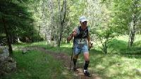

- :link: [Wordpress](https://www.cyber-neurones.org/2016/10/gorbio-kilometre-vertical/)

- :runner: Trail, 

- :triangular_flag_on_post: :fr: FFA :  
   - Course n°43
   - 57 (51M - 11V1) 
   - :watch: 1h12'29'' 
   - :round_pushpin: Gorbio

#### Courir pour une fleur – le semi – 

- :date: 2016-10-02
- TRaining IMPulse : 297

- :link: [Wordpress](https://www.cyber-neurones.org/2016/10/courir-pour-une-fleur-le-semi-edition-2016/)

- :runner: Course

- :triangular_flag_on_post: :fr: FFA : 
   - Course n°42
   - 421 (386M - 152V1) 
   - :watch: 1h55'24'' 
   - :round_pushpin: Antibes

#### Les foulées Biotoises 2016 :round_pushpin: Biot

- :date: 2016-07-03
- TRaining IMPulse : 132

- :link: [Wordpress](https://www.cyber-neurones.org/2016/07/les-foulees-biotoises-2016/)

- :runner: Course 

- :triangular_flag_on_post: :fr: FFA : 
   - Course n°41
   - 163 (142M - 45V1) 
   - :watch: 49'36'' 
   - :round_pushpin: Biot

#### Jeux de Sophia 2016

- :link: [Wordpress](https://www.cyber-neurones.org/2016/06/jeux-de-sophia-2016/)

-  Epreuves :  :basketball_man: Basket, :bow_and_arrow: Tir à l'arc, Karting, Football à 5, Cross, Football à 7, Tir au pistolet, :bowling: Bowling, Course d'orientation ...

##### Cross

- :date:        2 juin 2016
- :heavy_check_mark: Dossard  : 9
- Cross, 9 km,  :watch:     43:04
- Classement général :  160/259

##### Sophia Color Race 

- :date:    16 juin 2016

#### Les allumés de la plein lune : jusqu’à :round_pushpin: Mons

- :date: 2016-05-21
- TRaining IMPulse : 320

- :link: [Wordpress](https://www.cyber-neurones.org/2016/05/les-allumes-de-la-plein-lune-jusqua-mons/)

- Marche, 51,4 km , 1179 D+ , 

#### Trans 50 : Transvésubienne 2016 : :sweat: Abandon au kilomètre 69 sur 71 :sweat:

- :date: 2016-05-15 
- TRaining IMPulse : 830

- :link: [Wordpress](https://www.cyber-neurones.org/2016/05/trans-50-transvesubienne-2016-au-moins-jaurais-essaye/)

- :mountain_biking_man: VTT, 69 km , 1631 D+ , 

#### Semi-marathon de :round_pushpin: Nice

- :date: 2016-05-24
- TRaining IMPulse : 312

- :link: [Wordpress](https://www.cyber-neurones.org/2016/04/semi-marathon-de-nice-2016/)

- :runner: Course

- :triangular_flag_on_post: :fr: FFA :  
   - Course n°40
   - 1768. (1522M - 529V1) 
   - :watch: 1h53'44'' 
   - :round_pushpin: Nice

#### Mud Day : Pays d’Aix

- :date:   9 avril 2016
- Dossard : 201
- :watch:   1:49:06 
- :link: [Wordpress](https://www.cyber-neurones.org/2016/04/mud-day-pays-daix-edition-2016/)

- Course d'obstacle

#### :mountain_biking_man: VTT : La Bigreen de :round_pushpin: Saint-Vallier à :round_pushpin: Grasse.

 :date: 2016-03-28
- TRaining IMPulse : 327

- :link: [Wordpress](https://www.cyber-neurones.org/2016/03/vtt-la-bigreen-de-saint-vallier-a-grasse/)

- :mountain_biking_man: VTT, 46 km, 687 D+ , :watch: 6h01

#### Semi-marathon de :round_pushpin: Cannes 

- :date: 2016-02-21
- TRaining IMPulse : 310

- :link: [Wordpress](https://www.cyber-neurones.org/2016/02/semi-marathon-de-cannes-edition-2016/)

- :runner: Course

- :triangular_flag_on_post: :fr: FFA :  
   - Course n°39
   - 932 (796M - 303V1) 
   - :watch: 1h51'27'' 
   - :round_pushpin: Cannes

#### PROM Classic 2016 à :round_pushpin: Nice 

- :date: 2016-01-10

- :link: [Wordpress](https://www.cyber-neurones.org/2016/01/prom-classic-2016/)

- :runner: Course

- :triangular_flag_on_post: :fr: FFA :  
   - Course n°38
   - 2812 (2497M - 761V1) 
   - :watch: 48'11'' 
   - :round_pushpin: Nice

### 2015

#### Cross Amnesty de :round_pushpin: Valbonne

- :date:   13 décembre 2015
- TRaining IMPulse : 163
- :link: [Wordpress](https://www.cyber-neurones.org/2015/12/cross-amnesty-de-valbonne/)
- :runner: Cross, 11 km, :watch:  58:37
- Classement Général :   118/243

#### Compétition inter-entreprise de Padel

- Padel 

#### Cross des îles de Lérins

- :date: 2015-12-06
- TRaining IMPulse : 140

- :link: [Wordpress](https://www.cyber-neurones.org/2015/12/cross-des-iles-de-lerins/)

- :runner: Cross

- :triangular_flag_on_post: :fr: FFA : 
   - Course n°37
   - 130 . (78MA) 
   - :watch: 42'23'' 
   - :round_pushpin: Cannes

#### Marathon des Alpes-Maritimes

- :date: 2015-11-08

- :link: [Wordpress](https://www.cyber-neurones.org/2015/11/marathon-des-alpes-maritimes-sous-le-soleil/)

- :runner: Course

- :triangular_flag_on_post: :fr: FFA : 
   - Course n°36
   - 2955 (2600M - 1021MA) 
   - :watch: 3h58'17'' 
   - :round_pushpin: Nice

- Nombre de participation : 7

#### Spartan Race :round_pushpin:  Le Castellet : La Trifecta dans le Weekend

- :date: 17 & 18 octobre 2015

- :link: [Wordpress](https://www.cyber-neurones.org/2015/10/spartan-race-le-castellet-la-trifecta-dans-le-weekend/)

- :runner: **Course d'obstacles, 46 km, 1203 m D+, 65 obstacles. :watch: 9h12m35**

##### Spartan Race : Beast

- :date:        17 octobre 2015
- :watch:                 4:01:24
- Classement Général :            422/1221
- Dossard : 11399

##### Spartan Race : Sprint

- :date:        17 octobre 2015
- :watch:         2:02:27
- Classement Général :    1088/1667
- Dossard : 13030

##### Spartan Race : Super

- :date:   18 octobre 2015
- :watch:   3:08:34
- Classement Général :   742/2331
- Dossard : 13737

#### Trail de la Vésubie (version 22 km)

- :date: 2015-09-06
- TRaining IMPulse : 413
- :link: [Wordpress](https://www.cyber-neurones.org/2015/09/trail-de-la-vesubie-version-22-km/)

- :runner: Trail 

- :triangular_flag_on_post: :fr: FFA : 
   - Course n°34
   - 120 . (103M - 22MA) 
   - :watch: 3h17'03'' 
   - :round_pushpin:  Saint Martin Vesubie

#### Les foulées Biotoises

- :date: 2015-07-19
- TRaining IMPulse : 127

- :link: [Wordpress](https://www.cyber-neurones.org/2015/07/les-foulees-biotoises-edition-2015/)

- :runner: Course 

- :triangular_flag_on_post: :fr: FFA : 
   - Course n°33
   - 120 . (106M - 33MA) 
   - :watch: 43'28'' 
   - :round_pushpin:  Biot

#### Holi Run à :round_pushpin: Villeneuve-Loubet

- :date: 2015-07

- :link: [Wordpress](https://www.cyber-neurones.org/2015/07/holi-run-a-villeneuve-loubet/)

- :runner: " Course "

#### :-1: :hankey: Mud Day à :round_pushpin: Levens  :hankey:

- :date: 20 juin 2015
- :link: [Wordpress](https://www.cyber-neurones.org/2015/06/monday-morning-mud-day-nice-2015/)
- :link: [Wordpress](https://www.cyber-neurones.org/2015/06/mud-day-nice-2015/)
- :runner: Course d'obstacles
- :watch:   1:45:00
- Dossard : 101

#### Jeux de Sophia 2015

- :date: 2015-06

- :link: [Wordpress](https://www.cyber-neurones.org/2015/06/jeux-de-sophia-2015/)

- **15 épreuves** : :bow_and_arrow: Tir à l'arc, Tir au pistolet, Karting, Football à 5, Cross, :badminton: Badminton,  :basketball_man: Basket-ball, Football à 7, :volleyball: Volley-Ball, Course d'orientation, :bowling: Bowling, Baby foot, Beach Volley, :mountain_biking_man: VTT.

##### Cross

- :date:                 4 juin 2015
- :heavy_check_mark: Dossard  : 132
- 8,91 km , 72 m D+,
- Cross, 9 km,  :watch:                  47:13
- Classement général :            95/242

##### Course d'orientation

- :date: 10 juin 2015
- :watch: 1:46:33
- Classement général :  86/120

##### VTT

- :date: 18 juin 2015
- 15,75 km , 355m D+, :watch: 1h28m

#### Semi-marathon de Nice

- :date: 2015-04-26
- TRaining IMPulse : 270
- :link: [Wordpress](https://www.cyber-neurones.org/2015/04/semi-marathon-de-nice-2015/)

- [Statistiques du Semi-Marathon de Nice – 2015](https://www.cyber-neurones.org/2015/04/statistiques-du-semi-marathon-de-nice-2015/)

- :triangular_flag_on_post: :fr: FFA : 
   - Course n°32
   - 1473  (1310M - 458MA) 
   - :watch:  1h50'43'' 
   - :round_pushpin: Nice

#### Mud Day Pays d'Aix

- :date:     12 avril 2015
- TRaining IMPulse : 151
- :link: [Wordpress](https://www.cyber-neurones.org/2015/04/mud-day-pays-daix/)
- Course d'obstacles
- Dossard : 305
- :watch:   1:57:25

#### Tournois Tennis Biot Club

#### Nice Carnaval Run

- :date: 2015-02-15
- TRaining IMPulse : 164
- :link: [Wordpress](https://www.cyber-neurones.org/2015/02/nice-carnaval-run/)

- :triangular_flag_on_post: :fr: FFA : 
   - Course n°31
   - 318 (276M - 85MA) 
   - :watch: 50'01'' 
   - :round_pushpin: Nice

#### 12 Bornes de Gorbio

- :date: 2015-01-25
- TRaining IMPulse : 174

- :link: [Wordpress](https://www.cyber-neurones.org/2015/01/12-bornes-de-gorbio/)

- Trail, 11,45 km , 218m D+, 

- :triangular_flag_on_post: :fr: FFA :  
   - Course n°30
   - 129 (118M - 38MA) 
   - :watch: 1h02'20'' 
   - :round_pushpin: Gorbio

#### PROM Classic 2015

- :date: 2015-01-11
- TRaining IMPulse : 157

- :link: [Wordpress](https://www.cyber-neurones.org/2015/01/prom-classic-2015/)

- Course, 10 km , 41 m D+ ,

- :triangular_flag_on_post: :fr: FFA : 
   - Course n°29
   - 2676 (2405M - 733MA) 
   - :watch: 49'07'' 
   - :round_pushpin: Nice

### 2014

#### Marathon des Alpes-Maritimes

- :date: 2014-11-09
- TRaining IMPulse : 468

- :link: [Wordpress](https://www.cyber-neurones.org/2014/11/marathon-des-alpes-maritimes-2014/)

- :link: [Préparation](https://www.cyber-neurones.org/2014/11/preparation-au-marathon-des-alpes-maritimes/)

- Course, 41 km, 

- :triangular_flag_on_post: :fr: FFA : 
   - Course n°28
   - 3226 (2827M – 1049MA)
   - :watch: 3h56’21 
   - :round_pushpin:   Nice  

- Nombre de participation : 6

#### Spartan Race Beast : au circuit Paul Ricard.

- :date:   11 octobre 2014
- TRaining IMPulse : 323
- :link: [Wordpress](https://www.cyber-neurones.org/2014/10/spartan-race-beast-au-circuit-paul-ricard/)
- Course d'obstacles, 21 km, 40 obstables .
- Classement Général :   444/935
- :watch:   3:53:55

#### Courrir pour une fleur, le semi-marathon à :round_pushpin: Antibes

- :date: 2014-10-05
- TRaining IMPulse : 272
- :link: [Wordpress](https://www.cyber-neurones.org/2014/10/courir-pour-une-fleur-le-semi-marathon-2/)

- Course, 21 km,

- :triangular_flag_on_post: :fr: FFA :  
   - Course n°27
   - 407 (387M – 157SE)  
   - :watch: 1h46’45 
   - :round_pushpin:   Juan Les Pins  

#### Corrida de :round_pushpin: Valbonne

- :date: 2014-08-15
- TRaining IMPulse : 101
- :link: [Wordpress](https://www.cyber-neurones.org/2014/08/corrida-de-valbonne/)
- Course, 7,2 km , 159m  D+ ,

- :triangular_flag_on_post: :fr: FFA :
   - Course n°26
   - 125  (109M - 51SE)
   - :watch: 38'06''
   - :round_pushpin: Valbonne

#### Foulée Biotoise à :round_pushpin: Biot 

- :date: 2014-07-06
- TRaining IMPulse : 130

- :link: [Wordpress](https://www.cyber-neurones.org/2014/07/ma-course-les-foulees-biotoises/)

- Course, 8,1 km , 145 m D+ , :watch: 41m11

#### Jeux de Sophia 2014 #J2S

- :link: [Wordpress](https://www.cyber-neurones.org/2014/06/jeux-de-sophia-2014/)

- :link: [Cross](https://www.cyber-neurones.org/2014/06/cross-de-3-km-des-jeux-de-sophia-antipolis/)

- **13 Epreuves** : Cross, Basket-ball, Tir à l'arc, Tir au pistolet, Tennis de table, Voiles, Karting, Tennis, Squash, Bowling, VTT Nocturne, Padel, Badminton.

##### Cross

- :date:                3 juin 2014
- :heavy_check_mark: Dossard  : 803
- Cross, 3km,  :watch:                15:28
- Classement général :          17/94

#### Trail de :round_pushpin: Grasse : version courte 17 km.

- :date: 2014-06-01
- TRaining IMPulse : 265

- :link: [Wordpress](https://www.cyber-neurones.org/2014/06/trail-de-grasse-version-courte-17-km/)

- Trail, 17,47 km, 754m D+ ,  

- :triangular_flag_on_post: :fr: FFA : 
   - Course n°25
   - 83  (78M – 30SE)  
   - :watch: 2h08’48    
   - :round_pushpin: Grasse  

#### Ronde des Plages à :round_pushpin: Menton

- :date: 2014-05-18
- TRaining IMPulse : 166

- :link: [Wordpress](https://www.cyber-neurones.org/2014/05/ronde-des-plages-a-menton-2/)

- Course, 10 km, 33 m D+, 

#### Ascension du Col de :round_pushpin: Vence

- :date: 2014-05-04
- TRaining IMPulse : 167

- :link: [Wordpress](https://www.cyber-neurones.org/2014/05/ascension-du-col-de-vence-2/)

- Course, 11,23 km , 655 m D+, 

- :triangular_flag_on_post: :fr: FFA : 
   - Course n°24
   - 250  (215M – 91SE)  
   - :watch: 1h13’25 
   - :round_pushpin:  Vence  

#### Derby de la Meije :+1:

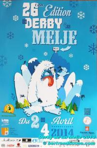

- :date: 2014-03-04
- TRaining IMPulse :  54
- :link: [Wordpress](https://www.cyber-neurones.org/2014/04/derby-de-la-meije/)

- :link: [Statistique : Derby de la Meije](https://www.cyber-neurones.org/2014/03/statistique-derby-de-la-meije/)

- :ski: Ski, 7 km , 1537 m D-, 

#### Trail d'Eze

- :date: 2014-03-09
- TRaining IMPulse : 402

- :link: [Wordpress](https://www.cyber-neurones.org/2014/03/trail-deze/)

- Trail, 18 km, 890m D+ , 

#### Rock’n Roll :round_pushpin: Nice 10 Miles du CARNAVAL 2014

- :date: 2014-02-16
- TRaining IMPulse : 256

- :link: [Wordpress](https://www.cyber-neurones.org/2014/02/rockn-roll-nice-10-miles-du-carnaval-2014/)

- Course, 10 Miles, 83 m D+,

- :triangular_flag_on_post: :fr: FFA : 
   - Course n°23
   - 639 (558M – 220SE)  
   - :watch: 1h22’50 
   - :round_pushpin:  Nice  

#### PROM Classic 2014 à :round_pushpin: Nice

- :date: 2014-01-05
- TRaining IMPulse : 182
- :link: [Wordpress](https://www.cyber-neurones.org/2014/01/prom-classic-2014/)

- Course, 10 km, 25m D+,

- :triangular_flag_on_post: :fr: FFA : 
   - Course n°22
   - 2449 ( – 978SE)  
   - :watch: 48’53  
   - :round_pushpin:  Nice

### 2013

#### Marathon des Alpes Maritimes.

- :date: 10 novembre 2013
- TRaining IMPulse : 512 

- :link: [Wordpress](https://www.cyber-neurones.org/2013/11/ma-course-marathon-des-alpes-maritimes-2013/)

- :link: [Statistique](https://www.cyber-neurones.org/2013/11/marathon-des-alpes-maritimes-2013/)

- Course, Marathon,

- :triangular_flag_on_post: :fr: FFA :
   - Course n°21
   -  4997 ( - 1421SE)
   - :watch:                    4h27'53''
   - :round_pushpin:  Nice

- Nombre de participation : 5

#### La boucle de Breil sur Roya.

- :date: 27 octobre 2013
- TRaining IMPulse : 228 

- :link: [Wordpress](https://www.cyber-neurones.org/2013/10/boucle-de-breil-sur-roya/)

- Trail, 13,44 km , 333m D+

#### Courir pour une fleur, Semi-marathon d’Antibes.

- :date: 6 octobre 2013
- TRaining IMPulse : 314
- :link: [Wordpress](https://www.cyber-neurones.org/2013/10/courir-pour-une-fleur-le-semi-marathon/)

- Course, 21,38 km , 190m D+, :watch: 1h54m40

#### Les foulées biotoises à :round_pushpin: Biot 

- :date: 7 juillet 2013 
- TRaining IMPulse : 136

- Course, 7,33 km , 138m D+, :watch: 43m19

#### Open Kilomètre vertical.

- :date: 29 juin 2013 
- TRaining IMPulse : 239

- :triangular_flag_on_post: :fr: FFA :
   - Course n°20
   - 162 ( - 53SE)
   - :watch:             1h16'06''
   - :round_pushpin:  Saint-Martin-De-Vesubie

#### Jeux de Sophia-Antipolis

- :date:                1 juin 2013
- :heavy_check_mark: Dossard  : 10
- Cross, 9km,  :watch:   00:45:56
- Classement général : 46/104

#### La ronde des plages à :round_pushpin:  Menton 

- :date: 19 mai 2013
- TRaining IMPulse : 161
- :triangular_flag_on_post: :fr: FFA :
   - Course n°19
   - 461 ( - 185SE)
   - :watch:      49'47''
   - :round_pushpin:  Menton

#### Ascension du Col de Vence.

- :date: 5 mai 2013
- TRaining IMPulse : 223
- Course, 11,21 km, 646m D+ ,
- :triangular_flag_on_post: :fr: FFA :
   - Course n°18
   -  365 ( - 91SE)
   - :watch:      1h21'27''
   - :round_pushpin:  Vence

####  Marathon du Lac d’Annecy.

- :date: 21 avril 2013 
- TRaining IMPulse : 557
- :triangular_flag_on_post: :fr: FFA :
   - Course n°17
   -  2282 ( - 596SE)
   - :watch:            4h43'56''
   - :round_pushpin:  Annecy

- Nombre de participation : 1

#### Rock’n Roll

- :date:               17 févr. 2013
- :heavy_check_mark: Dossard  : 1124
- Course, 15 km, :watch:                1:27:16
- Nombre de participation : 1

#### PROM Classic :round_pushpin: Nice

- :date:                6 janv. 2013
- :heavy_check_mark: Dossard  : 2042
- Course, 10 km, :watch:         00:49:14
- Classement Général :       2386/6385
- Nombre de participation : 3

- :triangular_flag_on_post: :fr: FFA :
   - Course n°16
   -  2396 ( - 947SE)
   - :watch:     49'14''
   - :round_pushpin:  Nice

### 2012

#### Marathon des Alpes-Maritimes :round_pushpin: Nice

- :date:       4 nov. 2012
- :heavy_check_mark: Dossard : 4717
- Course, 42 km, :watch:       04:29:34
- Classement Général :  4916/6405
- Nombre de participation : 4

- :triangular_flag_on_post: :fr: FFA :
   - Course n°15
   -  4916 ( - 1363SE)
   - :watch:            4h29'34''
   - :round_pushpin:  Nice

#### 10 km de :round_pushpin:  Grasse

- :date:  21 oct. 2012
- :heavy_check_mark: Dossard  :   410
- Course, 10 km, :watch:         00:49:24
- Classement Général :   767/1658
- Nombre de participation : 4

- :triangular_flag_on_post: :fr: FFA :
   - Course n°14
   -  767 ( - 294SE)
   - :watch:        50'22''
   - :round_pushpin:  Grasse

#### Jeux de Sophia-Antipolis

- :date:          31 mai 2012
- :heavy_check_mark: Dossard  : 10
- Cross, 5km,  :watch:            00:49:12

#### Ascension du Mont Chauve

- :date:                  27 mai 2012
- TRaining IMPulse : 276
- :link: [Wordpress](https://www.cyber-neurones.org/2012/05/ascension-du-mont-chauve/)
- :heavy_check_mark: Dossard  : 224
- Course, 12 km , 653 m D+ ,  :watch:     01:31:13
- Classement Général :          121/167
- Nombre de participation : 1

- :triangular_flag_on_post: :fr: FFA :
   - Course n°13
   -  121 ( - 35SE)
   - :watch:       1h31'21''
   - :round_pushpin:  Nice Stade Du Ray

#### 10 km :round_pushpin: Menton

- :date:                20 mai 2012
- :link: [Wordpress](https://www.cyber-neurones.org/2012/05/ronde-des-plages-a-menton/)
- :heavy_check_mark: Dossard  : 1200
- Course, 10 km, :watch:               00:51:18
- Classement Général :         582/1012
- Nombre de participation : 3

- :triangular_flag_on_post: :fr: FFA :
   - Course n°12
   - 579 ( - 216SE)
   - :watch:                  51'18''
   - :round_pushpin:  Menton

#### Ascension de :round_pushpin: Gourdon

- :date:        17 mai 2012
- :heavy_check_mark: Dossard : 89
- Course, 12,5 km, :watch:                  01:26:31
- Classement Général :              209/253
- Nombre de participation : 1

#### 10 km de :round_pushpin: Cannes 

- :date:   26 févr. 2012
- :heavy_check_mark: Dossard : 1989
- Course, 10 km, :watch:            00:50:56
- Classement Général :            952/1753
- Nombre de participation : 2

- :triangular_flag_on_post: :fr: FFA :
   - Course n°12
   -    952  ( - 393SE)
   - :watch:     51'34''
   - :round_pushpin:  Cannes

#### PROM Classic :round_pushpin: Nice

- :date:                8 janv. 2012
- :heavy_check_mark: Dossard  : 1112
- Course, 10 km, :watch:       00:48:39
- Classement Général :       2501/6182
- Nombre de participation : 2

- :triangular_flag_on_post: :fr: FFA :
   - Course n°11
   -  2501  ( - 957SE)
   - :watch:             50'55''
   - :round_pushpin:  Nice 

### 2011

#### Marathon des Alpes-Maritimes :round_pushpin: Nice

- :date:     20 nov. 2011
- :heavy_check_mark: Dossard : 4784
- Course, 42 km, :watch:     04:13:25
- Classement Général :                  4625/7093
- Nombre de participation : 3

- :triangular_flag_on_post: :fr: FFA :
   - Course n°10
   - 4311 ( - 1297SE)
   - :watch:      4h14'03''
   - :round_pushpin:  Nice :round_pushpin: Cannes

#### 10 km de :round_pushpin:  Grasse

- :date:                  23 oct. 2011
- :heavy_check_mark: Dossard  :   399
- Course, 10 km, :watch:       00:44:51
- Classement Général :   493/1562
- Nombre de participation : 3

- :triangular_flag_on_post: :fr: FFA :
   - Course n°9
   - 494 ( - 205SE)
   - :watch:     44'47''
   - :round_pushpin:  Grasse

#### Courir pour une fleur , version 10 km à :round_pushpin: Antibes

- :date:                2 oct. 2011
- :heavy_check_mark: Dossard  : ?
- Course, 10 km, :watch:   00:49:16
- Classement Général :               356/1863
- Nombre de participation : 3

#### Jeux de Sophia-Antipolis

- :date:   31 mai 2011
- :heavy_check_mark: Dossard  : 7127
- Cross, 5km,  :watch:   00:27:57
- Classement Général :    22/116

#### 10 km :round_pushpin: Menton

- :date:                22 mai 2011
- :heavy_check_mark: Dossard  : 2976
- Course, 10 km, :watch:             00:50:46
- Classement Général :       480/1039
- Nombre de participation : 2

- :triangular_flag_on_post: :fr: FFA :
   - Course n°8
   - 1646 ( - 624SE)
   - :watch:              55'51''
   - :round_pushpin:  Menton

#### Semi-marathon de :round_pushpin: Nice

- :date:   17 avr. 2011
- :heavy_check_mark: Dossard :   2434
- Course, 21 km, :watch:   01:54:01
- Classement Général :   1651/3239
- Nombre de participation : 2

- :triangular_flag_on_post: :fr: FFA :
   - Course n°7
   -    1646 ( - 624SE)
   - :watch:                     1h54'01''
   - :round_pushpin:  Nice

#### PROM Classic :round_pushpin: Nice

- :date:                9 janv. 2011
- :heavy_check_mark: Dossard  : 2976
- Course, 10 km, :watch:     00:53:08
- Classement Général :     2518/3656
- Nombre de participation : 1

### 2010

#### Cross des Iles de Lerens

- :date:          5 déc. 2010
- :heavy_check_mark: Dossard  : 10
- Cross, 8,5 km, :watch:                  00:40:59
- Classement Général :  117/393
- Nombre de participation : 1

- :triangular_flag_on_post: :fr: FFA :
   - Course n°6
   -    117 (59SE)
   - :watch:             40'59''
   - :round_pushpin:  Cannes

#### 10 km de :round_pushpin: Grasse

- :date:   28 nov. 2010
- :heavy_check_mark: Dossard  : 1160
- Course, 10 km, :watch:          00:47:05
- Classement Général :            601/1569
- Nombre de participation : 2

- :triangular_flag_on_post: :fr: FFA :
   - Course n°5
   -    601 ( - 239SE)
   - :watch:            47'05''
   - :round_pushpin:  Grasse

#### Marathon des Alpes-Maritimes :round_pushpin: Nice

- :date:   14 nov. 2010
- :heavy_check_mark: Dossard : 4428
- Course, 42 km, :watch:   04:00:27
- Classement Général :               4471/8232
- Nombre de participation : 2

#### Courir pour une fleur, version 10 km à :round_pushpin: Antibes

- :date:     3 oct. 2010
- :heavy_check_mark: Dossard : 2733
- Course, 10 km, :watch: 00:48:09
- Classement Général :             300/1837
- Nombre de participation : 2

### 2009

#### Marathon des Alpes-Maritimes :round_pushpin: Nice

- :date:                  8 nov. 2009
- :heavy_check_mark: Dossard : 10296
- Course, 10 km, :watch:            03:42:59
- Classement Général :       2971/7842
- Nombre de participation : 1

- :triangular_flag_on_post: :fr: FFA :
   - Course n°4
   -    2984 ( - 1096SE)
   - :watch:            3h44'41''
   - :round_pushpin:  Cannes

#### Courir pour une fleur, version 10 km à :round_pushpin: Antibes

- :date:          4 oct. 2009
- :heavy_check_mark: Dossard : 2741
- Course, 10 km, :watch:     00:46:45
- Classement Général :  270/1671
- Nombre de participation : 1

#### Boucle de :round_pushpin: Cagnes-sur-mer

- :date:   13 juin 2009
- :heavy_check_mark: Dossard : 8
- Course, 10 km, :watch:                  00:48:58
- Classement Général :                  254/483
- Nombre de participation : 1

#### 10 km de :round_pushpin: Cannes 

- :date: 15 févr. 2009
- :heavy_check_mark: Dossard : 1934
- Course, 10 km, :watch:          00:50:16
- Classement Général :            627/1322
- Nombre de participation : 1

### 2008

#### 10 km de :round_pushpin: Grasse

- :date: 23 nov. 2008
- :heavy_check_mark: Dossard  : 953
- Course, 10 km, :watch:   00:50:07
- Classement Général :   983/1863
- Nombre de participation : 1

- :triangular_flag_on_post: :fr: FFA :
   - Course n°3
   - 983 ( - 345SE)
   - :watch:    50'07''
   - :round_pushpin: Grasse

### 2007

### 2006

### 2005

### 2004

#### :round_pushpin: Marseille - :round_pushpin: Cassis

- :date: 31 oct. 2004
- :heavy_check_mark: Dossard : 5828
- Course, 21 km, :watch: 02:01:10
- Classement Général : 7588/11718
- Nombre de participation : 2

- :triangular_flag_on_post: :fr: FFA :
   - Course n°2
   - 7588 ( - 3118SE)
   - :watch :    2h01'10''
   - :round_pushpin: Marseille

#### Semi-marathon de :round_pushpin: Nice

- :date: 25 avr. 2004
- :heavy_check_mark: Dossard : 2923
- Course, 21 km, :watch: 02:04:40
- Classement Général : 1839/2275
- Nombre de participation : 1

- :triangular_flag_on_post: :fr: FFA :
   - Course n°1
   - 1839 ( - 824SE)
   - :watch:  2h04'40''
   - :round_pushpin: Nice

### 2003

### 2002

### 2001

### 2000

#### :round_pushpin: Marseille - :round_pushpin: Cassis

- :date: 29 oct. 2000
- :heavy_check_mark: Dossard : 9830
- Course, 21 km, :watch: 01:55:51
- Classement Général : 5483/11365
- Nombre de participation : 1

### 1999

#### Saison 1998/1999 de Rugby avec le [Toulouse Université Club (T.U.C.) ](https://tucsports.com/)

### 1998

#### Marathon Translauraguaise

- :date: 14 sept. 1998

- Course, 42 km, :watch: 05:15:00

#### Saison 1998/1999 de Rugby avec le [Toulouse Université Club (T.U.C.) ](https://tucsports.com/)

#### Saison 1997/1998 de Rugby avec le [Toulouse Université Club (T.U.C.) ](https://tucsports.com/)

### 1997

#### Saison 1997/1998 de Rugby avec le [Toulouse Université Club (T.U.C.) ](https://tucsports.com/)

#### Saison 1996/1997 de Rugby avec le [Toulouse Université Club (T.U.C.) ](https://tucsports.com/)

### 1996

#### Saison 1996/1997 de Rugby avec le [Toulouse Université Club (T.U.C.) ](https://tucsports.com/)

#### Saison 1995/1996 de Rugby avec le [Toulouse Université Club (T.U.C.) ](https://tucsports.com/)

### 1995

#### Saison 1995/1996 de Rugby avec le [Toulouse Université Club (T.U.C.) ](https://tucsports.com/)

### Materiels

Deux outils essentiels : Cardio-fréquence & Smartphone pour les photos (et secours).

#### Cardiofréquencemètre

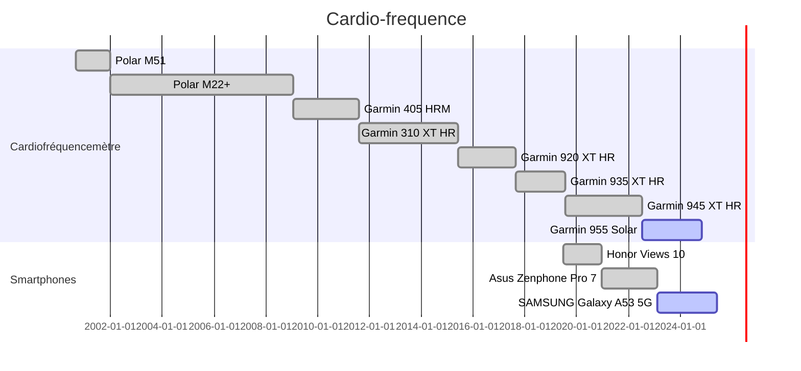
