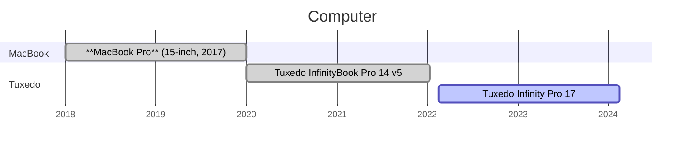

# Hardware

## TUXEDO

Je conseille cette marque : :computer: [Tuxedo](https://www.tuxedocomputers.com/) , pour faire des dev sous Ubuntu. C'est un très bon rapport qualité/prix.

- [TUXEDO InfinityBook Pro 14 v5 : Suppression de la batterie](https://www.cyber-neurones.org/2021/08/tuxedo-infinitybook-pro-14-v5-suppression-de-la-batterie/)

- [TUXEDO Computers GmbH : TUXEDO InfinityBook Pro 14 v5](https://www.cyber-neurones.org/2020/01/tuxedo-computers-gmbh-tuxedo-infinitybook-pro-14-v5/) : Toujours en vie, donc il a plus de 3 ans. 

Mes portables de dev (sous Ubuntu), je change tous les 2-3 ans :

- :computer: Tuxedo InfinityBook Pro 14 v5 : ( 1500 Euros :euro: )
  - 64 GB DDR4
  - 2x1 To SSD SAMSUNG
  - Garantie 2 ans
- :computer: Tuxedo Infinity Pro 17 : ( 2300 Euros :euro: ) 
  - 64 GB DDR4
  - 2x1 To SSD SAMSUNG
  - NVIDIA GeForce RTX 3060 ( Fortement recommandé, pas pour jouer  ) 
  - Garantie 2 ans

A noter que j'ai arreté les MacBook car la mémoire était soudé et que le prix devenait déraisonnable ... Et je regrette pas, pour avoir un MacBook avec 64 GB de DDR4 et 2x1 To de SSD SAMSUNG ... euh, c'est pas possible.

