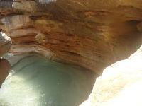

## Cayonning

### France

#### Alpes :

- Megève avec Les Guides de Megève : 
    - Torrent Planay : 1h20. (Approche : 0h05 / Retour : 0h15)
    - Note sur descente-canyon.com : 2.7/4 (25 votes)
    - Nom : La belle au bois.

##### Alpes-maritimes :

- Bar-sur-loup : 
    - Le Loup : 2h00. (Approche : 0h10 / Retour : 0h15)
    - Note sur [descente-canyon.com](descente-canyon.com) : 2.1/4 (55 votes)

-  [Breil-sur-roya avec Les Guides du Mercantour](https://www.cyber-neurones.org/2016/06/canyon-du-ruisseau-daudin/)
    - Audin : 1h40. (Approche : 0h40 / Retour : 0h20)
    - Note sur [descente-canyon.com](descente-canyon.com) : 2.6/4 (111 votes)

#### Pyrénées :

- [Canyon d’Hèas avec Hautes Pyrénées Canyoning.](https://www.cyber-neurones.org/2016/07/canyon-dheas/)
    - Gave d’Héas : 3h05 (Approche : 0h05 / Retour : 0h15)
    - Note sur [descente-canyon.com](descente-canyon.com) : 2.8/4 (27 votes)

### Espagne

- [Canyon : Los Oscuros del Balcés (Rodellar)](https://www.cyber-neurones.org/2016/08/canyon-los-oscuros-del-balces-rodellar/)
    - Rio : 2h30
    - Nom : Los Oscuros del Balcés.
    - Note sur [descente-canyon.com](descente-canyon.com) : 3.2/4 (84 votes)

- [Canyon : La peonera inférieure – Bierge (Huesca)](https://www.cyber-neurones.org/2016/07/canyon-la-peonera-inferieure-bierge-huesca/)
    - Rio Alcanadre : 4h05. (Marche aller : 50 min / Marche Retour : 15 min)
    - Nom : La peonera inférieure.
    - Note sur [descente-canyon.com](descente-canyon.com) : 3.1/4 (66 votes)

- [Canyon Formiga à Bierge (Huesca)](https://www.cyber-neurones.org/2016/07/canyon-formiga-a-bierge-huesca/)

## Via Ferrata

### France

### Espagne

- [Via Ferrata : Espolon de la Virgen (Rodellar).](https://www.cyber-neurones.org/2016/07/via-ferrata-espolon-de-la-virgen-rodellar/)
