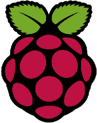

### [RASPBIAN](https://raspbian.org)

- [IoT : les langages de programmation les plus utilisés](https://www.cyber-neurones.org/2019/04/iot-les-langages-de-programmation-les-plus-utilises/) :date: 2019-04

#### Raspberry

- [Raspberry ( Raspbian : stretch ) / Git Server : Installation en bref](https://www.cyber-neurones.org/2018/11/raspberry-raspbian-stretch-git-server-installation-en-bref/) :date: 2018-11

- [Raspberry ( Raspbian : stretch ) / OwnCloud (10.0.10) : Installation en bref …](https://www.cyber-neurones.org/2018/11/raspberry-owncloud-installation-en-bref/) :date: 2018-11

- [SWAP sur Raspbian](https://www.cyber-neurones.org/2018/10/swap-sur-raspbian/) :date: 2018-11

- [PSSH/SSHPASS : Lancer des scripts en parallèle.](https://www.cyber-neurones.org/2018/10/pssh-sshpass-lancer-des-scripts-en-parallele/) :date: 2018-10

- [Raspberry / Munin / USB : Température via l’USB](https://www.cyber-neurones.org/2018/10/raspberry-munin-usb-temperature-via-lusb/) :date: 2018-10

- [Raspberry / Munin / USB : Température via l’USB : OK mais s’abstenir si on n’est pas développeur !](https://www.cyber-neurones.org/2018/10/munin-usb-temperature-via-lusb-ok-mais-sabstenir-si-on-nest-pas-developpeur/) :date: 2018-10

- [Raspberry/Munin : Plugin pour Awox pour suivre la consommation.](https://www.cyber-neurones.org/2018/10/raspberry-munin-plugin-pour-awox-pour-suivre-la-consommation/) :date: 2018-10

- [Raspberry/Jeedom : Installation …](https://www.cyber-neurones.org/2018/10/raspberry-jeedom-installation/) :date: 2018-10

- [Raspberry/ELK : Installation de Filebeat](https://www.cyber-neurones.org/2018/10/raspberry-elk-installation-de-filebeat/) :date: 2018-10

- [Raspberry/ELK : Installation sur 3 Raspberry(s) ](https://www.cyber-neurones.org/2018/10/raspberry-elk-installation-sur-3-raspberrys/) :date: 2018-10

- [Raspberry/Rsyslog : Centralisation des logs via syslog](https://www.cyber-neurones.org/2018/10/raspberry-rsyslog-centralisation-des-logs/) :date: 2018-10

- [Raspberry : Installation de l’écran WAVESHARE 5″ HDMI LCD (B)](https://www.cyber-neurones.org/2018/10/raspberry-installation-de-lecran-waveshare-5-hdmi-lcd-b/) :date: 2018-10

- [Munin/Raspberry : Correction à faire ?! ( irqstats, snmp_admin_swap, acpi )](https://www.cyber-neurones.org/2018/10/munin-raspberry-correction-a-faire-irqstats-snmp_admin_swap-acpi/) :date: 2018-10

- [Raspberry : Disque SSD vs Carte SD](https://www.cyber-neurones.org/2018/10/raspberry-disque-ssd-vs-carte-sd/) :date: 2018-10

- [Si tu n’as pas de salle serveur à 50 ans, on peut dire que tu as raté ta vie ;)](https://www.cyber-neurones.org/2018/10/si-tu-nas-pas-de-salle-serveur-a-50-ans-on-peut-dire-que-tu-as-rate-ta-vie/) :date: 2018-10

- [Raspberry/Munin : Installation d’un client SNMP pour Munin](https://www.cyber-neurones.org/2018/09/raspberry-munin-installation-dun-client-snmp-pour-munin/) :date: 2018-09

- [Raspberry : Configuration réseau sur une Raspbian GNU/Linux 9 (stretch) avec une Freebox](https://www.cyber-neurones.org/2018/09/raspberry-configuration-reseau-sur-une-raspbian-gnu-linux-9-stretch-avec-une-freebox/) :date: 2018-09

- [Raspberry/Munin : Monitor d’un site WordPress distant ( httpresponsetime )](https://www.cyber-neurones.org/2018/09/raspberry-munin-monitor-dun-site-wordpress-distant-httpresponsetime/) :date: 2018-09

- [Raspberry/Mac OS : ApplePi-Baker : Créer une carte SD pour le Raspberry.](https://www.cyber-neurones.org/2018/09/raspberry-mac-os-applepi-baker-creer-une-carte-sd-pour-le-raspberry/) :date: 2018-09

- [Raspberry : Que faire avec ?](https://www.cyber-neurones.org/2018/09/raspberry-que-faire-avec/) :date: 2018-09

- [OSMC/Raspberry : Basculement d’un carte SD à un disque dur SSD.](https://www.cyber-neurones.org/2018/09/osmc-raspberry-basculement-dun-carte-sd-a-un-disque-dur-ssd/) :date: 2018-09

- [OSMC/Raspberry : installation de munin ( et Apache2) avec un script pour Freebox](https://www.cyber-neurones.org/2018/09/osmc-raspberry-installation-de-muni-node-et-apache2-avec-un-script-pour-freebox/) :date: 2018-09

- [OSMC/Raspberry : Ajout de ELK ( Elasticsearch / Logstash / Kibana / Beats / Nginx )](https://www.cyber-neurones.org/2018/09/osmc-raspberry-ajout-de-elk-elasticsearch-logstash-kibana-beats-nginx/) :date: 2018-09

- [Installation un media-center avec OSMC sur un Raspberry Pi 3 Model B](https://www.cyber-neurones.org/2016/09/installation-un-media-center-avec-osmc-sur-un-raspberry-pi-3-model-b/) :date: 2016-09

#### Rock64

- [Rock64 / Débian : Ajouter un disque dur externe](https://www.cyber-neurones.org/2019/09/rock64-debian-ajouter-un-disque-dur-externe/) :date: 2019-09

- [Installation de NextCloud sur Rock64](https://www.cyber-neurones.org/2019/09/installation-de-nextcloud-sur-rock64/) :date: 2019-09

- [Rock64 : Les premiers pas …](https://www.cyber-neurones.org/2019/03/rock64-les-premiers-pas/) :date: 2019-03

- [Rock64 & 2 capteurs de débits d’eau ( Débitmètre )](https://www.cyber-neurones.org/2019/03/rock64-2-capteurs-de-debits-deau-debitmetre/) :date: 2019-03

