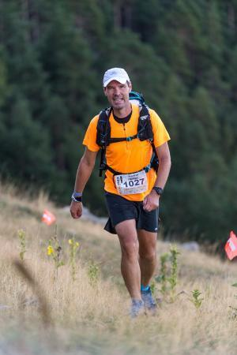
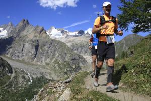
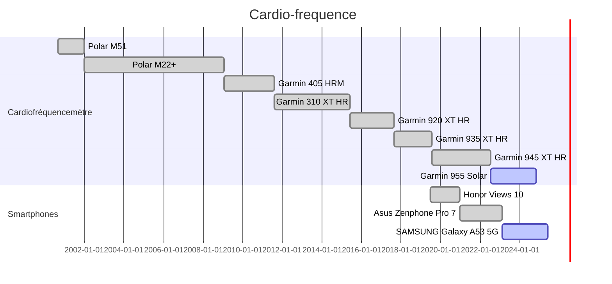
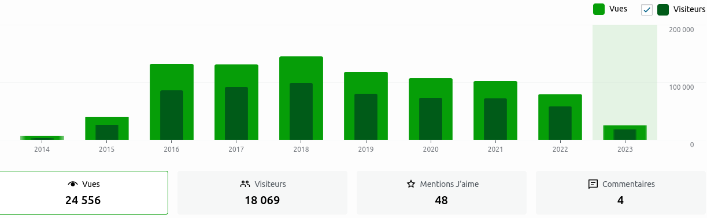
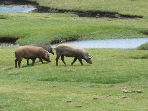
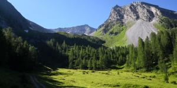
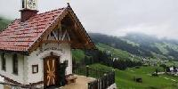
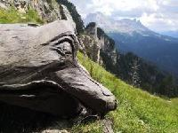

ARIAS FREDERIC
==============

Ma "vie publique" en un seul Markdown (version fr) , :construction: en cours de construction. :construction: 

Ceci n'est pas un CV car je ne sais pas faire de CV. Je fais tellement de POC avec tellement de techno ...  Ce qui est sûr c'est que ma compétence première est Linux et plutôt le coté serveur. Sachant que vu que je fais du C on peut le mettre sur le l'IoT sans problème.

Mon but dans un premier temps c'est la migration de mon blog sous Hugo.

# Liens externes 

- [Mon blog](www.cyber-neurones.org)
   - Actuellement mon blog est sur Wordpress, j'utilise mon bloc comme "Bloc Note Public" sachant que mon "Bloc Note Privé" c'est [Joplin](https://joplinapp.org/). L'idée est donc d'avoir le même format pour les post à savoir [Markdown](https://fr.wikipedia.org/wiki/Markdown) . Le mieux est donc de migrer vers [Hugo](https://gohugo.io/) . J'ai vu qu'il existait [des softs pour la migration](https://gohugo.io/tools/migrations/#wordpress) . La seule fonctionnalité que je ne veux pas perdre c'est de pouvoir visualiser les GPX de facons dynamique.   

- [Linkedin](http://fr.linkedin.com/in/ariasfrederic)

   - [A noter que j'ai bloqué des comptes sur Linkedin](https://www.cyber-neurones.org/2022/01/linkedin-bloquer-les-covidiots/)
   - [Certification de mon parcours](https://www.lassuranceretraite.fr/vitae/index.html#/c?p=8fdf2636ccb2425b8c19b6cde2c20d04)

- [Mastodon](https://pouet.chapril.org/@Cyberneurones)

- Pas de Twitter, Pas de Facebook(Supprimé le 26/11/2018) , Pas d'Instagram(Supprimé le 26/11/2018), Pas de WhatsApp (Supprimé le 26/11/2018), Pas de Pinterest (Supprimé le 26/11/2018), Pas de Viadeo (Supprimé le 26/11/2018), Pas de Xing (Supprimé le 26/11/2018) ....

# Experiences professionnelles :

## SECOM / HONEYWELL / RESIDEO - :round_pushpin: Mougins 

De Mi-Mai 2001 à aujdourd'hui.

### 2023 (RESIDEO)

#### Langage Dev : 

- C (70%) / PHP (20%) / BASH / AEL. 

- Protocol XML / JSON / SIP / RTP / Alarm ...

#### OS :

- Oracle Linux 8.7 / Oracle Linux 7.9 / Oracle Linux 9.1 .

- Ubuntu 

- Kali 

- Docker 
   - Oracle Linux.
   - RancherOS.
   - Alpine.

- Yocto
   - Linphone

#### Software 

- [PostgreSQL](https://www.postgresql.org/) / [Redis](https://redis.io/) / NGINX / Mosquitto / MySQL / RabbitMQ / Jenkins / Supervisord / Grafana.

- Asterisk 
   - Script AEL for Asterisk .
   - Build / Installation / Administration Asterisk .
   - Pour Oracle Linux .

#### Tools 

- Teams / Slack / JIRA / Github / SVN / 

### 2022 (RESIDEO)

#### Langage Dev : 

- C (70%) / PHP (20%) / BASH / AEL.

- Protocol XML / JSON / SIP / RTP / Alarm ...

#### OS :

- Oracle Linux 8.7 / Oracle Linux 7.9 / Oracle Linux 9.1 .

- Ubuntu .

- Kali .

- Docker .
   - Oracle Linux.
   - RancherOS.
   - Alpine.

- Marathon/Apache Mesos : End of life.
  - [Marathon/Mesos : Environnement complet via Docker ( docker-compose )](https://www.cyber-neurones.org/2022/04/marathon-mesos-environnement-complet-via-docker-docker-compose/)

#### Software 

- [PostgreSQL](https://www.postgresql.org/) / [Redis](https://redis.io/) / NGINX / Mosquitto / MySQL / RabbitMQ / Jenkins / Supervisord / Prometheus / Grafana.

- Asterisk
   - Script AEL for Asterisk .
   - Build / Installation / Administration Asterisk .
   - Pour Oracle Linux .

#### Tools 

- Teams / Slack / JIRA / Github / SVN /

#### Notes 

- [Quels sont les langages de programmation les plus verts ? (Dr. Milan Milanović)](https://www.cyber-neurones.org/2022/08/quels-sont-les-langages-de-programmation-les-plus-verts-dr-milan-milanovic/)

- [Voici pourquoi linux est plus facile à débugger](https://www.cyber-neurones.org/2022/08/voici-pourquoi-linux-est-plus-facile-a-debugger/)

- [Asterisk : Fichier asterisk.service pour Oracle Linux 8.6](https://www.cyber-neurones.org/2022/07/asterisk-fichier-asterisk-service-pour-oracle-linux-8-6/)

- [Migration de Oracle Linux 7.x vers Oracle Linux 8.x avec leapp : Echec complet](https://www.cyber-neurones.org/2022/05/migration-de-oracle-linux-7-x-vers-oracle-linux-8-x-avec-leapp-echec-complet/)

### 2021 (RESIDEO)

#### OS :

- Oracle Linux 8.x / Oracle Linux 7.x 

- Ubuntu .

#### Software 

- [PostgreSQL](https://www.postgresql.org/) / [Redis](https://redis.io/) / NGINX / Mosquitto / MySQL / RabbitMQ / Jenkins / Supervisord / Prometheus / Grafana.

#### Tools 

- Teams / Slack / JIRA / Github / SVN /

#### Notes 

- [Oracle Linux 8.2 : Installation de redis.so pour PHP 7.2](https://www.cyber-neurones.org/2021/02/oracle-linux-8-2-installation-de-redis-so-pour-php-7-2/)

### 2020

### 2019

#### Notes

- [Issue : Only one processor or Unsupported PM cap regs version (7).](https://www.cyber-neurones.org/2019/12/issue-only-one-processor-or-unsupported-pm-cap-regs-version-7/) : Oracle Linux 7.3

- [Jenkins / LibVirt / Qemu / Fédora : Brouillon d’une tentative de mise en place …](https://www.cyber-neurones.org/2019/09/jenkins-libvirt-qemu-fedora-brouillon-dune-tentative-de-mise-en-place/)

### 2018 

#### Notes 

- [Resideo : Mon premier jour chez Resideo](https://www.cyber-neurones.org/2018/10/resideo-mon-premier-jour-chez-resideo/)

- [Oracle Linux 7.x : History of GLIBC and CVE](https://www.cyber-neurones.org/2018/06/oracle-linux-7-x-history-of-glibc-and-cve/)

### 2017

#### Notes

- [Redis : Configuration et performance sous Fédora & Redhat](https://www.cyber-neurones.org/2017/09/redis-configuration-et-performance-sous-fedora-redhat/)

- [tmpwatch : Ménage dans /tmp/ sous Linux Redhat & Fédora](https://www.cyber-neurones.org/2017/01/tmpwatch-menage-dans-tmp-sous-linux-redhat-fedora/)

### 2016

### 2015

### 2014

### 2013

### 2012

### 2011

### 2010

### 2009

### 2008

### 2007

### 2006

### 2005

### 2004

### 2003

### 2002

### 2001

### Connaissances informatiques

Impossible de lister tous les protocoles et outils ... 

- Langages de Programmation :  C, C++, Perl, PHP, Java (JSB, Servlets), JavaScript, GO LANG, Python, Bash , Perl, Pascal ...
   - 70% de mes programmes sont fait en C, le Java/Javascript/Pascal je le fais que sous la torture ... et j'aimerai bien faire du RUST. 

- Langages de balisage :  XML, HTML, JSON, Markdown ...

- Langages de requête   : SQL, PL/SQL , NoSQL (comme REDIS) ...

- Librairie : CURL, OPENSSL, HIREDIS, SYSLOG, SIP, MQTT ...

- Database : SGBD Oracle, MySQL (et maintenant MariaDB), MSQL, Access, PostgreSQL, SQL server, MongoDB, Redis, SQLLite ...

- Protocoles ouverts : HTTP , FTP,  SIP, UCP, SMS ...

- Protocoles dédiée à la securité : SIA DC 03, SIA DC 07, SIA DC 09, CONTACT-ID, SURGARD MLR2, ADEMCO 685, F1COM, SECOM3, VAT, TIP ( TIP-EVT, ..)  .... 

- Serveurs (non Database & MQTT ) : Apache, Tomcat, Bind, OpenLDAP, SendMail, Samba, wu-Ftp, Asterisk, OpenSSH, QNIX, Munin, ELK, Jenkins ...

- Statistiques :  ProjetR ...

- Développement sous CVS, SVN, GIT, Bitbucket ..

- Tools : gcc, gdb, lsof, strace, gprof, google Test : [Gtest](https://github.com/google/googletest) ... 

- Divers Editeurs :  vi, emacs, LaTex, Doxygen, xfig , JBuider, mkdocs ....

- VirtualBox, VMWare, Docker ...

- Outils [Atlassian](https://fr.atlassian.com) : JIRA, Confluence, Bamboo, Bitbucket ...

- Outils Microsoft : Teams, Excel, Words ...

### Support Client ( SeCOM / HONEYWELL / RESIDEO ) 

J’ai effectué de nombreux déplacements en Espagne ( :round_pushpin: Madrid, :round_pushpin: Barcelone ) , en Finlande ( :round_pushpin: Helsinki) , en Norvège ( :round_pushpin: Olso ) , en Suède ( :round_pushpin: Linkoping , :round_pushpin: Malmo ) , au Portugal ( :round_pushpin: Lisbonne ),  en France ( :round_pushpin: Paris , :round_pushpin: Aix-en-Provence , :round_pushpin: Strasbourg , :round_pushpin: Dieppe , :round_pushpin: Besancon , :round_pushpin: Lyon , :round_pushpin: Nantes , :round_pushpin: Blois , :round_pushpin: Signes , :round_pushpin: Toulouse , :round_pushpin: Hossegor , :round_pushpin: Bry-sur-Marne )  , en Grande-Bretagne ( :round_pushpin: Manchester ) , en Italie ( :round_pushpin: Come , :round_pushpin: Florence , :round_pushpin: Milan ), en Russie ( :round_pushpin: Moscou ), en Allemagne ( :round_pushpin: Meshede ) , en Suisse ( :round_pushpin: Genève ) pour l’intégration de nos produits, la configuration des produits liés aux nouvelles technologies ( GSM-Data, GPRS, SMS, VOIP, Ethernet, …)

## RIGTHVISION – :round_pushpin: Mouans Sartoux 

- De Mi-Janvier 2001 à Mi-Mai 2001

- Righvision est une société qui développe des Appliances ( EyeBox ) sous Linux. http://www.rightvision.com/

- Développeur sous Windows et sous Linux.

- Création d’une interface en PHP pour la gestion de MySQL.
- Mise en place de Bench en Perl et optimisation sur MySQL sous Linux.
- Création d’une interface générique et développement d’un bureau virtuel en Flash5.

- Environnement : Linux( RedHat ), Windows, Perl, PHP, Apache, OpenlDAP, CVS, MySQL, Flash5( Action Script )

## CYBERWORKERS – :round_pushpin: Aubagne 

- De Mi-Avril 2000 à Mi-Janvier 2001

- Cyberworkers est une société qui développe une plate-forme destinée au télétravail pour les indépendants. http://www.cyberworkers.com/ Développeur, concepteur et DBA de 80% de la plate-forme sous LINUX :

- Création de pages dynamiques : Utilisation de PHP et SQL :
   - MySQL – Apache .
   - PostgreSQL – Apache.
   -  OpenLDAP – Apache.

- Création de requêtes complexes sous PostgreSQL : Utilisation de PL/SQL & PL/Perl

- Création d’une application pour le WAP.

- Développement en PERL – JavaScript – C – Java ( JSP, servlets ) .

- Création du MLD ( Modèle Logique des Données ) à l’aide des méthodes MERISE et UML (120 tables).

- Rédaction de la documentation.

- Environnement : Linux( Debian, SuSE ), Perl, PHP, JavaScript, C, Java (JSP, servlets), Apache, Merise, UML, PL/SQL, Tomcat

## Connaissance OS :

Systèmes Linux ( Debian, RedHat, SuSE, Fedora, Oracle Linux , Yocto), Unix SCO, NetBSD, Docker (sur mon blog), Raspberry.

Dans le détail des OS utilisés pour le dev dans l’ordre d’apparition :

- Redhat 5.2 ( la date de release est : 2 novembre 1998 ) : A l’université de Toulouse.
- SuSE & Mandrake : Au Centre Océanographique de Marseille.
- Debian ? & NetBSD : Chez Cyber-workers / Alias .
- Redhat ? : Chez Rightvision / Altior .
- Redhat 7.2 ( date release : 22 octobre 2001 ) & Unix SCO version 5 : Chez Honeywell / SeCOM
- Redhat 8.0 ( date release : 30 septembre 2002 )  : Chez Honeywell / SeCOM
- Redhat 9.0 ( date release : 31 septembre 2003 )  : Chez Honeywell / SeCOM
- Fédora 9.0 ( date release : 13 mai 2008 ) : Chez Honeywell / SeCOM
- Fédora 14.0 ( date release : 2 novembre 2010 )  : Chez Honeywell / SeCOM
- Fédora 17.0 ( date release : 29 mai 2012 ) : Chez Honeywell / SeCOM
- Oracle 7.0  ( date release : 23 juillet 2014 ) : Chez Honeywell / SeCOM
- Oracle 7.2 ( date release : 25 novembre 2015 ) : Chez Honeywell / SeCOM
- Oracle 7.3 ( date release : 10 novembre 2016 ) : Chez Honeywell / SeCOM
- Oracle 7.4 ( date release : 8 aout 2017 ) : Chez Honeywell / SeCOM
- Oracle 7.5 ( date release : 17 avril 2018 ) & Fédora 26 ( date release : 11 juillet 2017 ) sous Docker 17 ( RancherOS : https://rancher.com/rancher-os/ ): Chez Honeywell / SeCOM
- Ubuntu 16.04 ( date release : 21 avril 2016 ) & YOCTO :  Chez Resideo / SeCOM .
- Ubuntu 18.04 ( date release : 26 avril 2018 ) & YOCTO :  Chez Resideo / SeCOM .
- Oracle 7.6 ( date release : 2019-08-15 ) : Chez Resideo / SeCOM .
- Oracle 8.2 ( date release : 2020-05-06 ) : Chez Resideo / SeCOM .
- Oracle 8.3 ( date release : 2020-11-13 ) : Chez Resideo / SeCOM .
- Ubuntu 20.04 ( date release : 23 avril 2020 ) & Docker :  Chez Resideo / SeCOM .
- Debian 11 : Chez Resideo / SeCOM .
- Oracle Linux 7.9 :  Chez Resideo / SeCOM .
- Oralce Linux 8.7 : Chez Resideo / SeCOM .
- [Oracle Linux 9.1](https://docs.oracle.com/en/operating-systems/oracle-linux/9/relnotes9.1/) : Chez Resideo / SeCOM .
- [Kali](https://www.kali.org/) : Chez Resideo / SeCOM .
- [Alpine](https://www.alpinelinux.org/releases/) : Chez Resideo / SeCOM .
- Ubuntu 22.04 ( date release : April 21, 2022 ) : Chez Resideo / SeCOM .

# Formations 

## Initiales

### 1999-2000 D.E.S.S. Mathématiques pour l’Ingénieur - :round_pushpin: Marseille

- Université de la Méditerranée & de Provence. Mention Assez-bien.

- PNOC : Programme National d’Observation Côtière ( Projet DESS ) - Période Plus de 6 mois
   - Projet Client/Serveur :
      - Création d’une base de donnée relationnelle sur des données scientifiques océanographiques (Centre Océanographique de Marseille) à partir de données à « plat » ( fichier texte).
         - Analyse des données : établissement du dictionnaire des données
         - Création d’un modèle conceptuel de la BD : création des tables (utilisation de la Méthode MERISE )
         - Enrichissement des tables, à partir de fichier texte : programmation en Perl
         - Création de formulaire d’interrogation de la base de donnée à travers le Web par le langage PHP3 intégré à HTML ainsi que du JavaScript
         - Environnement : Linux ( Mandrake ) et Linux ( SuSE ), MySQL, SQL, C, Perl, PHP, JavaScript, HTML, Apache

### 1998-1999 Maîtrise d’Ingénierie Mathématique – Section calcul scientifique - :round_pushpin: Toulouse

Université Paul Sabatier. Mention Assez-bien.

### 1994-1995 Baccalauréat Scientifique (Option Mathématiques) - :round_pushpin: Castres

Lycée La Borde Basse. Mention Passable.

## Autres

- Six Sigma : DFSS : Design For Six Sigma (1 semaine) à :round_pushpin: Comes (Italie) : Juin 2004. 

- Formation à l’Institut Nationale des Télécoms d’Evry à :round_pushpin: Evry ( http://int-evry.fr/ ) : Novembre 2004 (2 semaines).

- Formation Administration SQL Server : CM 2321 (2 semaines) à :round_pushpin: Sophia-Antipolis ( Newport Communications ) : Décembre 2005 .

- Formation Linux Embarqué Yocto BSP à :round_pushpin: Sophia-Antipolis ( http://www.phytec.fr )  : Septembre 2018 (1 semaine) 

# Salons

#### Salon Open Source Expérience à :round_pushpin: Paris (Open Source Summit) : novembre 2022 

Sujets :

#### Salon Linux à :round_pushpin: Paris (Open Source Summit) : Dock pullman : décembre 2017

Tags : #OSSParis2017

Sujets : DevOps , Python , Haskell , Cloud , IA , Cybersecurity .

- [Paris Open Source Summit 2017 : #OSSParis2017](https://www.cyber-neurones.org/2017/12/paris-open-source-summit-2017-ossparis2017/)

#### Docker à :round_pushpin: Sophia-Antipolis : mars 2017 

Sujet : Docker

- [Celebration of Docker’s 4th Birthday à Sophia-Antipolis](https://www.cyber-neurones.org/2017/03/celebration-of-dockers-4th-birthday-a-sophia-antipolis/)

#### Salon Linux à :round_pushpin: Paris (Open Source Summit) : Dock pullman : novembre 2016 : http://www.opensourcesummit.paris

Sujets :

- [Paris Open Source Summit 2016 : #OSSPARIS2016 ](https://www.cyber-neurones.org/2016/11/paris-open-source-summit-2016-ossparis2016/)

#### Docker à :round_pushpin: Sophia-Antipolis : mars 2016 .

Sujet : Docker

#### Salon Linux à :round_pushpin: Paris (Open Source Summit) : Dock pullman : novembre 2015 : http://www.opensourcesummit.paris

Sujets :

#### Salon Cloud à :round_pushpin: Paris : Mars 2012

Sujets :

#### Salon Linux à :round_pushpin: Paris : Avril 2009

Sujets :

#### Salon VOIP à :round_pushpin: Paris : Avril 2008

Sujets :

#### Salon VOIP à :round_pushpin: Paris : Mai 2006

Sujets :

#### Salon Linux à :round_pushpin: Paris : Février 2006

Sujets :

#### Salon Linux à :round_pushpin: Paris 

Sujets :

# Loisirs 

## Compétitions

- [Strava](https://www.strava.com/athletes/12487918) : Profil privé. :lock:

- [ITRA](https://itra.run/RunnerSpace/ARIAS.Frederic/1260843) : Profil public. :unlock:

- [J'aime courrir](https://www.jaimecourir.fr/) : Profil privé. :lock:

- [BeTrail](https://www.betrail.run/runner/arias.frederic/overview) : Profil public. :unlock:

- [kikourou](http://www.kikourou.net/) : Profil public. :unlock:

### 2023

#### Ventoux Gravel Trans Massifs : Dentelles & Sommets 

- :link: [Wordpress](https://www.cyber-neurones.org/2023/05/ventoux-gravel-trans-massifs-edition-2023/)

- :bicyclist: Gravel, 114 km, 3300 m D+, 10:15:47. :round_pushpin: Bédouin

#### Semi-marathon de :round_pushpin: Nice 

- :link: [Wordpress](https://www.cyber-neurones.org/2023/04/semi-marathon-de-nice-edition-2023/)

- :runner: Course, 21 km, 90m D+, 01:51:30.

- :triangular_flag_on_post: :fr: FFA : 1390. (1149M - 133M2)	1h51'28'' :round_pushpin:  Nice 

#### Trail des baous de Saint-Jeannet – Parcours de 13 km

- :link: [Wordpress](https://www.cyber-neurones.org/2023/03/trail-des-baous-de-saint-jeannet-parcours-de-13-km-edition-2023/)

- :runner: Trail, 13 km, 670m D+, 01:38:34.

#### Trail du Ventoux : Origine 46 km 

- :link: [Wordpress](https://www.cyber-neurones.org/2023/03/trail-du-ventoux-origine-46-km-edition-2023/)

- :runner: Trail, 46 km, 2690m D+, 07:31:53.

- :triangular_flag_on_post: :fr: FFA : 746. (658M - 118M2)	7h31'40''  :round_pushpin:	Bedoin

- :triangular_flag_on_post: :star: ITRA : Ranking 746 / 1074  iTRA Score : 449 

#### Balcon de la Roya 

- :link: [Wordpress](https://www.cyber-neurones.org/2023/03/trail-balcon-de-la-roya-edition-2023/)

- :runner: Trail, 16 km, 1057m D+, 02:16:15

- :triangular_flag_on_post: :fr: FFA :  52. (49M - 7M2)	2h16'23''

#### Trаіl dеs Сrêtеs de :round_pushpin: Gréolières-les-neiges 

- :link: [Wordpress](https://www.cyber-neurones.org/2023/02/tr%d0%b0%d1%96l-d%d0%b5s-%d1%81ret%d0%b5s-de-greolieres-les-neiges-edition-2023/)

- :runner: Trail, 11 km, 600m D+, 01:38:37

#### Urban Trail de :round_pushpin: Cannes : Version 26 km 

- :link: [Wordpress](https://www.cyber-neurones.org/2023/01/urban-trail-de-cannes-edition-2023-version-26-km-le-vrai/)

- :runner: Trail, 26 km, 686 m D+, 02:42:48

- :triangular_flag_on_post: :fr: FFA : 154. (135M - 18M2)	2h42'50''

### 2022

#### Cross Amnesty de :round_pushpin: Valbonne 

- :link: [Wordpress](https://www.cyber-neurones.org/2022/12/cross-amnesty-de-valbonne-edition-2022/)

- :runner: Cross, 11 km, 296 m D+, 00:59:30

- :triangular_flag_on_post: :fr: FFA : 51. (46M - 13M2)	59'31''

#### Courir pour une fleur à :round_pushpin: Antibes 

- :link: [Wordpress](https://www.cyber-neurones.org/2022/10/courir-pour-une-fleur-a-antibes-edition-2022/)

- :runner: Course, 10 km, 109 m D+, 00:48:27

- :triangular_flag_on_post: :fr: FFA : 312. (267M - 38M2)	48'55'' (48'19'')

####  Trail Per Cami : Parcours découverte de 13 km

- :link: [Wordpress](https://www.cyber-neurones.org/2022/09/trail-per-cami-parcours-decouverte-de-13-km-edition-2022/)

- :runner: Tail, 13 km, 1043 m D+, :watch: 02:19:12

- :triangular_flag_on_post: :fr: FFA : 32. (28M - 7M2) :watch:	2h19'13''

#### Trail Mounte Cala à :round_pushpin: Gréolières-les-Neiges

- :link: [Wordpress](https://www.cyber-neurones.org/2022/07/trail-mounte-cala-a-greolieres-les-neiges-edition-2022/)

- :runner: Trail, 12 km, 1072 m D+, :watch: 02:54:56

#### Traversée des Dentelles de Montmirail

- :link: [Wordpress](https://www.cyber-neurones.org/2022/06/trail-traversee-des-dentelles-de-montmirail-ou-marathon-de-gigondas-ou-marathon-des-dentelles-edition-2022/)

- :runner: Trail, 42 km, 2168 m D+, :watch: 07:30:11

- :triangular_flag_on_post: :fr: FFA : 197. (168M - 24M2) :watch:	7h30'24'' 

#### Trail de Rimplas

- :link: [Wordpress](https://www.cyber-neurones.org/2022/05/trail-de-rimplas-2022-superbe-organisation/)

- :runner: Trail, 20 km, 1669 m D+, :watch: 04:18:29

- :triangular_flag_on_post: :fr: FFA : 31. (25M - 4M2) :watch:	4h18'28''

#### Trail de :round_pushpin: Biot

- :link: [Wordpress](https://www.cyber-neurones.org/2022/05/trail-de-biot-edition-2022/)

- :runner: Trail, 16 km, 398 m D+, :watch: 01:41:21

#### Calvaire d’Antibes

- :link: [Wordpress](https://www.cyber-neurones.org/2022/04/calvaire-dantibes-edition-2022/)

- :runner: Course, 10 km, 205 m D+, :watch: 00:53:19

- :triangular_flag_on_post: :fr: FFA : 132. (115M - 24M2)  :watch: 53'21''

#### Trail des merveilles à :round_pushpin: Breil-sur-roya

- :link: [Wordpress](https://www.cyber-neurones.org/2022/03/trail-des-merveilles-a-breil-sur-roya/)

- :runner: Trail, 33 km, 2068 m D+, :watch: 05:29:01

- :triangular_flag_on_post: :fr: FFA : 	96. (87M - 15M2) :watch:	5h29'16''

### 2021 

#### Cross Amnesty à :round_pushpin: Valbonne

- :triangular_flag_on_post: :fr: FFA : 116. (89M - 15M2) :watch: 	1h15'53''

#### Trail de l'Ours à :round_pushpin: Levens

- :link: [Wordpress](https://www.cyber-neurones.org/2021/11/trail-de-lours-a-levens/)

- :runner: Trail, 30 km, 2062 m D+, :watch: 05:39:34

- :triangular_flag_on_post: :fr: FFA : 146. (131M - 14M2) :watch:	5h39'42'' (5h39'31'')

#### Grasse Running Days 2021 : Trail de 24 km

- :link: [Wordpress](https://www.cyber-neurones.org/2021/11/grasse-running-days-2021/)

- :runner: Trail, 24 km, 1181 m D+, :watch: 03:15:33

- :triangular_flag_on_post: :fr: FFA : 117. (110M - 22M2) :watch:	3h15'55''

#### Semi-marathon de :round_pushpin: Nice

- :link: [Wordpress](https://www.cyber-neurones.org/2021/09/semi-marathon-de-nice-edition-2021/)

- :runner: Course, 21 km, 166 m D+, :watch: 01:50:13

- :triangular_flag_on_post: :fr: FFA :  	519. (460M - 66M2) :watch:	1h51'55'' (1h50'13'')

#### Urban Trail de :round_pushpin: Cannes 

- :link: [Wordpress](https://www.cyber-neurones.org/2021/09/urban-trail-de-cannes-edition-2021/)

- :runner: Trail, 27 km, 758 m D+,  :watch: 03:09:51

- :triangular_flag_on_post: :fr: FFA :   130. (109M - 24M2) :watch:	3h09'50''

#### Eco-Trail de :round_pushpin: Carros

- :link: [Wordpress](https://www.cyber-neurones.org/2021/06/eco-trail-de-carros-une-bonne-reprise/)

- :runner: Trail, 8 km, 516 m D+, :watch: 01:06:26

- :triangular_flag_on_post: :fr: FFA : 96. (80M - 14M2) :watch:	1h06'24''

#### Calvaire Antibois Connecté à :round_pushpin: Antibes

- :link: [Wordpress](https://www.cyber-neurones.org/2021/04/calvaire-antibois-connecte-2021/)

- :runner: Course, 10 km,  201 m D+, :watch:  00:53:20

### 2020 

#### EcoTrail de :round_pushpin: Montauroux 19 km

- :link: [Wordpress](https://www.cyber-neurones.org/2020/09/ecotrail-de-montauroux-19-km-edition-2020/)

- :runner: Trail, 20 km, 870 m D+, :watch: 02:34:52

- :triangular_flag_on_post: :fr: FFA : 86. (79M - 13M2) :watch:	2h34'51''

####  UTCAM MERCANTOUR 45 km

- :link: [Wordpress](https://www.cyber-neurones.org/2020/09/trail-utcam-trail-cote-dazur-mercantour-version-45-km-edition-2020/)

- :runner: Trail, 45 km, 3244 m D+, :watch: 10:33:19

- :triangular_flag_on_post: :fr: FFA : 	264. (220M - 30M2) :watch:	10h33'09''

- :triangular_flag_on_post: :star: ITRA : 264 / 327 
   - iTRA SCORE : 400 
   - iTRA POINT : 3
   - Mountain Points : 10
   - Finisher Level : 360

#### Urban Trail de :round_pushpin: Cannes

- :link: [Wordpress](https://www.cyber-neurones.org/2020/01/urban-trail-de-cannes-edition-2020/)

- :runner: Trail, 26 km ,  689 m D+, :watch: 03:01:13

- :triangular_flag_on_post: :fr:  FFA : 492. (408M - 79M2) :watch:	3h01'18'' (3h01'18'')

#### PROM Classic à :round_pushpin: Nice 

- :link: [Wordpress](https://www.cyber-neurones.org/2020/01/prom-classic-edition-2020/)

- :runner: Course

- :triangular_flag_on_post: :fr: FFA :   3021. (2515M - 349M2) :watch: 	57'24'' (51'01'')

### 2019

#### Trail de la Turbie : Pèlerinage de Laghet – 20 km

- :link: [Wordpress](https://www.cyber-neurones.org/2019/12/trail-de-la-turbie-pelerinage-de-laghet-20-km-edition-2019/)

- :runner: Trail, 20 km, 1059 m D+, :watch: 03:06:45

#### Marathon des Alpes-Maritimes à :round_pushpin: Nice 

- :link: [Wordpress](https://www.cyber-neurones.org/2019/11/marathon-des-alpes-maritimes-edition-2019/)

- :runner: Course, 21 km, 

- :triangular_flag_on_post: :fr: FFA : 1573. (1288M - 419V1) :watch:	2h00'15'' (1h57'00'')

#### Courir pour une Fleur à :round_pushpin: Antibes

- :link: [Wordpress](https://www.cyber-neurones.org/2019/10/courir-pour-une-fleur-a-antibes-edition-2019/)

- :runner: Course, 21 km, :watch: 01:57:15

- :triangular_flag_on_post: :fr: FFA : 530. (467M - 199V1) :watch:	1h57'56'' (1h57'09'')

#### Trail de :round_pushpin: Tourrettes-sur-Loup 

- :link: [Wordpress](https://www.cyber-neurones.org/2019/09/trail-de-tourrettes-sur-loup-edition-2019/)

- :runner: Trail, 18 km, 1052 m D+, :watch: 02:31:34

- :triangular_flag_on_post: :fr: FFA :  158. (140M - 39V1) :watch:	2h31'35''

#### UTMB CCC :sweat: Abandon au kilomètre 71 :sweat:

- :link: [Wordpress](https://www.cyber-neurones.org/2019/09/utmb-ccc-abandon-au-kilometre-71-des-regrets/)

- :link: [Wordpress](https://www.cyber-neurones.org/2019/08/utmb-ccc-contenu-de-mon-sac-a-dos/)

- :runner: Trail, 73 km, 4254 m D+, :watch: 17:22:15

- :triangular_flag_on_post: :star: ITRA :  98 km / 6150 m+ 		DNF 	DNF 

#### Trail de UBAYE Elite

- :link: [Wordpress](https://www.cyber-neurones.org/2019/08/trail-de-ubaye-elite-a-barcelonnette-edition-2019/)

- :runner: Trail, 41 km, 2522 m D+, :watch:  07:05:09

- :triangular_flag_on_post: :fr: FFA : 265. (238M - 79V1) :watch: 	7h05'06'' :round_pushpin: Barcelonnette

- :triangular_flag_on_post: :star: ITRA :  40 km / 2420 m+ 
    - :watch:  	7:05:06  
    - :black_circle:	265 / 386 
    - :black_circle: 	238 / 343 
    - iTRA Score	461 

#### Trail de :round_pushpin: Valberg

- :link: [Wordpress](https://www.cyber-neurones.org/2019/06/trail-de-valberg-edition-2019/)

- :runner: Trail, 29 km, 1635 m D+, :watch: 05:23:16

#### Trail Var Verdon

- :link: [Wordpress](https://www.cyber-neurones.org/2019/06/trail-var-verdon-30-km-edition-2019/)

- :runner: Trail,31 km, 1785 m D+, :watch: 06:25:27

- :triangular_flag_on_post: :fr: FFA :  222. (183M - 54V1) :watch:	6h25'26'' :round_pushpin: Aiguines

- :triangular_flag_on_post: :star: ITRA :  30 km / 1560 m+ :watch: 	6:25:26 :black_circle: 	222 / 243 :black_circle:	185 / 197 	iTRA Score 371 

#### Jeux de Sophia

- :link: [Trail](https://www.cyber-neurones.org/2019/06/trail-de-15-km-des-jeux-de-sophia/)

- :link: [Course d'orientation & Course](https://www.cyber-neurones.org/2019/05/jeux-de-sophia-2019/)

#### Trail des Gorges de l’Ardèche 

- :link: [Wordpress](https://www.cyber-neurones.org/2019/05/trail-des-gorges-de-lardeche-gtga-mais-finalement-la-tga/)

- :runner: Trail, 44 km, 1882 m D+, :watch: 07:54:20

- :triangular_flag_on_post: :fr:  FFA  : 171. (143M - 53V1) :watch:	10h54'28'' ( 07h54'20'' ) :round_pushpin:	Saint Martin D'ardeche

- :triangular_flag_on_post: :star: ITRA : 37 km / 1590 m+ :watch: 	10:54:28  :black_circle:	171 / 201  :black_circle:	144 / 164 	iTRA Score 298 

#### 16 ème CO’Tour de Sophia 

- :link: [Wordpress](https://www.cyber-neurones.org/2019/05/16-eme-cotour-de-sophia/)

- :runner: Course d'orientation en 5 étapes.

#### Urban Trail de Biot 

- :link: [Wordpress](https://www.cyber-neurones.org/2019/05/urban-trail-de-biot-edition-2019/)

- :runner: Trail, 17 km, 472 m D+, :watch: 01:51:41

- :triangular_flag_on_post: :fr: FFA : 65. (56M - 21V1) :watch:	1h50'40'' :round_pushpin:	Biot 

#### Semi-Marathon de :round_pushpin: Nice

- :link: [Wordpress](https://www.cyber-neurones.org/2019/05/semi-marathon-de-nice-edition-2019/)

- :runner: Course, 21 km, 162 m D+, :watch:  01:57:04

- :triangular_flag_on_post: :fr: FFA :  1573. (1288M - 419V1) :watch: 	2h00'15'' (1h57'00'') :round_pushpin:	Nice

#### Raid Vallis Bona

- :link: [Wordpress](https://www.cyber-neurones.org/2019/04/raid-vallis-bona-edition-2019/)

- :runner: Course d'orientation, Tir à l'arc, Lancée de buche, Rameur, ....

#### Urban Trail de :round_pushpin: Cannes

- :link: [Wordpress](https://www.cyber-neurones.org/2019/01/urban-trail-de-cannes-edition-2019/)

- :runner: Trail, 26 km, 706 m D+, :watch: 03:07:25

- :triangular_flag_on_post: :fr:  FFA : 	621. (504M - 201V1)  :watch:	3h07'23'' :round_pushpin:	Cannes

#### PROM Classic :round_pushpin: Nice

- :link: [Wordpress](https://www.cyber-neurones.org/2019/01/prom-classic-edition-2019/)

- :runner: Course, 10 km, 

- :triangular_flag_on_post: :fr:  FFA :	2017. (1775M - 499V1) :watch: 	52'06'' (49'16'') :round_pushpin: 	Nice

### 2018

#### Courir pour une fleur à :round_pushpin: Antibes

- :link: [Wordpress](https://www.cyber-neurones.org/2018/10/courir-pour-une-fleur-edition-2018/)

- :runner: Course, 21 km, 242 m D+,  :watch: 02:01:06

- :triangular_flag_on_post: :fr: FFA :    662. (580M - 202V1)	2h02'47'' :round_pushpin:	Antibes

#### Trail UTMB OCC au départ de :round_pushpin: Orsière – Version de 56 km

- 

- :link: [Wordpress](https://www.cyber-neurones.org/2018/09/trail-utmb-occ-au-depart-de-orsiere-version-de-56-km/)

- :runner: Trail, 60 km, 3492 m D+,  :watch: 11:19:38

- :triangular_flag_on_post: :fr: FFA :  969. (775M - 268V1) :watch: 	11h19'45''  :round_pushpin: 	Chamonix Mont Blanc

- :triangular_flag_on_post: :star: ITRA : 56 km / 3450 m+ :watch: 	11:19:45 :black_circle:	969 / 1572 :black_circle:	776 / 1185  iTRA Score	418 

#### Trail des Mélèzes – Version 25 km au départ de :round_pushpin: Colmars

- :link: [Wordpress](https://www.cyber-neurones.org/2018/07/trail-des-melezes-version-25-km-au-depart-de-colmars/)

- :runner: Trail, 28 km, 1964 m D+, :watch: 05:28:56

- :triangular_flag_on_post: :fr: FFA : 	172. (143M - 45V1) :watch: 	5h28'42''	 :round_pushpin:  Beauvezer

#### Trail : HTV : High Trail Vanoise :sweat: Abandon au kilomètre 51 :sweat:

- :link: [Wordpress](https://www.cyber-neurones.org/2018/07/trail-high-trail-vanoise-2018/)

- :link: [Materiel](https://www.cyber-neurones.org/2018/07/materiel-pour-high-trail-vanoise/)

- :runner: Trail, 51 km, 3716 m D+,  :watch: 11:39:46

#### Foulée Biotoise

- :link: [Wordpress](https://www.cyber-neurones.org/2018/07/foulee-biotoise-2018/)

- :runner: Course, :watch: 49:48:00

#### Ultra-Trail Var Verdon

- :link: [Wordpress](https://www.cyber-neurones.org/2018/06/ultra-trail-var-verdon-edition-2018/)

- :runner: Trail, 66 km, 3315 m D+, :watch: 12:28:56

- :triangular_flag_on_post: :star: ITRA :  60 km / 3400 m+  :watch:	12:28:36  :black_circle: 	111 / 179   :black_circle:	103 / 161 iTRA Score	437 

#### Trail La chaussée des Géants – Thueyts Ardèche

- :link: [Wordpress](https://www.cyber-neurones.org/2018/06/trail-la-chaussee-des-geants-thueyts-ardeche-edition-2018/)

- :runner: Trail, 50 km,  2782 m D+,  :watch: 09:02:35

- :triangular_flag_on_post: :fr: FFA : 	157. (151M - 50V1) :watch:	9h02'21'' :round_pushpin:	Thueyts

- :triangular_flag_on_post: :star: ITRA : 49 km / 2870 m+ :watch:  	9:02:21  :black_circle:	157 / 200 :black_circle: 	151 / 187  iTRA Score	435 

#### Jeux de Sophia - Edition 2018

- :link: [Wordpress](https://www.cyber-neurones.org/2018/05/jeux-de-sophia-2018/)

- Tir à l'arc, :runner: Trail, VTT, Karting, Baby Foot, Squash, Bowling, Course d'orientation.

#### Semi-marathon de :round_pushpin: Nice

- :link: [Wordpress](https://www.cyber-neurones.org/2018/04/semi-marathon-de-nice-edition-2018/)

- :runner: Course, 21 km,  :watch:  01:43:43

- :triangular_flag_on_post: :fr: FFA :  	871. (762M - 259V1) :watch: 	1h52'15'' (1h49'44'') :round_pushpin: 	Nice

#### Trail de la Galinette : Les drailles de la Galinette (46 km) à :round_pushpin: Cadolive

- :link: [Wordpress](https://www.cyber-neurones.org/2018/02/trail-de-la-galinette-les-drailles-de-la-galinette-46-km-a-cadolive/)

- :runner: Trail, 46 km

- :triangular_flag_on_post: :star: ITRA : 46 km / 2400 m+ 
   - :watch:	7:59:50 
   - :black_circle: 	228 / 291 
   - :black_circle: 	207 / 264 
   - iTRA Score 	432 

#### Urban Trail de Cannes : 26 km : Grand Cannois

- :link: [Wordpress](https://www.cyber-neurones.org/2018/01/urban-trail-de-cannes-26-km-grand-cannois/)

- :runner: Trail, 26 km

- :triangular_flag_on_post: :fr: FFA :  342. (304M - 125V1) :watch:	2h43'07'' :round_pushpin:	Cannes 

#### PROM Classic à  :round_pushpin:  Nice

- :link: [Wordpress](https://www.cyber-neurones.org/2018/01/prom-classic-edition-2018/)

- :runner: Course, 10 km

- :triangular_flag_on_post: :fr: FFA : 	2092. (1809M - 558V1)	56'14'' (49'01'') :round_pushpin: 	Nice

### 2017

#### Hivernale des templiers : Le marathon d’Orchis.

- :link: [Wordpress](https://www.cyber-neurones.org/2017/12/hivernale-des-templiers-le-marathon-dorchis/)

- :runner: Trail, 39 km, 

- :triangular_flag_on_post: :fr: FFA : 516. (459M - 150V1)	5h29'17'' round_pushpin:	Roquefort Sur Soulzon

- :triangular_flag_on_post: :star: ITRA :  	39 km / 1970 m+ 	
    - :watch: 5:29:17 	
    - :black_circle: 520 / 802
    - :black_circle: 	463 / 659
    - iTRA Score 	448 

#### L’Alpin Trail De PICHAURIS (Edition Elite) – 2017

- :link: [Wordpress](https://www.cyber-neurones.org/2017/11/lalpin-trail-de-pichauris-edition-elite-2017/)

- :triangular_flag_on_post: :fr: FFA : 	Alpin trail e lite 30 kms d/1700m	290. (257M - 111MA)	5h32'44'' :round_pushpin: 	Allauch

- :triangular_flag_on_post: :star: ITRA :  30 km / 1660 m+
    - :watch:	5:32:44 
    - :black_circle:	291 / 327
    - :black_circle: 	258 / 283 
    - iTRA Score	395 

#### Marathon des Alpes-Maritimes en relais

- :link: [Wordpress](https://www.cyber-neurones.org/2017/11/marathon-des-alpes-maritimes-en-relais/)

- :runner: Course,

- :triangular_flag_on_post: :fr: FFA : :watch: 1:52:11 

#### Trail de la Vésubie – version 44 km :sweat: Abandon :sweat:

- :link: [Wordpress](https://www.cyber-neurones.org/2017/08/trail-de-la-vesubie-version-44-km/)

- :runner: Trail,

- :triangular_flag_on_post: :fr: FFA :

#### Jeux de Sophia 2017

- :link: [Wordpress](https://www.cyber-neurones.org/2017/06/jeux-de-sophia-2017/)

- Basket-ball, Tir à l'arc, Tir au pistolet, Football à 5, Karting, Padel, Bowling, Course d'orientation, Babyfoot, Flechettes.

#### Lachens-mer, randonnée en VTT

- :link: [Wordpress](https://www.cyber-neurones.org/2017/05/lachens-mer-randonnee-en-vtt/)

- VTT, 90 km.

#### Trail des Balcons d’Azur : P’tit TBA

- :link: [Wordpress](https://www.cyber-neurones.org/2017/04/trail-des-balcons-dazur-ptit-tba/)

- :runner: Trail :watch: 3:33:26

- :triangular_flag_on_post: :fr: FFA : 283. (229M - 77V1) :watch:	3h34'38'' :round_pushpin: 	Mandelieu La Napoule

#### Trail des 5 Calanques 

- :link: [Wordpress](https://www.cyber-neurones.org/2017/04/trail-des-5-calanques-edition-2017/)

- :runner: Trail :watch: 

- :triangular_flag_on_post: :fr: FFA : 	427. (357M - 238MA) :watch:	3h05'23'' :round_pushpin:	Ensues La Redonne

#### Trail Hermes Fréjus Estérel

- :link: [Wordpress](https://www.cyber-neurones.org/2017/04/trail-hermes-frejus-esterel/)

- :runner: Trail :watch:

- :triangular_flag_on_post: :fr: FFA : 	167. (137M - 46V1)	3h10'10'' :round_pushpin:	Frejus 

#### :round_pushpin: Mougins Urban Trail (Première édition)

- :link: [Wordpress](https://www.cyber-neurones.org/2017/03/mougins-urban-trail-premiere-edition/)

- :runner:  Course

#### Trail des 3 cols à :round_pushpin: Bormes-les-mimosas 

- :link: [Wordpress](https://www.cyber-neurones.org/2017/02/trail-des-3-cols-a-bormes-les-mimosas/)

- :runner: Trail

- :triangular_flag_on_post: :fr: FFA :  210. (167M - 63V1)	3h02'42'' :round_pushpin:	Bormes Les Mimosas

### 2016

### 2015

### 2014

### 2013

### 2012

### 2011

### 2010

### 2009

### 2008

### 2007

### 2006

### 2005

### 2004

### 2003

### 2002

### 2008

### 2000

### 1999

### 1998

### 1997

### 1996

### 1995

### Materiels

Deux outils essentiels : Cardio-fréquence & Smartphone pour les photos (et secours).

#### Cardiofréquencemètre

## Linux 

### Associatioins

#### [APRIL](https://www.april.org/)

Promouvoir et défendre le logiciel libre. :heavy_check_mark: Je suis membre . 

#### Framasoft 

- [PeerTube](https://www.cyber-neurones.org/2018/06/framasoft-peertube-a-free-and-federated-video-platform/)

#### [La Quadrature du Net](https://www.laquadrature.net/)

J'ai été membre ... maintenant je suis plutôt APRIL. 

- [Association : La Quadrature Du Net](https://www.cyber-neurones.org/2019/12/association-la-quadrature-du-net/)

- [Rappel : SOUTENEZ LA QUADRATURE DU NET !](https://www.cyber-neurones.org/2017/12/rappel-soutenez-la-quadrature-du-net/)

### VIM

Meilleur éditeur au monde 

- [VIM sous Windows (version 8.0.586) : comment supprimé les ^M](https://www.cyber-neurones.org/2018/06/vim-sous-windows-version-8-0-586-comment-supprime-les-m/)

### Ubuntu

- [Ubuntu : Pour la recherche de photos en double findimagedupes](https://www.cyber-neurones.org/2021/03/ubuntu-pour-la-recherche-de-photos-en-double-findimagedupes/)

- [Ubuntu 20.04 & VirtualBox 6.1 : Creation d’une VM MacOS Catalina](https://www.cyber-neurones.org/2021/01/ubuntu-20-04-virtualbox-6-1-creation-dune-vm-macos/) : Un des projets très interessant mais que je n'ai pas réussi. Faire tourner MacOS dans une VM ....

- [TUXEDO InfinityBook Pro 14 v5 : Migration de Ubuntu 18.04 vers Ubuntu 20.04](https://www.cyber-neurones.org/2021/01/tuxedo-infinitybook-pro-14-v5-migration-de-ubuntu-18-04-vers-ubuntu-20-04/)

- [Ubuntu : Crash de update-manager](https://www.cyber-neurones.org/2021/01/ubuntu-crash-de-update-manager/)

- [Ubuntu 18 : Slack vs Teams ( CPU et Memory )](https://www.cyber-neurones.org/2020/05/ubuntu-18-slack-vs-teams-cpu-et-memory/)

- [Installation de Darling sous Ubuntu afin de lancer des logiciels MacOS](https://www.cyber-neurones.org/2020/04/installation-de-darling-sous-ubuntu-afin-de-lancer-des-logiciels-macos-echec/)

- [Internet Explorer sous Ubuntu 18.04 , c’est possible ? (en mode virtualbox et non libvrt)](https://www.cyber-neurones.org/2020/04/internet-explorer-sous-ubuntu-18-04-cest-possible-en-mode-virtualbox-et-non-libvrt/)

- [Installation Citrix Workspace sous Ubuntu 18](https://www.cyber-neurones.org/2020/04/installation-citrix-workspace-sous-ubuntu-18/)

- [Ubuntu 18 : Installation d’un client NextCloud avec Flatpak](https://www.cyber-neurones.org/2020/03/ubuntu-18-installation-dun-client-nextcloud-avec-flatpak/)

- [Digikam : sqlite3 lecture des tables afin de supprimer les images similaires](https://www.cyber-neurones.org/2020/01/digikam-sqlite3-lecture-des-tables-afin-de-supprimer-les-images-similaires/)

- [Ubuntu : Compression et dimenssion des photos](https://www.cyber-neurones.org/2020/01/ubuntu-compression-et-dimenssion-des-photos/)

- [Changer la date de modification et de création de photo avec exiftool](https://www.cyber-neurones.org/2020/01/changer-la-date-de-modification-et-de-creation-de-photo-avec-exiftool/)

- [Mojave : Build dlib : issue : fatal error: ‘X11/Xlib.h’ file not found](https://www.cyber-neurones.org/2019/02/mojave-build-dlib-issue-fatal-error-x11-xlib-h-file-not-found/)

- [Ubuntu : Connaitre la version en ligne de commande .](https://www.cyber-neurones.org/2018/09/ubuntu-connaitre-la-version-en-ligne-de-commande/)

### Debian

- [Débian : failed to load module mdraid: libbd_mdraid.so.2: cannot open shared object file: No such file or directory](https://www.cyber-neurones.org/2020/12/debian-failed-to-load-module-mdraid-libbd_mdraid-so-2-cannot-open-shared-object-file-no-such-file-or-directory/)

- [Comment ajouter un disque externe vierge à un serveur Débian ?](https://www.cyber-neurones.org/2020/11/comment-ajouter-un-disque-externe-vierge-a-un-serveur-debian/)

- [GNUPLOT : Pour l’analyse de mon script de débit](https://www.cyber-neurones.org/2019/10/gnuplot-pour-lanalyse-de-mon-script-de-debit/)

### [RASPBIAN](https://raspbian.org)

- [IoT : les langages de programmation les plus utilisés](https://www.cyber-neurones.org/2019/04/iot-les-langages-de-programmation-les-plus-utilises/)

#### Raspberry

- [Raspberry ( Raspbian : stretch ) / Git Server : Installation en bref](https://www.cyber-neurones.org/2018/11/raspberry-raspbian-stretch-git-server-installation-en-bref/)

- [Raspberry ( Raspbian : stretch ) / OwnCloud (10.0.10) : Installation en bref …](https://www.cyber-neurones.org/2018/11/raspberry-owncloud-installation-en-bref/)

- [SWAP sur Raspbian](https://www.cyber-neurones.org/2018/10/swap-sur-raspbian/)

- [PSSH/SSHPASS : Lancer des scripts en parallèle.](https://www.cyber-neurones.org/2018/10/pssh-sshpass-lancer-des-scripts-en-parallele/)

- [Raspberry / Munin / USB : Température via l’USB](https://www.cyber-neurones.org/2018/10/raspberry-munin-usb-temperature-via-lusb/)

- [Raspberry / Munin / USB : Température via l’USB : OK mais s’abstenir si on n’est pas développeur !](https://www.cyber-neurones.org/2018/10/munin-usb-temperature-via-lusb-ok-mais-sabstenir-si-on-nest-pas-developpeur/)

- [Raspberry/Munin : Plugin pour Awox pour suivre la consommation.](https://www.cyber-neurones.org/2018/10/raspberry-munin-plugin-pour-awox-pour-suivre-la-consommation/)

- [Raspberry/Jeedom : Installation …](https://www.cyber-neurones.org/2018/10/raspberry-jeedom-installation/)

- [Raspberry/ELK : Installation de Filebeat](https://www.cyber-neurones.org/2018/10/raspberry-elk-installation-de-filebeat/)

- [Raspberry/ELK : Installation sur 3 Raspberry(s) ](https://www.cyber-neurones.org/2018/10/raspberry-elk-installation-sur-3-raspberrys/)

- [Raspberry/Rsyslog : Centralisation des logs via syslog](https://www.cyber-neurones.org/2018/10/raspberry-rsyslog-centralisation-des-logs/)

- [Raspberry : Installation de l’écran WAVESHARE 5″ HDMI LCD (B)](https://www.cyber-neurones.org/2018/10/raspberry-installation-de-lecran-waveshare-5-hdmi-lcd-b/)

- [Munin/Raspberry : Correction à faire ?! ( irqstats, snmp_admin_swap, acpi )](https://www.cyber-neurones.org/2018/10/munin-raspberry-correction-a-faire-irqstats-snmp_admin_swap-acpi/)

- [Raspberry : Disque SSD vs Carte SD](https://www.cyber-neurones.org/2018/10/raspberry-disque-ssd-vs-carte-sd/)

- [Si tu n’as pas de salle serveur à 50 ans, on peut dire que tu as raté ta vie ;)](https://www.cyber-neurones.org/2018/10/si-tu-nas-pas-de-salle-serveur-a-50-ans-on-peut-dire-que-tu-as-rate-ta-vie/)

- [Raspberry/Munin : Installation d’un client SNMP pour Munin](https://www.cyber-neurones.org/2018/09/raspberry-munin-installation-dun-client-snmp-pour-munin/)

- [Raspberry : Configuration réseau sur une Raspbian GNU/Linux 9 (stretch) avec une Freebox](https://www.cyber-neurones.org/2018/09/raspberry-configuration-reseau-sur-une-raspbian-gnu-linux-9-stretch-avec-une-freebox/)

- [Raspberry/Munin : Monitor d’un site WordPress distant ( httpresponsetime )](https://www.cyber-neurones.org/2018/09/raspberry-munin-monitor-dun-site-wordpress-distant-httpresponsetime/)

- [Raspberry/Mac OS : ApplePi-Baker : Créer une carte SD pour le Raspberry.](https://www.cyber-neurones.org/2018/09/raspberry-mac-os-applepi-baker-creer-une-carte-sd-pour-le-raspberry/)

- [Raspberry : Que faire avec ?](https://www.cyber-neurones.org/2018/09/raspberry-que-faire-avec/)

- [OSMC/Raspberry : Basculement d’un carte SD à un disque dur SSD.](https://www.cyber-neurones.org/2018/09/osmc-raspberry-basculement-dun-carte-sd-a-un-disque-dur-ssd/)

- [OSMC/Raspberry : installation de munin ( et Apache2) avec un script pour Freebox](https://www.cyber-neurones.org/2018/09/osmc-raspberry-installation-de-muni-node-et-apache2-avec-un-script-pour-freebox/)

- [OSMC/Raspberry : Ajout de ELK ( Elasticsearch / Logstash / Kibana / Beats / Nginx )](https://www.cyber-neurones.org/2018/09/osmc-raspberry-ajout-de-elk-elasticsearch-logstash-kibana-beats-nginx/)

#### Rock64

- [Rock64 / Débian : Ajouter un disque dur externe](https://www.cyber-neurones.org/2019/09/rock64-debian-ajouter-un-disque-dur-externe/)

- [Installation de NextCloud sur Rock64](https://www.cyber-neurones.org/2019/09/installation-de-nextcloud-sur-rock64/)

- [Rock64 : Les premiers pas …](https://www.cyber-neurones.org/2019/03/rock64-les-premiers-pas/)

- [Rock64 & 2 capteurs de débits d’eau ( Débitmètre )](https://www.cyber-neurones.org/2019/03/rock64-2-capteurs-de-debits-deau-debitmetre/)

### Installation serveur

#### Cloud

- [Raspberry / Cloud Privé : Architecture : Interrogation écrite !](https://www.cyber-neurones.org/2018/10/raspberry-cloud-prive-architecture-interrogation-ecrite/)

- [Raspberry : Architecture : Interrogation écrite !](https://www.cyber-neurones.org/2018/10/raspberry-architecture-interrogation-ecrite/)

#### NextCloud 

Installation / Administration (sous Ubuntu).

C'est la meilleure alternative pour la synchronisation des fichiers sur le LAN sur different OS ( Linux / Windows / MacOS). Je ne suis pas un pour mettre NextCloud visible sur internet. Nextcloud est mon outil de sauvegarde à local.

- [No space left on device in /usr/share/nginx/nextcloud/lib/private/Log/File.php on line 89](https://www.cyber-neurones.org/2023/01/nextcloud-no-space-left-on-device-in-usr-share-nginx-nextcloud-lib-private-log-file-php-on-line-89/)

- [Migration to 25.0.3](https://www.cyber-neurones.org/2023/01/nextcloud-migration-to-25-0-3/)

- [NEXTCLOUD 24.0.1 : Migration de php 7.3 vers 7.4](https://www.cyber-neurones.org/2022/05/nextcloud-24-0-1-migration-de-php-7-3-vers-7-4/)

- [NEXTCLOUD : Problème d’index](https://www.cyber-neurones.org/2022/05/nextcloud-probleme-dindex/)

- [NextCloud : Erreur : « Unable to generate a URL for the named route \ »theming.Theming.getImage\ » as such route does not exist. »](https://www.cyber-neurones.org/2021/08/nextcloud-erreur-unable-to-generate-a-url-for-the-named-route-theming-theming-getimage-as-such-route-does-not-exist/)

- [Nextcloud : Problème dans la rotation des fichiers nextcloud.log](https://www.cyber-neurones.org/2021/07/nextcloud-probleme-dans-la-rotation-des-fichiers-nextcloud-log/)

- [NextCloud : APCu not available for local cache (Is the matching PHP module installed and enabled?)](https://www.cyber-neurones.org/2021/07/nextcloud-apcu-not-available-for-local-cache-is-the-matching-php-module-installed-and-enabled/)

- [NexCloud : Mise à jours en version 20.0.10](https://www.cyber-neurones.org/2021/05/nexcloud-mise-a-jours-en-version-20-0-10/)

- [NextCloud : Suppression manuelle des anciennes versions de fichier](https://www.cyber-neurones.org/2021/03/nextcloud-suppression-manuelle-des-anciennes-versions-de-fichier/)

- [Nextcloud : Comment forcer le scan des photos avoir fait des modifications ( Application Maps )](https://www.cyber-neurones.org/2021/02/nextcloud-comment-forcer-le-scan-des-photos-avoir-fait-des-modifications-application-maps/)

- [NEXTCLOUD : Error : SQLSTATE[40001]: Serialization failure: 1213 Deadlock found when trying to get lock](https://www.cyber-neurones.org/2020/11/nextcloud-error-sqlstate40001-serialization-failure-1213-deadlock-found-when-trying-to-get-lock/)

- [NextCloud : Ajouter un certificat SSL sur Apache.](https://www.cyber-neurones.org/2020/11/nextcloud-ajouter-un-certificat-ssl-sur-apache/)

#### [Wordpress](https://wordpress.com/fr/)

Installation / Administration (sous Débian).

J'ai installer Wordpress pour mon blog en 2014 :

- [WordPress : Passage en PHP 8.1](https://www.cyber-neurones.org/2022/12/wordpress-passage-en-php-8-1/)

- [WordPress : Upgrade 6.0](https://www.cyber-neurones.org/2022/05/wordpress-upgrade-6-0/)

- [WordPress : Installation de Matomo …](https://www.cyber-neurones.org/2021/08/wordpress-installation-de-matomo/)

J'ai aussi mis le plugin Matomo afin de supprimer Google Analytics.

- [WordPress : Modification de la configuration : Passage de HTTP en HTTPS](https://www.cyber-neurones.org/2021/07/modification-de-la-configuration-passage-de-http-en-https/)

- [WordPress : WP-Optimize option cache : Des résultats visibles !](https://www.cyber-neurones.org/2020/11/wordpress-wp-optimize-option-cache-des-resultats-visibles/)

- [Transposh , le plugin WordPress qui consomme toute la base de donnée !](https://www.cyber-neurones.org/2016/12/transposh-le-plugin-qui-consomme-toute-la-base-de-donnee/)

#### [Drupal](https://www.drupal.fr/)

Installation / Administration (sous Debian).

#### [Joomla](https://www.joomla.fr/)

Installation / Administration (sous Debian).

#### [Humhub](https://www.humhub.com/en)

Installation / Administration (sous Debian)

C'est la meilleure alternative à Facebook pour des groupes à taille humaine. En cours d'utilisation depuis le 11/2020. 

Competences : Apache / Humhub / Debian / Firewall . 

- [Humhub v1.11.1 : Migration de php 7.3 vers php 7.4](https://www.cyber-neurones.org/2022/05/humhub-v1-11-1-migration-de-php-7-3-vers-php-7-4/)

- [HumHub : Compression d’image](https://www.cyber-neurones.org/2021/05/humhub-compression-dimage/)

- [Humhub : runtime/searchdb/segments… is not readable.](https://www.cyber-neurones.org/2020/12/humhub-runtime-searchdb-segments-is-not-readable/)

- [Humhub : Administration à faire](https://www.cyber-neurones.org/2020/11/humhub-administration-a-faire/)

- [Installation de humhub version 1.6.3 sur Debian](https://www.cyber-neurones.org/2020/11/installation-de-humhub-version-1-6-3-sur-debian/)

#### [Home Assistant](https://www.home-assistant.io/) 

Installation / Administration (sous Debian).

Avant j'utilisais [Jeedom](https://www.jeedom.com/fr/) sur Raspberry mais depuis 2021 je suis sur Home Assistant sus VM.

J'utilise du "SONOFF ZigBee" pour les périphériques.

#### [Jenkins](https://www.jenkins.io/)

Installation / Administration (sous Debian).

- [Jenkins : 32 Go de RAM …](https://www.cyber-neurones.org/2019/04/jenkins-32-go-de-ram/)

- [Jenkins & Docker : /usr/bin/cat: cannot execute binary file](https://www.cyber-neurones.org/2019/04/jenkins-docker-usr-bin-cat-cannot-execute-binary-file/)

#### [VMWare ESXi](https://www.vmware.com/products/esxi-and-esx.html)

Installation sur serveur DELL PowerEdge T110 II avec 32 Go.

J'ai migrer de Raspberry vers ESX.

#### [IPTable](https://doc.ubuntu-fr.org/iptables)

- [Mon IPTable](https://www.cyber-neurones.org/2023/01/mon-ip-table-liste-de-toutes-les-ip-bloquees/)

#### [Grafana](https://grafana.com/)

- [Analyse de mon compte Twitter avec Grafana](https://www.cyber-neurones.org/2021/12/analyse-de-mon-compte-twitter-avec-grafana/)

- [Analyse via Grafana du compte Twitter @CYBERNEURONES](https://www.cyber-neurones.org/2021/01/analyse-via-grafana-du-compte-twitter-cyberneurones/)

- [ENEDIS : Migration des données pour une utilisation dans Mariadb / Grafana (fait en Python)](https://www.cyber-neurones.org/2020/04/enedis-migration-des-donnees-pour-une-utilisation-dans-mariadb-grafana-fait-en-python/)

- [Thunderbird mbox to Influxdb and Postgresql to Grafana in Python](https://www.cyber-neurones.org/2020/03/thunderbird-mbox-to-influxdb-and-postgresql-to-grafana-in-python/)

#### [Munin](http://munin-monitoring.org/)

- [MUNIN : Comment ajouter un multiping ?](https://www.cyber-neurones.org/2019/05/munin-comment-ajouter-un-multiping/)

- [Raspberry : Munin : les graphiques de la Freebox après un mois](https://www.cyber-neurones.org/2018/10/raspberry-munin-les-graphiques-de-la-freebox-apres-un-mois/)

## Randonnées 

### France

#### Alpes-Maritimes

- [Randonnée Saint-Grat : Cime de Prals, Cime de la Valette de Prals, Cime de Montjoia](https://www.cyber-neurones.org/2023/04/randonnee-saint-grat-cime-de-prals-cime-de-la-valette-de-prals-cime-de-montjoia/)

- [Boucle des chasseurs entre :round_pushpin: Biot et :round_pushpin: Villeneuve-Loubet ](https://www.cyber-neurones.org/2023/03/randonnee-boucle-des-chasseurs-entre-biot-et-villeneuve-loubet/)

- [Chapelle Saint-Jean, Arche de Ponadieu, Grotte des deux goules, Cascades ](https://www.cyber-neurones.org/2023/02/randonnee-tres-difficile-chapelle-saint-jean-arche-de-ponadieu-grotte-des-deux-goules-cascades/)

- [Sommet (ou pointe) des quatre cantons au départ de Bairols](https://www.cyber-neurones.org/2023/02/randonnee-sommet-ou-pointe-des-quatre-cantons-au-depart-de-bairols/)

- [Tête de Giarons, Tête de l’Abric, Les Cluots](https://www.cyber-neurones.org/2023/01/randonnee-hivernale-tete-de-giarons-tete-de-labric-les-cluots-avec-13-au-sommet/)

- [Tour du Mont Lion (avec passage par le sommet) au départ de Gilette](https://www.cyber-neurones.org/2022/06/randonnee-tour-du-mont-lion-avec-passage-par-le-sommet-au-depart-de-gilette/)

- [Tour complet du Cap d’Antibes](https://www.cyber-neurones.org/2022/04/marche-tour-complet-du-cap-dantibes/)

- [Brec d’Utelle au départ de Saint-Jean La Rivière](https://www.cyber-neurones.org/2022/03/randonnee-a-utelle-brec-dutelle-au-depart-de-saint-jean-la-riviere/)

- [Randonnée à Caille : Crêtes du Bauroux](https://www.cyber-neurones.org/2022/02/randonnee-a-caille-cretes-du-bauroux/)

- [Randonnée : Sommet de Thiey au départ de Nans](https://www.cyber-neurones.org/2022/01/randonnee-sommet-de-thiey-au-depart-de-nans/)

- [Randonnée : Baisse de Tueis (Camp d’Argent) vers La Minière de Vallauria](https://www.cyber-neurones.org/2021/08/randonnee-baisse-de-tueis-camp-dargent-vers-la-miniere-de-vallauria/)

- [Randonnée hors piste : La voie Mathis : La minière de Vallauria vers la pointe de la Corne de Bouc](https://www.cyber-neurones.org/2021/08/randonnee-hors-piste-la-voie-mathis-la-miniere-de-vallauria-vers-la-pointe-de-la-corne-de-bouc/)

- [Randonnée sportive : Boucle de 22 km sur la Vallée de Merveilles](https://www.cyber-neurones.org/2021/08/randonnee-sportive-boucle-de-22-km-sur-la-vallee-de-merveilles/)

- [Randonnée Ultra-Sportive : Cime du Gélas (Départ La Gordolasque) avec une boucle](https://www.cyber-neurones.org/2021/07/randonnee-ultra-sportif-cime-du-gelas-depart-la-gordolasque/) :grinning:

- [Randonnée : Le Pra – Refuge de Vens – Col du Fer](https://www.cyber-neurones.org/2021/07/randonnee-le-pra-refuge-de-vens-col-du-fer/)

- [Trail/Marche sur Biot : Au départ du pont des Tamarins (une boucle de 10 km)](https://www.cyber-neurones.org/2021/04/trail-marche-sur-biot-au-depart-du-pont-des-tamarins-une-boucle-de-10-km/)

- [Randonnée à Caussols : Boucle autour du plateau](https://www.cyber-neurones.org/2021/02/randonnee-a-caussols-boucle-autour-du-plateau/)

- [Courmes : Randonnée vers le Pic de Courmettes](https://www.cyber-neurones.org/2021/01/courmes-randonnee-vers-le-pic-de-courmettes/)

- [Courmes : Randonnée sur le plateau de Saint-Barnabé.](https://www.cyber-neurones.org/2021/01/courmes-randonnee-sur-le-plateau-de-saint-barnabe/)

- [Randonnée 2 jours : Vallée des merveilles .](https://www.cyber-neurones.org/2020/09/randonnee-2-jours-vallee-des-merveilles/)

- [Randonnée : Départ de Duranus vers Mine de l’Eguisse , la Chapelle Saint-Michel et les ruines de Rocca Sparvièra.](https://www.cyber-neurones.org/2020/06/randonnees-depart-de-duranus-vers-mine-de-leguisse-la-chapelle-saint-michel-et-les-ruines-de-rocca-sparviera/)

- [Randonnée : Gréolières-les-neiges vers Vegay](https://www.cyber-neurones.org/2020/06/randonnee-greoliere-les-neiges-vers-vegay/)

- [Randonnée : La crête du Cheiron au départ de Gréolières-les-neiges ( Gréolières station )](https://www.cyber-neurones.org/2020/06/randonnee-la-crete-du-cheiron-au-depart-de-greoliere-station/)

- [Randonnée hors piste : Col de la Sinne vers Lauvet d’Ilonse , et au retour Le Mont D’Ilonse](https://www.cyber-neurones.org/2020/05/randonnee-hors-piste-col-de-la-sinne-vers-lauvet-dilonse-et-au-retour-le-mont-dilonse/)

- [Isola 2000 : Randonnée vers les Lacs de Terre Rouge et le Col Baisse de Druos](https://www.cyber-neurones.org/2019/08/isola-2000-randonnee-vers-les-lacs-de-terre-rouge-et-le-col-baisse-de-druos/)

- [Isola 2000 : Ranndonnée : Col de Mercière, Tête Mercière, Tête de la Roubine, Col de la Valette](https://www.cyber-neurones.org/2019/08/isola-2000-ranndonnee-col-de-merciere-tete-merciere-tete-de-la-roubine-col-de-la-valette/)

- [Randonnée de l’Adous (Villars-sur-Var) vers le Baisse des Colettes](https://www.cyber-neurones.org/2019/06/randonnee-de-ladous-villars-sur-var-vers-le-baisse-des-colettes/)

- [Randonnée/escalade : Baou de Saint-Jeannet ( avec équipement )](https://www.cyber-neurones.org/2019/06/randonnee-escalade-baou-de-saint-jeannet-avec-equipement/)

- [Randonnée à Puget-Théniers vers le Col de Rigaudon](https://www.cyber-neurones.org/2019/06/randonnee-a-puget-theniers-vers-le-col-de-rigaudon/)

- [Randonnée de Sausse vers la Tête de Travers](https://www.cyber-neurones.org/2019/06/randonnee-de-sausse-vers-la-tete-de-travers/)

- [Randonnée dans les Gorges de Daluis](https://www.cyber-neurones.org/2019/06/randonnee-dans-les-gorges-de-daluis/)

- [Randonnée : Du bas de :round_pushpin: Gréolière à la Cime du Cheiron (via une partie du GR4)](https://www.cyber-neurones.org/2019/05/randonnee-du-bas-de-greoliere-a-la-cime-du-cheiron-via-une-partie-du-gr4/)

- [Randonnée : Boucle de 16 km sur Roquebillière vers la pointe de Siruol](https://www.cyber-neurones.org/2018/05/randonnee-boucle-de-16-km-sur-roquebilliere-vers-la-pointe-de-siruol/)

- [Randonnée : Boucle de 15 km : Malausséne – Mont Vial – Col du Vial.](https://www.cyber-neurones.org/2018/04/randonnee-boucle-de-15-km-malaussene-mont-vial-col-du-vial/)

- [Lantosque : Randonnée vers le Col de Turini](https://www.cyber-neurones.org/2018/02/lantosque-randonnee-vers-le-col-de-turini/)

- [Randonnée à Eze](https://www.cyber-neurones.org/2017/09/randonnee-a-eze/)

- [Randonnée à Auron : Cime de la Bercha via une boucle](https://www.cyber-neurones.org/2017/08/randonnee-a-auron-cime-de-la-bercha-via-une-boucle/)

- [Balade à l’ombre : De Biot à Valbonne par la Brague](https://www.cyber-neurones.org/2017/08/balade-de-biot-a-valbonne-par-la-brague/)

- [Randonnée : Piste du Castellaras (Commune d’Andon)](https://www.cyber-neurones.org/2016/12/randonnee-piste-du-castellaras-commune-dandon/)

##### Alpes-de-Haute-Provence

- [Colmars les alpes : Cascade de la Lance & Cascade de Chaumie](https://www.cyber-neurones.org/2018/07/colmars-les-alpes-cascade-de-la-lance-cascade-de-chaumie/)

##### Tarn

- [Randonnée à :round_pushpin: Dourgne : Boucle Saint Stapin, La Capelette de Saint-Ferréol, :round_pushpin: Massaguel ( dans le Tarn )](https://www.cyber-neurones.org/2019/04/randonnee-a-dourgne-boucle-saint-stapin-la-capelette-de-saint-ferreol-massaguel-dans-le-tarn/)

- [Randonnée à :round_pushpin: Dourgne : Source du Melzic](https://www.cyber-neurones.org/2019/04/randonnee-a-dourgne-source-du-melzic/)

- [Balade à :round_pushpin: Mazamet : La passerelle d’Hautpoul](https://www.cyber-neurones.org/2019/04/balade-a-mazamet-la-passerelle-dhautpoul/)

- [Saint-Avit (Tarn) vers le Dicosa](https://www.cyber-neurones.org/2018/04/velo-saint-avit-tarn-vers-le-dicosa/)

- [La Capelette de Saint-Ferréol à Dourgne](https://www.cyber-neurones.org/2016/12/la-capelette-de-saint-ferreol-a-dourgne-dans-le-tarn-2/)

##### Pyrénées-Orientales

- [Randonnée : Bivouac 2 jours : Lac des Bouillouses -> Refuge des Camporells -> Lac Estany Gros](https://www.cyber-neurones.org/2020/08/randonnee-bivouac-2-jours-lac-des-bouillouses-refuge-des-camporells-lac-estany-gros/)

- [Randonnée : Bivouac 2 jours : :round_pushpin: Font-Romeu <-> Pic Carlit.](https://www.cyber-neurones.org/2020/08/randonnee-bivouac-2-jours-font-romeu-pic-carlit/)

#### Savoie

- [Valloire : Randonnée Le Verneys vers Le Crey Rond](https://www.cyber-neurones.org/2022/08/valloire-randonnee-le-verneys-vers-le-crey-rond/)

- [Valloire : Randonnée : Col du Boléon (2845m)](https://www.cyber-neurones.org/2022/08/valloire-randonnee-col-du-boleon-2845m/)

- [Valloire : Randonnée : Le Grand Galibier](https://www.cyber-neurones.org/2022/08/valloire-randonnee-le-grand-galibier/)

- [Valloire : Randonnée de Bonnenuit vers l’Aiguille de l’Epaisseur (3230m)](https://www.cyber-neurones.org/2022/08/valloire-randonnee-de-bonnenuit-vers-laiguille-de-lepaisseur-3230m/)

- [Valloire : Randonnée de Bonnenuit vers le Lac Rond](https://www.cyber-neurones.org/2022/08/valloire-randonnee-de-bonnenuit-vers-le-lac-rond/) 

#### Corse

- [Sentier des plages de Bonifacio en deux étapes](https://www.cyber-neurones.org/2022/04/randonnee-en-corse-sentier-des-plages-de-bonifacio-en-deux-etapes/)

- [Tour de Sénèque au départ de Fieno (Cap Corse)](https://www.cyber-neurones.org/2022/04/corse-tour-de-seneque-au-depart-de-fieno/)

- GR20 

- 

- 

### Autriche

#### Tyrol

- [Randonnée Tyrol en Autriche : De Juns Fener-Haus vers Tote Böden](https://www.cyber-neurones.org/2019/08/randonnee-tyrol-en-autriche-de-juns-fener-haus-vers-tote-boden/)

- [Randonnée Tyrol en Autriche : De Tuxer Fener-Haus vers Friesenbergscharte](https://www.cyber-neurones.org/2019/08/randonnee-tyrol-en-autriche-de-tuxer-fener-haus-vers-friesenbergscharte)

- [Hintertux : Panorama Gefrorene-Wand-Spitzen en télécabine.](https://www.cyber-neurones.org/2019/08/hintertux-panorama-gefrorene-wand-spitzen-en-telecabine/)

- [Randonnée Tyrol en Autriche : De Tux vers Geiselalm](https://www.cyber-neurones.org/2019/07/randonnee-tyrol-en-autriche-de-tux-vers-geiselalm/)

- [Randonnée Tyrol en Autriche : De Finkenberg vers Penkenjoch](https://www.cyber-neurones.org/2019/07/randonnee-tyrol-en-autriche-de-finkenberg-vers-penkenjoch/)

- [Randonnée Tyrol en Autriche : Cascade (ou chutes) de Krimml](https://www.cyber-neurones.org/2019/07/randonnee-tyrol-en-autriche-cascade-de-krimml/)

- [Randonnée Tyrol en Autriche : Karlshütte vers le barrage de Schlegeisspeicher](https://www.cyber-neurones.org/2019/07/randonnee-tyrol-en-autriche-karshutte-vers-le-barrage-de-schlegeisspeicher/)

- [Randonnée Tyrol en Autriche : Hintertux vers Pfannkopfl](https://www.cyber-neurones.org/2019/07/randonnee-tyrol-en-autriche-hintertux-vers-pfannkopfl/)

- [Randonnée Tyrol en Autriche : Juns vers Grüblspitze](https://www.cyber-neurones.org/2019/07/randonnee-tyrol-en-autriche-juns-vers-grublspitze/)

- [Randonnée Tyrol en Autriche : Hintertux vers Tuxer Ferner-Haus](https://www.cyber-neurones.org/2019/07/randonnee-tyrol-en-autriche-hintertux-vers-tuxer-ferner-haus/)

- [Randonnée Tyrol en Autriche : Hintertux vers Tettensjoch, puis Hollebsteinhütte](https://www.cyber-neurones.org/2019/07/randonnee-tyrol-en-autriche-hintertux-vers-tettensjoch-puis-hollebsteinhutte/)

- [Randonnée Tyrol en Autriche : Hintertux vers Bichlalm](https://www.cyber-neurones.org/2019/07/randonnee-tyrol-en-autriche-hintertux-vers-bichlalm/)

### Italie

#### Dolomites 

- [Italie Dolomites : Parc Naturel « Dello Sciliar-Catinaccio » : Les sculptures sur bois.](https://www.cyber-neurones.org/2018/08/italie-dolomites-parc-naturel-dello-sciliar-catinaccio-les-sculptures-sur-bois/)

- [Italie Dolomites : Randonnée n°517,18,22 : Karer Pass, échec de l’ascension vers Latemar (mal sécurisé)](https://www.cyber-neurones.org/2018/08/italie-dolomites-randonnee-n5171822-karer-pass-echec-de-lascension-vers-latemar-mal-securise/)

- [Italie Dolomites : Randonnée n°580,579 : De Mazzin à la cascade Spina de Lech](https://www.cyber-neurones.org/2018/08/italie-dolomites-randonnee-n580579-de-mazzin-a-la-cascade-spina-de-lech/)

- [Italie Dolomites : Randonnée n°2,9 : Aller-Retour de Weisslahnbad à Schafkopfe.](https://www.cyber-neurones.org/2018/08/italie-dolomites-randonnee-n29-aller-retour-de-weisslahnbad-a-schafkopfe/)

- [Italie Dolomites : Randonnée n°5,5A,1,1A : Boucle de Tiers (Tires) vers NigerPass](https://www.cyber-neurones.org/2018/08/italie-dolomites-randonnee-n55a11a-boucle-de-tiers-tires-vers-nigerpass/)

- [Italie Dolomites : Randonnée n°1,550,541,549 : Boucle départ Nigerpass autour de Coronelle, Zigolade, Rotwand.](https://www.cyber-neurones.org/2018/08/italie-dolomites-randonnee-n1550541549-boucle-depart-nigerpass-autour-de-coronelle-zigolade-rotwand/)

- [Italie Dolomites : Randonnée n°2,1,7,7B,4 : Boucle Weisslahnbad, Sesselsschwaige, Tschafonhütte .](https://www.cyber-neurones.org/2018/08/italie-dolomites-randonnee-n2177b4-boucle-weisslahnbad-sesselsschwaige-tschafonhutte/)

- [Italie Dolomites : Randonnée n°3 : Rifugio (Refuge) Alpe di Tires ( Tierser Alpl )](https://www.cyber-neurones.org/2018/08/italie-dolomites-randonnee-n3-rifugio-refuge-alpe-di-tires-tierser-alpl/)

## Developpement

### Python

- [Python/BRISQUE : Voir la « qualité » des photos NEXTCLOUD avec un script](https://www.cyber-neurones.org/2022/06/python-brisque-voir-la-qualite-des-photos-nextcloud-avec-un-script/)

- [Python/OpenCV : Détection des contours du blob](https://www.cyber-neurones.org/2022/04/python-opencv-brouillon-detection-des-contours-du-blob/)

- [Issue : NVIDIA GeForce RTX 3060 Laptop GPU with CUDA capability sm_86 is not compatible with the current PyTorch installation.](https://www.cyber-neurones.org/2022/03/issue-nvidia-geforce-rtx-3060-laptop-gpu-with-cuda-capability-sm_86-is-not-compatible-with-the-current-pytorch-installation/)

- [Python : Creation de PNG à base de CSV, avec des EXIF de localisation](https://www.cyber-neurones.org/2021/02/python-creation-de-png-a-base-de-csv-avec-des-exif-de-localisation/)

- [(Draft) Ubuntu, Jupyter Notebook, Python3, Tensorflow, OpenCV : Comptage des cyclistes avec yolo model et floutage des visages](https://www.cyber-neurones.org/2020/10/draft-ubuntu-jupyter-notebook-python3-tensorflow-opencv-comptage-des-cyclistes-avec-yolo-model-et-floutage-des-visages/)

- [Python facetool : Modification d’un visage par une image dans un MP4.](https://www.cyber-neurones.org/2020/10/python-facetool-modification-dun-visage-par-une-image-dans-un-mp4/)

- [(Draft) Ubuntu, Jupyter Notebook, Python3, Tensorflow, OpenCV : Comptage des cyclistes avec yolo model](https://www.cyber-neurones.org/2020/10/draft-ubuntu-jupyter-notebook-python3-tensorflow-opencv-comptage-des-cyclistes-avec-yolo-model/)

- [Ubuntu : Merge de 4 MP4 en screen split avec Kdenlive](https://www.cyber-neurones.org/2020/10/ubuntu-merge-de-4-mp4-en-screen-split-avec-kdenlive/)

- [(Draft) Ubuntu, Jupyter Notebook, Python3, Tensorflow, OpenCV : Comptage des cyclistes](https://www.cyber-neurones.org/2020/10/draft-ubuntu-jupyter-notebook-python3-tensorflow-opencv-comptage-des-cyclistes-2/)

- [(Draft) Ubuntu, Jupyter Notebook, Python3, Tensorflow, OpenCV : Comptage des cyclistes](https://www.cyber-neurones.org/2020/10/draft-ubuntu-jupyter-notebook-python3-tensorflow-opencv-comptage-des-cyclistes/)

- [(Draft) Ubuntu, Jupyter Notebook, Python3, Tensorflow, OpenCV : Détection des cyclistes et des casques](https://www.cyber-neurones.org/2020/10/draft-ubuntu-jupyter-notebook-python3-tensorflow-opencv-detection-des-cyclistes-et-des-casques/)

- [MacOS : Python : Suppression des doublons d’emails avec l’API Python Elasticsearch/Kibana (Version V3)](https://www.cyber-neurones.org/2019/11/macos-python-suppression-des-doublons-demails-avec-lapi-python-elasticsearch-kibana-version-v3/)

- [MacOS : Python : Découverte de l’API Python Elasticsearch/Kibana avec SVN pour des stats](https://www.cyber-neurones.org/2019/11/macos-python-decouverte-de-lapi-python-elasticsearch-kibana-avec-svn-pour-des-stats/)

### BASH

- [Mon script de test de débit](https://www.cyber-neurones.org/2019/10/mon-script-de-test-de-debit/)

- 

## Vélo 

### Information

- [Consommation vélo electrique](https://www.cyber-neurones.org/2023/04/consommation-velo-electrique/)

### Association 

Membre de l'association [Choisir Velo](https://www.choisirlevelo.org/bienvenue/)

- [Comptage des cyclistes avec YOLO](https://www.cyber-neurones.org/2021/10/convergence-azureenne-2021-comptage-des-cyclistes/)

- [Tous à vélo : :round_pushpin: Biot – :round_pushpin: Antibes – :round_pushpin: Cannes . ( Edition 2019 ) #TousàVélo](https://www.cyber-neurones.org/2019/11/tous-a-velo-biot-antibes-cannes-edition-2019-tousavelo/)

- [Plan vélo de Sophia Antipolis et les extensions prévues pour 2020](https://www.cyber-neurones.org/2018/04/plan-velo-de-sophia-antipolis-et-les-extensions-prevues-pour-2020/)

- [Rapport indemnité vélo ( IKV ) : un rapport comme je les aime !](https://www.cyber-neurones.org/2017/12/rapport-indemnite-velo-ikv-un-rapport-comme-je-les-aime/)

### Parcours

#### Gravel

##### Alpes-Maritimes

- [Canal de la Siagne de Mougins à Grasse](https://www.cyber-neurones.org/2023/04/gravel-canal-de-la-siagne-de-mougins-a-grasse/)

- [Biot vers Gourdon en gravel](https://www.cyber-neurones.org/2023/03/gravel-biot-vers-gourdon-en-gravel/)

- [Allianz Riviera à Vélo : au départ de Biot ](https://www.cyber-neurones.org/2022/08/allianz-riviera-a-velo-au-depart-de-biot-ostrea/)

- [Rond point d’Opio – Col de Gourdon – Col de l’Ecre – Observatoire de Calern](https://www.cyber-neurones.org/2022/07/velo-rond-point-dopio-col-de-gourdon-col-de-lecre-observatoire-de-calern/)

- [Vélo : Col de Braus : 1002 m depuis Sospel](https://www.cyber-neurones.org/2021/09/velo-col-de-braus-1002-m-depuis-sospel/)

- [Vélo : Mont Agaisen : 751 m depuis Sospel](https://www.cyber-neurones.org/2021/09/velo-mont-agaisen-751-m-depuis-sospel/)

- [Vélo : Col de Braus : 1002 m depuis L’Escarène](https://www.cyber-neurones.org/2021/09/velo-col-de-braus-1002-m-depuis-lescarene/)

- [Vélo : Boucle Biot, Cagnes-sur-Mer, La gaude, Carros, Bouyon, Coursegoules, Pont-du-Loup, Bar-sur-Loup, Valbonne](https://www.cyber-neurones.org/2021/07/velo-boucle-biot-cagnes-sur-mer-la-gaude-carros-bouyon-coursegoules-pont-du-loup-bar-sur-loup-valbonne/)

- [Vélo & Gravel : Boucle au départ de Biot, Villeneuve-Loubet, La Colle Sur Loup, Châteauneuf-Grasse, Opio, Valbonne](https://www.cyber-neurones.org/2021/05/velo-gravel-boucle-au-depart-de-biot-villeneuve-loubet-la-colle-sur-loup-chateauneuf-grasse-opio-valbonne/)

- [Vélo & Gravel : Col de Vence au départ de Biot](https://www.cyber-neurones.org/2021/05/velo-gravel-col-de-vence-au-depart-de-biot/)

- [Vélo Course/Gravel : Mur de Courmettes au départ de la D2210](https://www.cyber-neurones.org/2021/04/velo-course-gravel-mur-de-courmettes-au-depart-de-la-d2210/)

- [Gravel/Vélo de Course : Départ de :round_pushpin: Biot, circuit sur le dos du Dragon](https://www.cyber-neurones.org/2021/04/gravel-velo-de-course-depart-de-biot-circuit-sur-le-dos-du-dragon/)

- [Départ de l’office du Tourisme vers le Phare de la Garoupe à :round_pushpin: Antibes](https://www.cyber-neurones.org/2021/04/gravel-a-biot-depart-de-loffice-du-tourisme-vers-le-phare-de-la-garoupe-a-antibes/)

- [Boucle au départ de la place de Biot, puis Saint-Philippe et le pont des Tamarins](https://www.cyber-neurones.org/2021/04/gravel-a-biot-boucle-au-depart-de-la-place-de-biot-puis-saint-philippe-et-le-pont-des-tamarins/)

- [Vélo : :round_pushpin:  Nice ( Vieux port ) vers :round_pushpin:  Biot par le bord de mer](https://www.cyber-neurones.org/2020/09/velo-nice-vieux-port-vers-biot/)

##### Hautes-Alpes

- [Col du Galibier au départ de Le Verneys](https://www.cyber-neurones.org/2022/08/col-du-galibier-au-depart-de-le-verneys/)

##### Tarn

- [Boucle de La Capelette](https://www.cyber-neurones.org/2023/04/velo-gravel-a-dourgne-boucle-de-la-capelette/)

- [ :round_pushpin: Dourgne la montée de Montalric](https://www.cyber-neurones.org/2023/04/velo-gravel-dourgne-la-montee-de-montalric/)

- [Vélo : Montagne Noire : Les segments pour les grimpeurs](https://www.cyber-neurones.org/2021/08/velo-montagne-noire-les-segments-pour-les-grimpeurs/)

- [Vélo : :round_pushpin: Saint-Avit (Tarn) vers le Lac du Dicosa](https://www.cyber-neurones.org/2021/08/velo-saint-avit-tarn-vers-le-lac-du-dicosa/)

- [Vélo : Pic de Nore au départ des passerelles Mazamet](https://www.cyber-neurones.org/2021/08/velo-pic-de-nore-au-depart-des-passerelles-mazamet/)

- [Vélo : La Rigole de la montagne noire : La prise d’Alzeau vers les Cammazes](https://www.cyber-neurones.org/2021/08/velo-la-rigole-de-la-montagne-noire-la-prise-dalzeau-vers-les-cammazes/)

- [Vélo : Biot vers Coursegoules par le Col de Vence](https://www.cyber-neurones.org/2021/06/velo-biot-vers-coursegoules-par-le-col-de-vence/)

- [Vélo/Gravel : De Biot à Gourdon](https://www.cyber-neurones.org/2021/06/velo-gravel-de-biot-a-gourdon/)

- [Vélo : Biot vers Courmes](https://www.cyber-neurones.org/2021/06/velo-biot-vers-courmes/) 

- [Lautrec vers Lombers via la voie verte.](https://www.cyber-neurones.org/2018/04/velo-lautrec-vers-lombers-via-la-voie-verte/)

- [Boucle Saint-Avit (Tarn), Dourgne, Montalric, Sorèze, Cahuzac, Lagardiolle.](https://www.cyber-neurones.org/2018/04/velo-boucle-saint-avit-tarn-dourgne-montalric-soreze-cahuzac-lagardiolle/)

##### Vaucluse

- [Mont Ventoux en Gravel au départ de :round_pushpin: Bédoin](https://www.cyber-neurones.org/2021/06/mont-ventoux-en-gravel-au-depart-de-bedoin/)

#### VTT

##### Alpes-Maritimes

- [Théoule-sur-mer vers le Mont vinaigre](https://www.cyber-neurones.org/2022/12/vtt-theoule-sur-mer-vers-le-mont-vinaigre/)

- [Boucle dans l’Estérel autour du pic de l’Ours au départ de Théoule-sur-mer](https://www.cyber-neurones.org/2022/10/vtt-boucle-dans-lesterel-autour-du-pic-de-lours-au-depart-de-theoule-sur-mer/)

- [VTT : De Biot vers les ruines du château de Roquefort](https://www.cyber-neurones.org/2021/03/vtt-de-biot-vers-les-ruines-du-chateau-de-roquefort/)

- [VTT à :round_pushpin: Théoule-sur-mer : Tour du Pic de l’Ours](https://www.cyber-neurones.org/2020/08/vtt-a-theoule-sur-mer-tour-du-pic-de-lours/)

## Padel

## :ski: Ski 

- [La piste Luc Alphand à Serre-Chevalier](https://www.cyber-neurones.org/2019/02/la-piste-luc-alphand-a-serre-chevalier/)

- [Alpe d’Huez : La piste Sarenne …. pour moi c’est 11 km maximum !](https://www.cyber-neurones.org/2018/03/alpe-dhuez-la-piste-sarenne-pour-moi-cest-11-km-maximum/)

## Ski de randonnée

- [Ski de randonnée à :round_pushpin: Roubion](https://www.cyber-neurones.org/2021/12/ski-de-randonnee-a-roubion/)

- [Ski de randonnée à :round_pushpin: Auron : Parcours simple.](https://www.cyber-neurones.org/2021/03/ski-de-randonnee-a-auron-parcours-simple/)

## Plongée

- [Formation Niveau 1 en plongée avec Kalliste Plongée et Divingeek à Porto Vecchio](https://www.cyber-neurones.org/2017/08/formation-niveau-1-en-plongee-avec-kalliste-plongee-et-divingeek-a-porto-vecchio/)

## :surfer: Surf

- [La meilleure école de surf sur Léon : One Palm ](https://www.cyber-neurones.org/2017/07/la-meilleure-ecole-de-surf-sur-leon-one-palm/)

## Musique : :saxophone: Saxophone .

## :rugby_football: Rugby

# Logiciels 

Mes logiciels préférés 

## Joplin

Meilleur bloc note, avec comme format natif le Markdown ! :tada: 

J'ai commencé par ANotes (uniquement sous iOS/MacOS), puis Diaro et maintenant Joplin . Et Joplin c'est parfait surtout qu'il y a une plugin sous Nextcloud pour la synchronisation sur le LAN local.

- [JOPLIN : Script to rename tacitpart file](https://www.cyber-neurones.org/2019/11/joplin-script-to-rename-tacitpart-file/)

- [Python : How to clean ressources of Joplin not used ?](https://www.cyber-neurones.org/2019/03/python-how-to-clean-ressources-of-joplin-not-used/)

- [Joplin : Je suis heureux de recevoir le badge « New User of the Month »](https://www.cyber-neurones.org/2019/02/joplin-je-suis-heureux-de-recevoir-le-badge-new-user-of-the-month/)

- [Joplin : Très robuste, et avec une API REST ! Mais que demande le peuple ? Plus d’open source](https://www.cyber-neurones.org/2019/02/joplin-tres-robuste-et-avec-une-api-rest-mais-que-demande-le-peuple-plus-dopen-source/)

- [Python : How to migrate data of Awesome Note 2 (bridworks.com) to Joplin ?](https://www.cyber-neurones.org/2019/02/python-how-to-migrate-data-of-awesome-note-bridworks-com-to-joplin/)

- [Python : How to do a Word Cloud with data (Title or body) in Joplin ?](https://www.cyber-neurones.org/2019/02/how-to-do-a-word-cloud-with-title-or-boby-in-joplin/)

- [Joplin & Python ( Static Map ) : How to create a Maps (JPEG) with REST API and data in Joplin ?](https://www.cyber-neurones.org/2019/02/joplin-python-static-map-how-to-create-a-maps-jpeg-with-rest-api-and-data-in-joplin/)

- [Joplin & Python ( gmplot Google Map) : How to create a Maps with REST API and data in Joplin ?](https://www.cyber-neurones.org/2019/02/joplin-python-gmplot-google-map-how-to-create-a-maps-with-rest-api-and-data-in-joplin/)

- [How to import data of WordPress (Feed RSS) to Joplin ?](https://www.cyber-neurones.org/2019/02/how-to-import-data-of-wordpress-feed-rss-to-joplin/)

- [How to import data of Google+ to Joplin ?](https://www.cyber-neurones.org/2019/02/how-to-import-data-of-google-to-joplin/)

- [Diaro App (PIXEL CRATER LTD) : DiaroBackup.xml : How to migrate data to JOPLIN ?](https://www.cyber-neurones.org/2019/02/diaro-app-pixel-crater-ltd-diarobackup-xml-how-to-migrate-data-to-joplin/)

- [Diaro App : DiaroBackup.xml : How to parse in python ? (Draft n°4)](https://www.cyber-neurones.org/2019/02/diaro-app-diarobackup-xml-how-to-parse-in-python-draft-n4/)

- [Pourquoi l’application Joplin sous Android est mieux que Diaro ? ( Diaro App )](https://www.cyber-neurones.org/2019/02/pourquoi-lapplication-joplin-sous-android-est-mieux-que-diaro-diaro-app/)

- [Diaro ( diaroapp.com ) : Import from Awesome Note ( bridworks.com )](https://www.cyber-neurones.org/2018/01/diaro-diaroapp-com-import-from-awesome-note-bridworks-com/)

- [Diaro sous Android](https://www.cyber-neurones.org/2016/12/diaro-sous-android/)

## [RubiTrack sous MacOS](https://www.rubitrack.com/fr/)

Meilleur logiciel de suivi de sport, même si l'export n'est pas très propre.

- [RubiTrack 6 : Installation et test … toujours pas de vrai Export !](https://www.cyber-neurones.org/2021/08/rubitrack-6-installation-et-test-toujours-pas-de-vrai-export/)

- [rubiTrack 5 Pro : Comment est calculé le Trimp ?](https://www.cyber-neurones.org/2018/05/rubitrack-5-pro-comment-est-calcule-le-trimp/)

- [Rubitrack : Quel est la limite du logiciel ?](https://www.cyber-neurones.org/2018/03/rubitrack-quel-est-la-limite-du-logiciel/)

## [Signal](https://signal.org/fr/download/)

Meilleure alternative à WhatsApp.

- [Fin de la migration de WhatsApp vers Signal : suppression du compte WhatsApp](https://www.cyber-neurones.org/2021/01/fin-de-la-migration-de-whatsapp-vers-signal-suppression-du-compte-whatsapp/)

# Hardware

## TUXEDO

Je conseille cette marque : [Tuxedo](https://www.tuxedocomputers.com/) , pour faire des dev sous Ubuntu. C'est un très bon rapport qualité/prix.

- [TUXEDO InfinityBook Pro 14 v5 : Suppression de la batterie](https://www.cyber-neurones.org/2021/08/tuxedo-infinitybook-pro-14-v5-suppression-de-la-batterie/)

- [TUXEDO Computers GmbH : TUXEDO InfinityBook Pro 14 v5](https://www.cyber-neurones.org/2020/01/tuxedo-computers-gmbh-tuxedo-infinitybook-pro-14-v5/) : Toujours en vie, donc il a plus de 3 ans. 

# :round_pushpin: Biot 

- [Trail à :round_pushpin: Biot : Le tour du sanglier !](https://www.cyber-neurones.org/2019/10/trail-a-biot-le-tour-du-sanglier/)

## Inondation

- [NAIAD : Atelier participatif du jeudi 20 Décembre 2018, IMREDD Nice](https://www.cyber-neurones.org/2019/02/naiad-atelier-participatif-du-eudi-20-decembre-2018-imredd-nice/)

- [NAIAD2020 : Premier post sur Twitter concernant la Brague.](https://www.cyber-neurones.org/2018/09/naiad2020-premier-post-sur-twitter-concernant-la-brague/)

- [Sénat : Aménagement de l’autoroute A8 : buses de l’Autoroute ( par Dominique Estrosi Sassone )](https://www.cyber-neurones.org/2018/06/senat-buses-de-lautoroute/)

- [BIOT PPRI](https://www.cyber-neurones.org/2018/02/biot-ppri-lien-nouvelle-carte-et-documents/)

- [BIOT nouveau PPRI](https://www.cyber-neurones.org/2017/05/biot-nouveau-plan-de-prevention-des-risques-dinondation-ppri/)

- [Biot Réunion du 31 : Porter à connaissance de la nouvelle cartographie des zones inondables](https://www.cyber-neurones.org/2017/02/biot-reunion-du-31-porter-a-connaissance-de-la-nouvelle-cartographie-des-zones-inondables/)

## Réunion 

- [Biot : Rénion du quartier n°2](https://www.cyber-neurones.org/2017/09/biot-renion-du-quartier-n2/)

- [Conseil de quartier à Biot n°2: j’y étais pour vous](https://www.cyber-neurones.org/2016/11/conseil-de-quartier-a-biot-n2-jy-etais-pour-vous/)

# Autres

## [OpenData](https://www.data.gouv.fr/fr/)

- [OpenDataGouv : Transaction immobilière sur Biot](https://www.cyber-neurones.org/2019/04/opendatagouv-transaction-immobiliere-sur-biot/)

- [OpenData : Il suffisait de demander pour avoir un format exploitable ;)](https://www.cyber-neurones.org/2016/11/opendata-il-suffisait-de-demander-pour-avoir-un-format-exploitable/)

