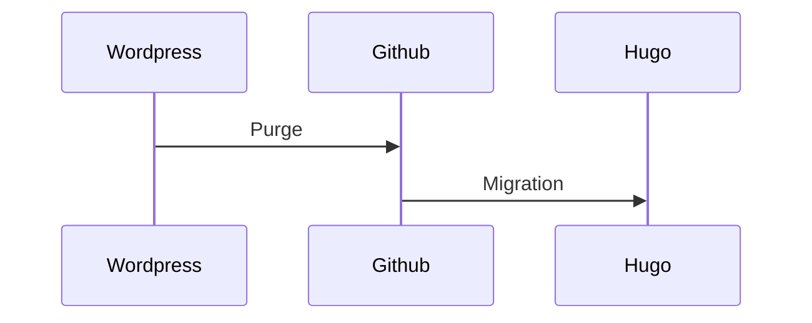

ARIAS FREDERIC
==============

Ma "vie publique" en un seul Markdown (version fr) , :construction: en cours de construction . :construction: 

Ceci n'est pas un CV car je ne sais pas faire de CV . Je fais tellement de POC avec tellement de techno  . . .  Ce qui est sûr c'est que ma compétence première est :penguin: Linux et plutôt le coté serveur . Vu que je fais du C on peut le mettre sur le l'IoT sans problème .

Mon but dans un premier temps c'est la migration de mon blog Wordpress sous Hugo, avec au passage le ménage (suppression d'articles) . Seuls les articles qui ont un lien dans ce Markdown vont être conservés .

# Liens externes 

- [Mon blog](www.cyber-neurones.org)
   - Actuellement mon blog est sur Wordpress (j'ai le nom de domaine cyber-neurones.org depuis que je travaille ...) , j'utilise mon bloc comme "Bloc Note Public" sachant que mon "Bloc Note Privé" c'est [Joplin](https://joplinapp.org/). L'idée est donc d'avoir le même format pour les post à savoir [Markdown](https://fr.wikipedia.org/wiki/Markdown) . Le mieux est donc de migrer vers [Hugo](https://gohugo.io/) . J'ai vu qu'il existait [des softs pour la migration](https://gohugo.io/tools/migrations/#wordpress) . La seule fonctionnalité que je ne veux pas perdre c'est de pouvoir visualiser les GPX de facons dynamique .   

- [Linkedin](http://fr.linkedin.com/in/ariasfrederic)

   - [A noter que j'ai bloqué des comptes sur Linkedin](https://www.cyber-neurones.org/2022/01/linkedin-bloquer-les-covidiots/)
   - [Certification de mon parcours](https://www.lassuranceretraite.fr/vitae/index.html#/c?p=8fdf2636ccb2425b8c19b6cde2c20d04)

- [Mastodon](https://pouet.chapril.org/@Cyberneurones)

- Pas de Twitter : #DeleteTwitter , Pas de Facebook : #DeleteFacebook (Supprimé le :date: 26/11/2018 ) , Pas d'Instagram : #DeleteInstagram (Supprimé le :date: 26/11/2018 ), Pas de WhatsApp #DeleteWhatsApp (Supprimé le :date: 26/11/2018 ), Pas de Pinterest (Supprimé le :date: 26/11/2018 ), Pas de Viadeo (Supprimé le :date: 26/11/2018 ), Pas de Xing (Supprimé le :date: 26/11/2018 ) ....

