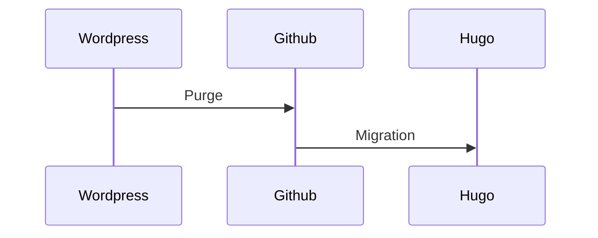
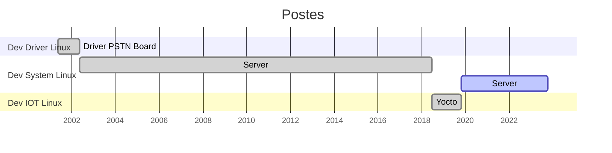
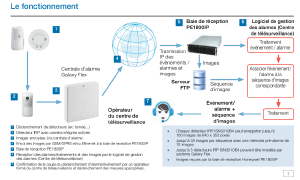

ARIAS FREDERIC
==============

Ma "vie publique" en un seul Markdown (version fr) , :construction: en cours de construction . :construction: 

Ceci n'est pas un CV car je ne sais pas faire de CV . Je fais tellement de POC avec tellement de techno  . . .  Ce qui est sûr c'est que ma compétence première est :penguin: Linux et plutôt le coté serveur . Vu que je fais du C on peut le mettre sur le l'IoT sans problème .

Mon but dans un premier temps c'est la migration de mon blog Wordpress sous Hugo, avec au passage le ménage (suppression d'articles) . Seuls les articles qui ont un lien dans ce Markdown vont être conservés .

# Liens externes 

- [Mon blog](www.cyber-neurones.org)
   - Actuellement mon blog est sur Wordpress (j'ai le nom de domaine cyber-neurones.org depuis que je travaille ...) , j'utilise mon bloc comme "Bloc Note Public" sachant que mon "Bloc Note Privé" c'est [Joplin](https://joplinapp.org/). L'idée est donc d'avoir le même format pour les post à savoir [Markdown](https://fr.wikipedia.org/wiki/Markdown) . Le mieux est donc de migrer vers [Hugo](https://gohugo.io/) . J'ai vu qu'il existait [des softs pour la migration](https://gohugo.io/tools/migrations/#wordpress) . La seule fonctionnalité que je ne veux pas perdre c'est de pouvoir visualiser les GPX de facons dynamique .   

- [Linkedin](http://fr.linkedin.com/in/ariasfrederic)

   - [A noter que j'ai bloqué des comptes sur Linkedin](https://www.cyber-neurones.org/2022/01/linkedin-bloquer-les-covidiots/)
   - [Certification de mon parcours](https://www.lassuranceretraite.fr/vitae/index.html#/c?p=8fdf2636ccb2425b8c19b6cde2c20d04)

- [Mastodon](https://pouet.chapril.org/@Cyberneurones)

- Pas de Twitter : #DeleteTwitter , Pas de Facebook : #DeleteFacebook (Supprimé le :date: 26/11/2018 ) , Pas d'Instagram : #DeleteInstagram (Supprimé le :date: 26/11/2018 ), Pas de WhatsApp #DeleteWhatsApp (Supprimé le :date: 26/11/2018 ), Pas de Pinterest (Supprimé le :date: 26/11/2018 ), Pas de Viadeo (Supprimé le :date: 26/11/2018 ), Pas de Xing (Supprimé le :date: 26/11/2018 ) ....

# Experiences professionnelles :

## SECOM / HONEYWELL / RESIDEO - :round_pushpin: Mougins 

De Mi-Mai 2001 à aujdourd'hui.

J'ai eu trois type de poste de developpeur sous :penguin: Linux .

### 2023 (RESIDEO)

#### Langage Dev : 

- C (70%) / PHP (20%) / BASH / AEL . 

- Protocol XML / JSON / SIP / RTP / Alarm ...

#### OS :

- Oracle Linux 8.7 / Oracle Linux 7.9 / Oracle Linux 9.1 .

- Ubuntu 

- Kali 

- Docker 
   - Oracle Linux .
   - RancherOS .
   - Alpine .

- Yocto
   - Linphone

#### Software 

- [PostgreSQL](https://www.postgresql.org/) / [Redis](https://redis.io/) / NGINX / Mosquitto / MySQL / RabbitMQ / Jenkins / Supervisord / Grafana.

- Asterisk 
   - Script AEL for Asterisk .
   - Build / Installation / Administration Asterisk .
   - Pour Oracle Linux .

#### Tools 

- Teams / Slack / JIRA / Github / SVN / 

### 2022 (RESIDEO)

#### Langage Dev : 

- C (70%) / PHP (20%) / BASH / AEL .

- Protocol XML / JSON / SIP / RTP / Alarm ...

#### OS :

- Oracle Linux 8.7 / Oracle Linux 7.9 / Oracle Linux 9.1 .

- Ubuntu .

- Kali .

- Docker .
   - Oracle Linux.
   - RancherOS.
   - Alpine .

- Marathon/Apache Mesos : End of life .
  - [Marathon/Mesos : Environnement complet via Docker ( docker-compose )](https://www.cyber-neurones.org/2022/04/marathon-mesos-environnement-complet-via-docker-docker-compose/)

#### Software 

- [PostgreSQL](https://www.postgresql.org/) / [Redis](https://redis.io/) / NGINX / Mosquitto / MySQL / RabbitMQ / Jenkins / Supervisord / Prometheus / Grafana.

- Asterisk
   - Script AEL for Asterisk .
   - Build / Installation / Administration Asterisk .
   - Pour Oracle Linux .

#### Tools 

- Teams / Slack / JIRA / Github / SVN .

#### Notes 

- [Quels sont les langages de programmation les plus verts ? (Dr. Milan Milanović)](https://www.cyber-neurones.org/2022/08/quels-sont-les-langages-de-programmation-les-plus-verts-dr-milan-milanovic/)  :date: 2022-08

- [Voici pourquoi linux est plus facile à débugger](https://www.cyber-neurones.org/2022/08/voici-pourquoi-linux-est-plus-facile-a-debugger/) :date: 2022-08

- [Asterisk : Fichier asterisk.service pour Oracle Linux 8.6](https://www.cyber-neurones.org/2022/07/asterisk-fichier-asterisk-service-pour-oracle-linux-8-6/)

- [Migration de Oracle Linux 7.x vers Oracle Linux 8.x avec leapp : Echec complet](https://www.cyber-neurones.org/2022/05/migration-de-oracle-linux-7-x-vers-oracle-linux-8-x-avec-leapp-echec-complet/)

##### 20 years !!!

### 2021 (RESIDEO)

#### Langage Dev :

- C (70%) / PHP (20%) / BASH

#### OS :

- Oracle Linux 8.x / Oracle Linux 7.x 

- Ubuntu .

#### Software 

- [PostgreSQL](https://www.postgresql.org/) / [Redis](https://redis.io/) / NGINX / Mosquitto / MySQL / RabbitMQ / Jenkins / Supervisord / Prometheus / Grafana.

#### Tools 

- Teams / Slack / JIRA / Github / SVN /

#### Notes 

- [Oracle Linux 8.2 : Installation de redis.so pour PHP 7.2](https://www.cyber-neurones.org/2021/02/oracle-linux-8-2-installation-de-redis-so-pour-php-7-2/)

### 2020

#### Langage Dev :

- C (70%) / PHP (20%) / BASH

### 2019

#### Langage Dev :

- C (70%) / PHP (20%) / BASH

#### Notes

- [Issue : Only one processor or Unsupported PM cap regs version (7).](https://www.cyber-neurones.org/2019/12/issue-only-one-processor-or-unsupported-pm-cap-regs-version-7/) : Oracle Linux 7.3

- [Jenkins / LibVirt / Qemu / Fédora : Brouillon d’une tentative de mise en place …](https://www.cyber-neurones.org/2019/09/jenkins-libvirt-qemu-fedora-brouillon-dune-tentative-de-mise-en-place/)

### 2018 

#### Langage Dev :

- C (70%) / PHP (20%) / BASH

#### Notes 

- [Resideo : Mon premier jour chez Resideo](https://www.cyber-neurones.org/2018/10/resideo-mon-premier-jour-chez-resideo/)

- [Oracle Linux 7.x : History of GLIBC and CVE](https://www.cyber-neurones.org/2018/06/oracle-linux-7-x-history-of-glibc-and-cve/)

### 2017

#### Langage Dev :

- C (70%) / PHP (20%) / BASH

#### Notes

- [Redis : Configuration et performance sous Fédora & Redhat](https://www.cyber-neurones.org/2017/09/redis-configuration-et-performance-sous-fedora-redhat/)

- [tmpwatch : Ménage dans /tmp/ sous Linux Redhat & Fédora](https://www.cyber-neurones.org/2017/01/tmpwatch-menage-dans-tmp-sous-linux-redhat-fedora/)

### 2016

#### Langage Dev :

- C (70%) / PHP (20%) / BASH

### 2015

#### Langage Dev :

- C (70%) / PHP (20%) / BASH

#### Notes

- [PostgreSQL : Maximum de connexion en simultanés](https://www.cyber-neurones.org/2015/11/postgresql-maximum-de-connexion-en-simultanes/)

### 2014

#### Langage Dev :

- C (70%) / PHP (20%) / BASH

### 2013

#### Langage Dev :

- C (70%) / PHP (20%) / BASH

### 2012

#### Langage Dev :

- C (70%) / PHP (20%) / BASH

### 2011

#### Langage Dev :

- C (70%) / PHP (20%) / BASH

### 2010

#### Langage Dev :

- C (70%) / PHP (20%) / BASH

### 2009

#### Langage Dev :

- C (70%) / PHP (20%) / BASH

### 2008

#### Langage Dev :

- C (70%) / PHP (20%) / BASH

### 2007

#### Langage Dev :

- C (70%) / PHP (20%) / BASH

### 2006

#### Langage Dev :

- C (70%) / PHP (20%) / BASH

### 2005

#### Langage Dev :

- C (70%) / PHP (20%) / BASH

### 2004

#### Langage Dev :

- C (70%) / PHP (20%) / BASH

### 2003

#### Langage Dev :

- C (70%) / PHP (20%) / BASH

### 2002

#### Langage Dev :

- C (70%) / PHP (20%) / BASH

### 2001

#### Langage Dev :

- C (70%) / PHP (20%) / BASH

### Connaissances informatiques

Impossible de lister tous les protocoles et outils ... 

- Langages de Programmation :  C, C++, Perl, PHP, Java (JSB, Servlets), JavaScript, GO LANG, Python, Bash , Perl, Pascal ...
   - **70% de mes programmes sont fait en C**, le Java/Javascript/Pascal je le fais que sous la torture ... et j'aimerai bien faire du **RUST** . 

- Langages de balisage :  XML, HTML, JSON, Markdown ...

- Langages de requête   : SQL, PL/SQL , NoSQL (comme REDIS) ...

- Librairie : CURL, OPENSSL, HIREDIS, SYSLOG, SIP, MQTT ...

- Database : SGBD Oracle, MySQL (et maintenant MariaDB), MSQL, Access, PostgreSQL, SQL server, MongoDB, Redis, SQLLite ...

- Protocoles ouverts : HTTP , FTP,  SIP, UCP, SMS ...

- Protocoles dédiée à la securité : SIA DC 03, SIA DC 07, SIA DC 09, CONTACT-ID, SURGARD MLR2, ADEMCO 685, F1COM, SECOM3, VAT, TIP ( TIP-EVT, ..)  .... 

- Serveurs (non Database & MQTT ) : Apache, Tomcat, Bind, OpenLDAP, SendMail, Samba, wu-Ftp, Asterisk, OpenSSH, QNIX, Munin, ELK, Jenkins ...

- Statistiques :  ProjetR ...

- Développement sous CVS, SVN, GIT, Bitbucket ..

- Tools : gcc, gdb, lsof, strace, gprof, google Test : [Gtest](https://github.com/google/googletest) ... 

- Divers Editeurs :  vi, emacs, LaTex, Doxygen, xfig , JBuider, mkdocs ....

- VirtualBox, VMWare, Docker ...

- Outils [Atlassian](https://fr.atlassian.com) : JIRA, Confluence, Bamboo, Bitbucket ...

- Outils Microsoft : Teams, Excel, Words ...

### Support Client ( SeCOM / HONEYWELL / RESIDEO ) 

J’ai effectué de nombreux déplacements en Espagne ( :round_pushpin: Madrid, :round_pushpin: Barcelone ) , en Finlande ( :round_pushpin: Helsinki) , en Norvège ( :round_pushpin: Olso ) , en Suède ( :round_pushpin: Linkoping , :round_pushpin: Malmo ) , au Portugal ( :round_pushpin: Lisbonne ),  en France ( :round_pushpin: Paris , :round_pushpin: Aix-en-Provence , :round_pushpin: Strasbourg , :round_pushpin: Dieppe , :round_pushpin: Besancon , :round_pushpin: Lyon , :round_pushpin: Nantes , :round_pushpin: Blois , :round_pushpin: Signes , :round_pushpin: Toulouse , :round_pushpin: Hossegor , :round_pushpin: Bry-sur-Marne )  , en Grande-Bretagne ( :round_pushpin: Manchester ) , en Italie ( :round_pushpin: Come , :round_pushpin: Florence , :round_pushpin: Milan ), en Russie ( :round_pushpin: Moscou ), en Allemagne ( :round_pushpin: Meshede ) , en Suisse ( :round_pushpin: Genève ) pour l’intégration de nos produits, la configuration des produits liés aux nouvelles technologies ( GSM-Data, GPRS, SMS, VOIP, Ethernet, …)

### Quelques logiciels "systemes" 

Certains sont fait à 100% par moi dans ma periode "Dev System Linux" :

- PE1800IP / PE1800IP-S / PE1800XS / PE1800HB / PE1800 ( C’est un ensemble de logiciels pour la reception/transmission d’evenement relatif aux alarmes) :
    - XACAPELA (Linux in C): (Alpha release only) Manage client to use text to speech.
    - XACTIVITY (Linux in C): (Alpha release only) Supervision of process .
    - XADEMCO685 (Linux in C): Manage the protocol Ademco685 to send event .
    - XCCMD / XCCMD2 (Linux in C): Manage client for protocol TIP-CMD .
    - XCEVT (Linux in C) : Manage client for protocol TIP-EVT .
    - XCEVTONE (Linux in C): Manage client for protocol TIP-EVT .
    - XCIST (Linux in C):(Alpha release only) Manage client for protocol TIP-IST .
    - XCMESSAGE (Linux in C): Mange client for protocol Message for SIA Alarm ( Smartphone )
    - XCONF (Linux in C): Manage configuration .
    - XCSMS (Linux in C): Manage client on serial port to send SMS ( with Gateway WaveCom of other )
    - XCSPEECH (Linux in C): Manage client to use text to speech .
    - XCVAT (Linux in C): Manage PSTN board for protocol SECOM3 and VAT .
    - XDEFAULT / XDEFAULT2 / XDEFAULT3 (Linux in C): Manage de default of heartbeat
    - XEICONTOOLS (Linux in C): (Alpha release only) : Manage PSTN board EICON .
    - DIALOUTEZ (Linux in C): (Alpha release only) : Manage PSTN board EICON .
    - XFEP (Linux in C): Manage protocol FEP .
    - XFRONTEL (Linux in C): (Alpha release only) Manage protocol Frontel .
    - XFRONTELCC (Linux in C): (Alpha release only) Manage protocol CC for Frontel
    - XFTP (Linux in C): Send file in FTP, SFTP, SCP .
    - XGTC (Linux in C): Manage all process to send default in syslog .
    - XHEARTBEAT / XHEARTBEAT2 (Linux in C): Manage protocol for heartbeat .
    - XIMG (Linux in C): Manage and merde picture .
    - XIP (Linux in C): Manage protocol SECOM3/VAT in TCP/IP
    - XLOADIP / XLOADIP2 (Linux in C): Test load on IP .
    - XMAIL (Linux in C): Send mail .
    - XMQTT (Linux in C): (Alpha release only) Manage MQTT for event .
    - XNUAGE / XNUAGE2 (Linux in C): Manage protocol for heartbeat .
    - XODBC (Linux in C): Manage ODBC to Microsoft SQL Server
    - XOPENSSL (Linux in C): Send SMS with protocol SSL .
    - XPARTITION (Linux in C): Manage partition .
    - XPE12 (Linux in C): Manage protocol PE1200 .
    - XPING (Linux in C): Manage internet link .
    - XPRINT (Linux in C): Send event to printer .
    - XPROTO (Linux in C): Manage protocol for PSTN board (B-channel)
    - XPURGE (Linux in C): Purge file on server .
    - XPURGEDATABASE (Linux in C): Purge event on database .
    - XPUSH (Linux in C): (Alpha release only) Push event on XML/JSON .
    - XPUSHJSON (Linux in C): (Alpha release only) Push event on XML/JSON .
    - XREPLIK (Linux in C): Share keys .
    - XRNIS (Linux in C): Manage server for protocol TIP-CMD and manage PSTN board (D-channel) .
    - XSAS (Linux in C): Manage protocol SAS .
    - XSECHO / XSECHO2 (Linux in C):(Alpha release only)
    - XSERIAL (Linux in C): Manage serial port for protocol VAT .
    - XSEVT (Linux in C): Manage server with protocol TIP-EVT .
    - XSF1COM (Linux in C): Manage protocol F1COM to send event .
    - XSIADC09 (Linux in C): Manage protocol SIA DC 09 to send alarm .
    - XSIADC09GRIP (Linux in C): Manage protocol SIA DC 09 to receive alarm (in TCP/IP) .
    - XSIAIP (Linux in C): Manage protocol SIA DC 03 to receive alarm (in TCP/IP) .
    - XSIAUDP (Linux in C): Manage protocol SIA DC 09 to receive alarm (in UDP/IP) .
    - XSIP (Linux in C): (Alpha release only)  Manage protocol SIP .
    - XSIST (Linux in C): (Alpha release only) Manage server with protocol TIP-IST .
    - XSMS (Linux in C): Send SMS with lot of providers (Orange, Vodafone, Ocito, Text Anywhere, Pswin, TMobil, Mblox, …) .
    - XSMSC (Linux in C): Send SMS with protocol UCP .
    - XSURGARD (Linux in C): Manage protocol MLR2 to send event .
    - XSVAT (Linux in C): Manage server with protocol TIP-VAT .
    - XSYNC / XSYNC2 (Linux in C): Sync of event .
    - XTICTAC (Linux in C):  Manage time and freeze of time .
    - XTRANSVEIL (Linux in C): (Alpha release only) Manage protocol Transveil .
    - XVEBONIP (Linux in C): (Alpha release only) Manage protocol Vebon
    - XVOIP (Linux in C): (Alpha release only) Manage Voice Over IP .
    - XWHATSUP (Linux in C):  (Alpha release only) Supervision of process .
    - …
    - XLOFT (Linux in PHP): GUI and WebService .

## RIGTHVISION – :round_pushpin: Mouans Sartoux 

- De Mi-Janvier 2001 à Mi-Mai 2001

- Righvision est une société qui développe des Appliances ( EyeBox ) sous Linux . http://www.rightvision.com/

- Développeur sous Windows et sous Linux .

- Création d’une interface en PHP pour la gestion de MySQL .
- Mise en place de Bench en Perl et optimisation sur MySQL sous Linux .
- Création d’une interface générique et développement d’un bureau virtuel en Flash5 .

- Environnement : :penguin: Linux( RedHat ), Windows, Perl, PHP, Apache, OpenlDAP, CVS, MySQL, Flash5( Action Script )

## CYBERWORKERS – :round_pushpin: Aubagne 

- De Mi-Avril 2000 à Mi-Janvier 2001

- Cyberworkers est une société qui développe une plate-forme destinée au télétravail pour les indépendants . http://www.cyberworkers.com/ Développeur, concepteur et DBA de 80% de la plate-forme sous LINUX :

- Création de pages dynamiques : Utilisation de PHP et SQL :
   - MySQL – Apache .
   - PostgreSQL – Apache .
   -  OpenLDAP – Apache .

- Création de requêtes complexes sous PostgreSQL : Utilisation de PL/SQL & PL/Perl

- Création d’une application pour le WAP.

- Développement en PERL – JavaScript – C – Java ( JSP, servlets ) .

- Création du MLD ( Modèle Logique des Données ) à l’aide des méthodes MERISE et UML (120 tables).

- Rédaction de la documentation .

- Environnement : :penguin: Linux( Debian, SuSE ), Perl, PHP, JavaScript, C, Java (JSP, servlets), Apache, Merise, UML, PL/SQL, Tomcat

## Connaissance OS :

Systèmes :penguin: Linux ( Debian, RedHat, SuSE, Fedora, Oracle Linux , Yocto), Unix SCO, NetBSD, Docker (sur mon blog), Raspberry.

Dans le détail des OS utilisés pour le dev dans l’ordre d’apparition :

- Redhat 5.2 ( la date de release est : 2 novembre 1998 ) : A l’université de Toulouse .
- SuSE & Mandrake : Au Centre Océanographique de Marseille .
- Debian ? & NetBSD : Chez Cyber-workers / Alias  .
- Redhat ? : Chez Rightvision / Altior .
- Redhat 7.2 ( date release : 22 octobre 2001 ) & Unix SCO version 5 : Chez Honeywell / SeCOM
- Redhat 8.0 ( date release : 30 septembre 2002 )  : Chez Honeywell / SeCOM
- Redhat 9.0 ( date release : 31 septembre 2003 )  : Chez Honeywell / SeCOM
- Fédora 9.0 ( date release : 13 mai 2008 ) : Chez Honeywell / SeCOM
- Fédora 14.0 ( date release : 2 novembre 2010 )  : Chez Honeywell / SeCOM
- Fédora 17.0 ( date release : 29 mai 2012 ) : Chez Honeywell / SeCOM
- Oracle 7.0  ( date release : 23 juillet 2014 ) : Chez Honeywell / SeCOM
- Oracle 7.2 ( date release : 25 novembre 2015 ) : Chez Honeywell / SeCOM
- Oracle 7.3 ( date release : 10 novembre 2016 ) : Chez Honeywell / SeCOM
- Oracle 7.4 ( date release : 8 aout 2017 ) : Chez Honeywell / SeCOM
- Oracle 7.5 ( date release : 17 avril 2018 ) & Fédora 26 ( date release : 11 juillet 2017 ) sous Docker 17 ( RancherOS : https://rancher.com/rancher-os/ ): Chez Honeywell / SeCOM
- Ubuntu 16.04 ( date release : 21 avril 2016 ) & YOCTO :  Chez Resideo / SeCOM .
- Ubuntu 18.04 ( date release : 26 avril 2018 ) & YOCTO :  Chez Resideo / SeCOM .
- Oracle 7.6 ( date release : 2019-08-15 ) : Chez Resideo / SeCOM .
- Oracle 8.2 ( date release : 2020-05-06 ) : Chez Resideo / SeCOM .
- Oracle 8.3 ( date release : 2020-11-13 ) : Chez Resideo / SeCOM .
- Ubuntu 20.04 ( date release : 23 avril 2020 ) & Docker :  Chez Resideo / SeCOM .
- Debian 11 : Chez Resideo / SeCOM .
- Oracle Linux 7.9 :  Chez Resideo / SeCOM .
- Oralce Linux 8.7 : Chez Resideo / SeCOM .
- [Oracle Linux 9.1](https://docs.oracle.com/en/operating-systems/oracle-linux/9/relnotes9.1/) : Chez Resideo / SeCOM .
- [Kali](https://www.kali.org/) : Chez Resideo / SeCOM .
- [Alpine](https://www.alpinelinux.org/releases/) : Chez Resideo / SeCOM .
- Ubuntu 22.04 ( date release : April 21, 2022 ) : Chez Resideo / SeCOM .

