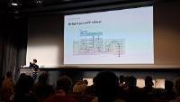
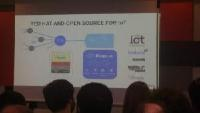

# Salons

#### Salon Open Source Expérience à :round_pushpin: Paris (Open Source Summit) : novembre 2022 

Sujets :

#### Salon Linux à :round_pushpin: Paris (Open Source Summit) : Dock pullman : décembre 2017

Tags : #OSSParis2017

Sujets : DevOps , Python , Haskell , Cloud , IA , Cybersecurity .

- [Paris Open Source Summit 2017 : #OSSParis2017](https://www.cyber-neurones.org/2017/12/paris-open-source-summit-2017-ossparis2017/) :date: 2017-12

#### Docker à :round_pushpin: Sophia-Antipolis : mars 2017 

Sujet : Docker

- [Celebration of Docker’s 4th Birthday à Sophia-Antipolis](https://www.cyber-neurones.org/2017/03/celebration-of-dockers-4th-birthday-a-sophia-antipolis/) :date: 2017-03

#### Salon Linux à :round_pushpin: Paris (Open Source Summit) : Dock pullman : novembre 2016 : http://www.opensourcesummit.paris

Sujets : IoT

- [Paris Open Source Summit 2016 : #OSSPARIS2016 ](https://www.cyber-neurones.org/2016/11/paris-open-source-summit-2016-ossparis2016/) :date: 2016-11

#### Docker à :round_pushpin: Sophia-Antipolis : mars 2016 .

Sujet : Docker

- [Docker Birthday Celebration à SophiaTech](https://www.cyber-neurones.org/2016/03/docker-birthday-celebration-a-sophiatech/) :date: 2016-03 

#### Salon Linux à :round_pushpin: Paris (Open Source Summit) : Dock pullman : novembre 2015 : http://www.opensourcesummit.paris

Sujets :

- [Paris Open Source Summit 2015](https://www.cyber-neurones.org/2015/11/paris-open-source-summit-2015/)

#### Salon Cloud à :round_pushpin: Paris : Mars 2012

Sujets :

#### Salon Linux à :round_pushpin: Paris : Avril 2009

Sujets :

#### Salon VOIP à :round_pushpin: Paris : Avril 2008

Sujets :

#### Salon VOIP à :round_pushpin: Paris : Mai 2006

Sujets :

#### Salon Linux à :round_pushpin: Paris : Février 2006

Sujets :

#### Salon Linux à :round_pushpin: Paris 

Sujets :

