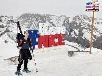
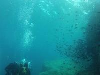

## Padel

## :ski: Ski 

- [La piste Luc Alphand à Serre-Chevalier](https://www.cyber-neurones.org/2019/02/la-piste-luc-alphand-a-serre-chevalier/)

- [Alpe d’Huez : La piste Sarenne …. pour moi c’est 11 km maximum !](https://www.cyber-neurones.org/2018/03/alpe-dhuez-la-piste-sarenne-pour-moi-cest-11-km-maximum/)

- [Grand Massif ( Flaine , Sixt ) : La piste des cascades.](https://www.cyber-neurones.org/2016/02/grand-massif-la-piste-des-cascades/)

## Ski de randonnée

- [Ski de randonnée à :round_pushpin: Roubion](https://www.cyber-neurones.org/2021/12/ski-de-randonnee-a-roubion/)

- [Ski de randonnée à :round_pushpin: Auron : Parcours simple.](https://www.cyber-neurones.org/2021/03/ski-de-randonnee-a-auron-parcours-simple/)

## Plongée

- [Formation Niveau 1 en plongée avec Kalliste Plongée et Divingeek à Porto Vecchio](https://www.cyber-neurones.org/2017/08/formation-niveau-1-en-plongee-avec-kalliste-plongee-et-divingeek-a-porto-vecchio/)

## :surfer: Surf

- Léon, [Madère](https://www.cyber-neurones.org/2014/07/madere-surf-a-madere/) , ...

- [La meilleure école de surf sur Léon : One Palm ](https://www.cyber-neurones.org/2017/07/la-meilleure-ecole-de-surf-sur-leon-one-palm/)
    
## :rugby_football: Rugby

## Musique : :saxophone: Saxophone .
