## Randonnées 

### France

#### Alpes-Maritimes

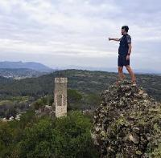

- [Randonné à Moulinet : Tête de Gars, Cime du Tiers, Mangiabo, Baisse de la Déa](https://www.cyber-neurones.org/2023/05/randonne-a-moulinet-tete-de-gars-cime-du-tiers-mangiabo-baisse-de-la-dea/) :date: 2023-05 
    - Distance : 19 km, Denivelé : 1200m D+, :watch: 7h00

- [Randonnée Saint-Grat : Cime de Prals, Cime de la Valette de Prals, Cime de Montjoia](https://www.cyber-neurones.org/2023/04/randonnee-saint-grat-cime-de-prals-cime-de-la-valette-de-prals-cime-de-montjoia/) :date: 2023-04 
    - Distance : 13 km, Denivelé : 1300m D+, :watch: 7h00

- [Boucle des chasseurs entre :round_pushpin: Biot et :round_pushpin: Villeneuve-Loubet ](https://www.cyber-neurones.org/2023/03/randonnee-boucle-des-chasseurs-entre-biot-et-villeneuve-loubet/) :date: 2023-03
   - Distance : 16 km, Denivelé : 700m D+, :watch: 4h00

- [Chapelle Saint-Jean, Arche de Ponadieu, Grotte des deux goules, Cascades ](https://www.cyber-neurones.org/2023/02/randonnee-tres-difficile-chapelle-saint-jean-arche-de-ponadieu-grotte-des-deux-goules-cascades/) :date: 2023-02

- [Sommet (ou pointe) des quatre cantons au départ de Bairols](https://www.cyber-neurones.org/2023/02/randonnee-sommet-ou-pointe-des-quatre-cantons-au-depart-de-bairols/) :date: 2023-02

- [Tête de Giarons, Tête de l’Abric, Les Cluots](https://www.cyber-neurones.org/2023/01/randonnee-hivernale-tete-de-giarons-tete-de-labric-les-cluots-avec-13-au-sommet/) :date: 2023-01

- [Tour du Mont Lion (avec passage par le sommet) au départ de Gilette](https://www.cyber-neurones.org/2022/06/randonnee-tour-du-mont-lion-avec-passage-par-le-sommet-au-depart-de-gilette/) :date: 2022-06

- [Tour complet du Cap d’Antibes](https://www.cyber-neurones.org/2022/04/marche-tour-complet-du-cap-dantibes/) :date: 2022-04

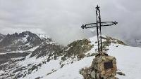

- [Brec d’Utelle au départ de Saint-Jean La Rivière](https://www.cyber-neurones.org/2022/03/randonnee-a-utelle-brec-dutelle-au-depart-de-saint-jean-la-riviere/) :date: 2022-03

- [Randonnée à Caille : Crêtes du Bauroux](https://www.cyber-neurones.org/2022/02/randonnee-a-caille-cretes-du-bauroux/) :date: 2022-02

- [Randonnée : Sommet de Thiey au départ de Nans](https://www.cyber-neurones.org/2022/01/randonnee-sommet-de-thiey-au-depart-de-nans/) :date: 2022-01

- [Randonnée : Baisse de Tueis (Camp d’Argent) vers La Minière de Vallauria](https://www.cyber-neurones.org/2021/08/randonnee-baisse-de-tueis-camp-dargent-vers-la-miniere-de-vallauria/) :date: 2021-08

- [Randonnée hors piste : La voie Mathis : La minière de Vallauria vers la pointe de la Corne de Bouc](https://www.cyber-neurones.org/2021/08/randonnee-hors-piste-la-voie-mathis-la-miniere-de-vallauria-vers-la-pointe-de-la-corne-de-bouc/) :date: 2021-08

- [Randonnée sportive : Boucle de 22 km sur la Vallée de Merveilles](https://www.cyber-neurones.org/2021/08/randonnee-sportive-boucle-de-22-km-sur-la-vallee-de-merveilles/) :date: 2021-08

- [Randonnée Ultra-Sportive : Cime du Gélas (Départ La Gordolasque) avec une boucle](https://www.cyber-neurones.org/2021/07/randonnee-ultra-sportif-cime-du-gelas-depart-la-gordolasque/) :grinning: :date: 2021-07 

- [Randonnée : Le Pra – Refuge de Vens – Col du Fer](https://www.cyber-neurones.org/2021/07/randonnee-le-pra-refuge-de-vens-col-du-fer/) :date: 2021-07

- [Trail/Marche sur Biot : Au départ du pont des Tamarins (une boucle de 10 km)](https://www.cyber-neurones.org/2021/04/trail-marche-sur-biot-au-depart-du-pont-des-tamarins-une-boucle-de-10-km/) :date: 2021-04

- [Randonnée à Caussols : Boucle autour du plateau](https://www.cyber-neurones.org/2021/02/randonnee-a-caussols-boucle-autour-du-plateau/) :date: 2021-02

- [Courmes : Randonnée vers le Pic de Courmettes](https://www.cyber-neurones.org/2021/01/courmes-randonnee-vers-le-pic-de-courmettes/) :date: 2021-01

- [Courmes : Randonnée sur le plateau de Saint-Barnabé.](https://www.cyber-neurones.org/2021/01/courmes-randonnee-sur-le-plateau-de-saint-barnabe/) :date: 2021-01

- [Randonnée 2 jours : Vallée des merveilles .](https://www.cyber-neurones.org/2020/09/randonnee-2-jours-vallee-des-merveilles/) :date: 2020-09

- [Randonnée : Départ de Duranus vers Mine de l’Eguisse , la Chapelle Saint-Michel et les ruines de Rocca Sparvièra.](https://www.cyber-neurones.org/2020/06/randonnees-depart-de-duranus-vers-mine-de-leguisse-la-chapelle-saint-michel-et-les-ruines-de-rocca-sparviera/) :date: 2020-06

- [Randonnée : Gréolières-les-neiges vers Vegay](https://www.cyber-neurones.org/2020/06/randonnee-greoliere-les-neiges-vers-vegay/) :date: 2020-06

- [Randonnée : La crête du Cheiron au départ de Gréolières-les-neiges ( Gréolières station )](https://www.cyber-neurones.org/2020/06/randonnee-la-crete-du-cheiron-au-depart-de-greoliere-station/) :date: 2020-06

- [Randonnée hors piste : Col de la Sinne vers Lauvet d’Ilonse , et au retour Le Mont D’Ilonse](https://www.cyber-neurones.org/2020/05/randonnee-hors-piste-col-de-la-sinne-vers-lauvet-dilonse-et-au-retour-le-mont-dilonse/) :date: 2020-05

- [Isola 2000 : Randonnée vers les Lacs de Terre Rouge et le Col Baisse de Druos](https://www.cyber-neurones.org/2019/08/isola-2000-randonnee-vers-les-lacs-de-terre-rouge-et-le-col-baisse-de-druos/) :date: 2019-08

- [Isola 2000 : Ranndonnée : Col de Mercière, Tête Mercière, Tête de la Roubine, Col de la Valette](https://www.cyber-neurones.org/2019/08/isola-2000-ranndonnee-col-de-merciere-tete-merciere-tete-de-la-roubine-col-de-la-valette/) :date: 2019-08

- [Randonnée de l’Adous (Villars-sur-Var) vers le Baisse des Colettes](https://www.cyber-neurones.org/2019/06/randonnee-de-ladous-villars-sur-var-vers-le-baisse-des-colettes/)  :date: 2019-06

- [Randonnée/escalade : Baou de Saint-Jeannet ( avec équipement )](https://www.cyber-neurones.org/2019/06/randonnee-escalade-baou-de-saint-jeannet-avec-equipement/) :date: 2019-06

- [Randonnée à Puget-Théniers vers le Col de Rigaudon](https://www.cyber-neurones.org/2019/06/randonnee-a-puget-theniers-vers-le-col-de-rigaudon/) :date: 2019-06

- [Randonnée de Sausse vers la Tête de Travers](https://www.cyber-neurones.org/2019/06/randonnee-de-sausse-vers-la-tete-de-travers/)

- [Randonnée dans les Gorges de Daluis](https://www.cyber-neurones.org/2019/06/randonnee-dans-les-gorges-de-daluis/)

- [Randonnée : Du bas de :round_pushpin: Gréolière à la Cime du Cheiron (via une partie du GR4)](https://www.cyber-neurones.org/2019/05/randonnee-du-bas-de-greoliere-a-la-cime-du-cheiron-via-une-partie-du-gr4/)

- [Randonnée : Boucle de 16 km sur Roquebillière vers la pointe de Siruol](https://www.cyber-neurones.org/2018/05/randonnee-boucle-de-16-km-sur-roquebilliere-vers-la-pointe-de-siruol/)

- [Randonnée : Boucle de 15 km : Malausséne – Mont Vial – Col du Vial.](https://www.cyber-neurones.org/2018/04/randonnee-boucle-de-15-km-malaussene-mont-vial-col-du-vial/)

- [Lantosque : Randonnée vers le Col de Turini](https://www.cyber-neurones.org/2018/02/lantosque-randonnee-vers-le-col-de-turini/) :date: 2018-02

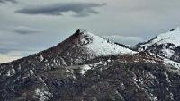

- [Randonnée à :round_pushpin: Eze](https://www.cyber-neurones.org/2017/09/randonnee-a-eze/) :date: 2017-09

- [Randonnée à :round_pushpin: Auron : Cime de la Bercha via une boucle](https://www.cyber-neurones.org/2017/08/randonnee-a-auron-cime-de-la-bercha-via-une-boucle/) :date: 2017-08

- [Balade à l’ombre : De :round_pushpin: Biot à :round_pushpin: Valbonne par la Brague](https://www.cyber-neurones.org/2017/08/balade-de-biot-a-valbonne-par-la-brague/) :date: 2017-08

- [Randonnée : Piste du Castellaras (Commune d’Andon)](https://www.cyber-neurones.org/2016/12/randonnee-piste-du-castellaras-commune-dandon/) :date: 2016-12

- [Balade sur le Plateau de Cavillore à :round_pushpin: Gourdon](https://www.cyber-neurones.org/2016/11/balade-sur-le-plateau-de-cavillore-a-gourdon/) :date: 2016-11

- [Balade Sportive : Le Grand Mont](https://www.cyber-neurones.org/2016/10/balade-sportive-le-grand-mont/) :date: 2016-10

- [Balade à Tanneron : Les crêtes de Tanneron](https://www.cyber-neurones.org/2016/10/balade-a-tanneron-les-cretes-de-tanneron/) :date: 2016-10

- [Tentative des Balcons d’Azur par :round_pushpin: Carros Village.](https://www.cyber-neurones.org/2016/05/tentative-des-balcons-dazur-par-carros-village/) :date: 2016-05

- [Balade : Pont des Tamarins à :round_pushpin: Biot vers :round_pushpin: Valbonne par la Brague](https://www.cyber-neurones.org/2016/03/balade-pont-des-tamarins-a-biot-vers-valbonne-par-la-brague/) :date: 2016-03

- [Balade : Pont des Tamarins vers le Village de Biot](https://www.cyber-neurones.org/2016/03/balade-pont-des-tamarins-vers-le-village-de-biot/) :date: 2016-03

- [Circuit de la Malle dans le pays Grassois](https://www.cyber-neurones.org/2016/01/circuit-de-la-malle-dans-le-pays-grassois/) :date: 2016-01

##### Alpes-de-Haute-Provence

- [Colmars les alpes : Cascade de la Lance & Cascade de Chaumie](https://www.cyber-neurones.org/2018/07/colmars-les-alpes-cascade-de-la-lance-cascade-de-chaumie/) :date: 2018-07

##### Tarn

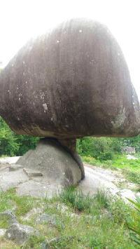

- [Randonnée à :round_pushpin: Dourgne : Boucle Saint Stapin, La Capelette de Saint-Ferréol, :round_pushpin: Massaguel ( dans le Tarn )](https://www.cyber-neurones.org/2019/04/randonnee-a-dourgne-boucle-saint-stapin-la-capelette-de-saint-ferreol-massaguel-dans-le-tarn/) :date: 2019-04

- [Randonnée à :round_pushpin: Dourgne : Source du Melzic](https://www.cyber-neurones.org/2019/04/randonnee-a-dourgne-source-du-melzic/) :date: 2019-04

- [Balade à :round_pushpin: Mazamet : La passerelle d’Hautpoul](https://www.cyber-neurones.org/2019/04/balade-a-mazamet-la-passerelle-dhautpoul/) :date: 2019-04

- [ :round_pushpin: Saint-Avit (Tarn) vers le Dicosa](https://www.cyber-neurones.org/2018/04/velo-saint-avit-tarn-vers-le-dicosa/) :date: 2018-04

- [La Capelette de Saint-Ferréol à :round_pushpin: Dourgne](https://www.cyber-neurones.org/2016/12/la-capelette-de-saint-ferreol-a-dourgne-dans-le-tarn-2/) :date: 2016-12

- [Balade aux :round_pushpin: Escoussens ( dans le Tarn )](https://www.cyber-neurones.org/2016/01/balade-aux-escoussens-dans-le-tarn/) :date: 2016-01

- [Balade à :round_pushpin: Massaguel ( dans le Tarn )](https://www.cyber-neurones.org/2015/12/balade-a-massaguel-dans-le-tarn/) :date: 2015-12

- [Tour du Lac de Saint-Férreol](https://www.cyber-neurones.org/2015/12/tour-du-lac-de-saint-ferreol/) :date: 2015-12

- [La Capelette de Saint-Ferréol à Dourgne ( dans le Tarn )](https://www.cyber-neurones.org/2015/12/la-capelette-de-saint-ferreol-a-dourgne-dans-le-tarn/) :date: 2015-12

- [Table d’orientation de Montalric sur les hauteurs de Dourgne ( dans le Tarn ) .](https://www.cyber-neurones.org/2015/12/table-dorientation-de-montalric-sur-les-hauteurs-de-dourgne-dans-le-tarn/) :date: 2015-12

- [Tour du Lac ( ou barrage ) des Cammazes ( dans le Tarn )](https://www.cyber-neurones.org/2015/12/tour-du-lac-ou-barrage-des-cammazes-dans-le-tarn/) :date: 2015-12

- [Balade à l’Oppidum de Berniquaut près de Sorèze : version boucle ( dans le Tarn )](https://www.cyber-neurones.org/2015/12/balade-a-loppidum-de-berniquaut-pres-de-soreze-version-boucle-dans-le-tarn/) :date: 2015-12

- [Balade des Avaris à Saint-Amancet ( dans le Tarn )](https://www.cyber-neurones.org/2015/12/balade-des-avaris-a-saint-amancet-dans-le-tarn/) :date: 2015-12

- [Balade à l’Oppidum de Berniquaut près de Sorèze : version aller-retour ( dans le Tarn )](https://www.cyber-neurones.org/2015/12/balade-a-loppidum-de-berniquaut-pres-de-soreze-dans-le-tarn/) :date: 2015-12

##### Pyrénées-Orientales

- [Randonnée : Bivouac 2 jours : Lac des Bouillouses -> Refuge des Camporells -> Lac Estany Gros](https://www.cyber-neurones.org/2020/08/randonnee-bivouac-2-jours-lac-des-bouillouses-refuge-des-camporells-lac-estany-gros/) :date: 2020-08

- [Randonnée : Bivouac 2 jours : :round_pushpin: Font-Romeu <-> Pic Carlit.](https://www.cyber-neurones.org/2020/08/randonnee-bivouac-2-jours-font-romeu-pic-carlit/) :date: 2020-08

##### Hautes-Pyrénées

- [Randonnée : :round_pushpin: Gèdre vers le Lac de Bassia.](https://www.cyber-neurones.org/2016/07/randonnee-gedre-vers-le-lac-de-bassia/) :date: 2016-07

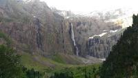

- [Randonnée : Gavarnie vers le Cirque de Gavarnie (et boucle dans le cirque à partir des échelles).](https://www.cyber-neurones.org/2016/07/randonnee-gavarnie-vers-le-cirque-de-gavarnie-et-boucle-dans-le-cirque-a-partir-des-echelles/) :date: 2016-07

- [Randonnée : :round_pushpin: Gèdre vers le Barrage ( ou Lac ) des Gloriettes](https://www.cyber-neurones.org/2016/07/randonnee-gedre-vers-le-barrage-ou-lac-des-gloriettes/) :date: 2016-07 

- [Randonnée : Chapelle de Héas (Gèdre) vers le Lacs des aires.](https://www.cyber-neurones.org/2016/07/randonnee-chapelle-de-heas-gedre-vers-le-lacs-des-aires/) :date: 2016-07

#### Savoie

- [Valloire : Randonnée Le Verneys vers Le Crey Rond](https://www.cyber-neurones.org/2022/08/valloire-randonnee-le-verneys-vers-le-crey-rond/) :date: 2022-08

- [Valloire : Randonnée : Col du Boléon (2845m)](https://www.cyber-neurones.org/2022/08/valloire-randonnee-col-du-boleon-2845m/) :date: 2022-08

- [Valloire : Randonnée : Le Grand Galibier](https://www.cyber-neurones.org/2022/08/valloire-randonnee-le-grand-galibier/) :date: 2022-08

- [Valloire : Randonnée de Bonnenuit vers l’Aiguille de l’Epaisseur (3230m)](https://www.cyber-neurones.org/2022/08/valloire-randonnee-de-bonnenuit-vers-laiguille-de-lepaisseur-3230m/) :date: 2022-08

- [Valloire : Randonnée de Bonnenuit vers le Lac Rond](https://www.cyber-neurones.org/2022/08/valloire-randonnee-de-bonnenuit-vers-le-lac-rond/) :date: 2022-08

#### Bouches du Rhône

- [Randonnée – La Sainte-Victoire par le GR9 – Sentier des Venturiers –](https://www.cyber-neurones.org/2016/05/la-sainte-victoire-par-le-gr9-sentier-des-venturiers/) :date: 2016-05

- [Calanque de sugiton à Marseille.](https://www.cyber-neurones.org/2014/05/calanque-de-sugiton-a-marseille/)

##### Vaucluse

- [Colorado Provencal à Rustrel ( Vaucluse – Lubéron ) : Circuit orange.](https://www.cyber-neurones.org/2016/05/colorado-provencal-a-rustrel-vaucluse-luberon-circuit-orange/) :date: 2016-05 

- [Colorado Provencal à Rustrel ( Vaucluse – Lubéron ) : Circuit bleu.](https://www.cyber-neurones.org/2016/05/colorado-provencal-a-rustrel-vaucluse-luberon-circuit-bleu/)

- [Sentier des Ocres à Roussillon ( Lubéron )](https://www.cyber-neurones.org/2016/05/sentier-des-ocres-a-roussillon-luberon/)

#### Corse

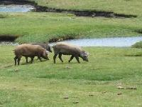

- [Sentier des plages de :round_pushpin: Bonifacio en deux étapes](https://www.cyber-neurones.org/2022/04/randonnee-en-corse-sentier-des-plages-de-bonifacio-en-deux-etapes/) :date: 2022-04

- [Tour de Sénèque au départ de Fieno (Cap Corse)](https://www.cyber-neurones.org/2022/04/corse-tour-de-seneque-au-depart-de-fieno/) :date: 2022-04

- GR20 

- 

- 

### Autriche

#### Tyrol

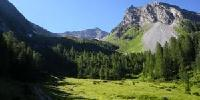

- [Randonnée Tyrol en Autriche : De Juns Fener-Haus vers Tote Böden](https://www.cyber-neurones.org/2019/08/randonnee-tyrol-en-autriche-de-juns-fener-haus-vers-tote-boden/)

- [Randonnée Tyrol en Autriche : De Tuxer Fener-Haus vers Friesenbergscharte](https://www.cyber-neurones.org/2019/08/randonnee-tyrol-en-autriche-de-tuxer-fener-haus-vers-friesenbergscharte)

- [Hintertux : Panorama Gefrorene-Wand-Spitzen en télécabine.](https://www.cyber-neurones.org/2019/08/hintertux-panorama-gefrorene-wand-spitzen-en-telecabine/)

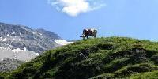

- [Randonnée Tyrol en Autriche : De Tux vers Geiselalm](https://www.cyber-neurones.org/2019/07/randonnee-tyrol-en-autriche-de-tux-vers-geiselalm/)

- [Randonnée Tyrol en Autriche : De Finkenberg vers Penkenjoch](https://www.cyber-neurones.org/2019/07/randonnee-tyrol-en-autriche-de-finkenberg-vers-penkenjoch/)

- [Randonnée Tyrol en Autriche : Cascade (ou chutes) de Krimml](https://www.cyber-neurones.org/2019/07/randonnee-tyrol-en-autriche-cascade-de-krimml/)

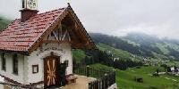

- [Randonnée Tyrol en Autriche : Karlshütte vers le barrage de Schlegeisspeicher](https://www.cyber-neurones.org/2019/07/randonnee-tyrol-en-autriche-karshutte-vers-le-barrage-de-schlegeisspeicher/)

- [Randonnée Tyrol en Autriche : Hintertux vers Pfannkopfl](https://www.cyber-neurones.org/2019/07/randonnee-tyrol-en-autriche-hintertux-vers-pfannkopfl/)

- [Randonnée Tyrol en Autriche : Juns vers Grüblspitze](https://www.cyber-neurones.org/2019/07/randonnee-tyrol-en-autriche-juns-vers-grublspitze/)

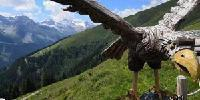

- [Randonnée Tyrol en Autriche : Hintertux vers Tuxer Ferner-Haus](https://www.cyber-neurones.org/2019/07/randonnee-tyrol-en-autriche-hintertux-vers-tuxer-ferner-haus/)

- [Randonnée Tyrol en Autriche : Hintertux vers Tettensjoch, puis Hollebsteinhütte](https://www.cyber-neurones.org/2019/07/randonnee-tyrol-en-autriche-hintertux-vers-tettensjoch-puis-hollebsteinhutte/)

- [Randonnée Tyrol en Autriche : Hintertux vers Bichlalm](https://www.cyber-neurones.org/2019/07/randonnee-tyrol-en-autriche-hintertux-vers-bichlalm/)

### Italie

#### Dolomites 

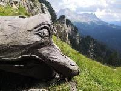

- [Italie Dolomites : Parc Naturel « Dello Sciliar-Catinaccio » : Les sculptures sur bois.](https://www.cyber-neurones.org/2018/08/italie-dolomites-parc-naturel-dello-sciliar-catinaccio-les-sculptures-sur-bois/) :date: 2018-08

- [Italie Dolomites : Randonnée n°517,18,22 : Karer Pass, échec de l’ascension vers Latemar (mal sécurisé)](https://www.cyber-neurones.org/2018/08/italie-dolomites-randonnee-n5171822-karer-pass-echec-de-lascension-vers-latemar-mal-securise/) :date: 2018-08

- [Italie Dolomites : Randonnée n°580,579 : De Mazzin à la cascade Spina de Lech](https://www.cyber-neurones.org/2018/08/italie-dolomites-randonnee-n580579-de-mazzin-a-la-cascade-spina-de-lech/) :date: 2018-08

- [Italie Dolomites : Randonnée n°2,9 : Aller-Retour de Weisslahnbad à Schafkopfe.](https://www.cyber-neurones.org/2018/08/italie-dolomites-randonnee-n29-aller-retour-de-weisslahnbad-a-schafkopfe/) :date: 2018-08

- [Italie Dolomites : Randonnée n°5,5A,1,1A : Boucle de Tiers (Tires) vers NigerPass](https://www.cyber-neurones.org/2018/08/italie-dolomites-randonnee-n55a11a-boucle-de-tiers-tires-vers-nigerpass/) :date: 2018-08

- [Italie Dolomites : Randonnée n°1,550,541,549 : Boucle départ Nigerpass autour de Coronelle, Zigolade, Rotwand.](https://www.cyber-neurones.org/2018/08/italie-dolomites-randonnee-n1550541549-boucle-depart-nigerpass-autour-de-coronelle-zigolade-rotwand/) :date: 2018-08

- [Italie Dolomites : Randonnée n°2,1,7,7B,4 : Boucle Weisslahnbad, Sesselsschwaige, Tschafonhütte .](https://www.cyber-neurones.org/2018/08/italie-dolomites-randonnee-n2177b4-boucle-weisslahnbad-sesselsschwaige-tschafonhutte/) :date: 2018-08

- [Italie Dolomites : Randonnée n°3 : Rifugio (Refuge) Alpe di Tires ( Tierser Alpl )](https://www.cyber-neurones.org/2018/08/italie-dolomites-randonnee-n3-rifugio-refuge-alpe-di-tires-tierser-alpl/) :date: 2018-08

### Espagne

- [Balade San Juan de Gaztelugatxe (Bermeo, Espagne)](https://www.cyber-neurones.org/2016/08/balade-san-juan-de-gaztelugatxe/) :date: 2016-08

- 
