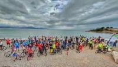
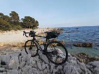
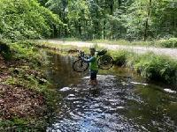
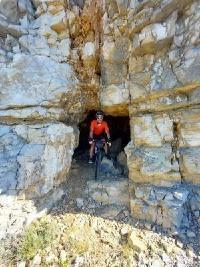
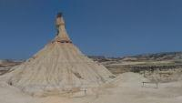
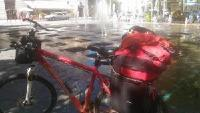

## Vélo 

### Information

- [Consommation vélo electrique](https://www.cyber-neurones.org/2023/04/consommation-velo-electrique/) :date: 2023-04

- [Lettre à Christian Estrosi pour l’accès au Stade Allianz-Riviera à Vélo](https://www.cyber-neurones.org/2016/04/lettre-a-christian-estrosi-pour-lacces-au-stade-allianz-riviera-a-velo/) :date: 2016-04

- [Le portail contre les cyclistes en direction de l’Allianz-Riviera.](https://www.cyber-neurones.org/2016/04/le-portail-contre-les-cyclistes-pour-lallianz-riviera/) :date: 2016-04

- [Stade Allianz Riviera à Nice : Toujours pas d’accès à Vélo.](https://www.cyber-neurones.org/2014/05/stade-allianz-riviera-a-nice-toujours-pas-dacces-a-velo/) :date: 2014-05

### Association 

Membre de l'association [Choisir Velo](https://www.choisirlevelo.org/bienvenue/), mes quelques artciles sur le vélo : 

- [Comptage des cyclistes avec YOLO](https://www.cyber-neurones.org/2021/10/convergence-azureenne-2021-comptage-des-cyclistes/) :date: 2021-10

- [Tous à vélo : :round_pushpin: Biot – :round_pushpin: Antibes – :round_pushpin: Cannes . ( Edition 2019 ) #TousàVélo](https://www.cyber-neurones.org/2019/11/tous-a-velo-biot-antibes-cannes-edition-2019-tousavelo/) :date: 2019-11

- [Plan vélo de Sophia Antipolis et les extensions prévues pour 2020](https://www.cyber-neurones.org/2018/04/plan-velo-de-sophia-antipolis-et-les-extensions-prevues-pour-2020/)

- [Rapport indemnité vélo ( IKV ) : un rapport comme je les aime !](https://www.cyber-neurones.org/2017/12/rapport-indemnite-velo-ikv-un-rapport-comme-je-les-aime/)

- [Création de piste cyclable dans les alpes-maritimes](https://www.cyber-neurones.org/2015/12/creation-de-piste-cyclable-dans-les-alpes-maritimes/)

- [Stade Allianz Riviera : un an après la pose du portail anti-cycliste.](https://www.cyber-neurones.org/2015/04/stade-allianz-riviera-un-an-apres-la-pose-du-portail-anti-cycliste/)

### Parcours

#### Gravel

##### Alpes-Maritimes

- [Canal de la Siagne de Mougins à Grasse](https://www.cyber-neurones.org/2023/04/gravel-canal-de-la-siagne-de-mougins-a-grasse/) :date: 2023-04

- [Biot vers Gourdon en gravel](https://www.cyber-neurones.org/2023/03/gravel-biot-vers-gourdon-en-gravel/) :date: 2023-03

- [Allianz Riviera à Vélo : au départ de Biot ](https://www.cyber-neurones.org/2022/08/allianz-riviera-a-velo-au-depart-de-biot-ostrea/) :date: 2022-08

- [Rond point d’Opio – Col de Gourdon – Col de l’Ecre – Observatoire de Calern](https://www.cyber-neurones.org/2022/07/velo-rond-point-dopio-col-de-gourdon-col-de-lecre-observatoire-de-calern/) :date: 2022-07

- [Vélo : Col de Braus : 1002 m depuis Sospel](https://www.cyber-neurones.org/2021/09/velo-col-de-braus-1002-m-depuis-sospel/) :date: 2021-09

- [Vélo : Mont Agaisen : 751 m depuis Sospel](https://www.cyber-neurones.org/2021/09/velo-mont-agaisen-751-m-depuis-sospel/) :date: 2021-09

- [Vélo : Col de Braus : 1002 m depuis L’Escarène](https://www.cyber-neurones.org/2021/09/velo-col-de-braus-1002-m-depuis-lescarene/) :date: 2021-09

- [Vélo : Boucle Biot, Cagnes-sur-Mer, La gaude, Carros, Bouyon, Coursegoules, Pont-du-Loup, Bar-sur-Loup, Valbonne](https://www.cyber-neurones.org/2021/07/velo-boucle-biot-cagnes-sur-mer-la-gaude-carros-bouyon-coursegoules-pont-du-loup-bar-sur-loup-valbonne/) :date: 2021-07

- [Vélo & Gravel : Boucle au départ de Biot, Villeneuve-Loubet, La Colle Sur Loup, Châteauneuf-Grasse, Opio, Valbonne](https://www.cyber-neurones.org/2021/05/velo-gravel-boucle-au-depart-de-biot-villeneuve-loubet-la-colle-sur-loup-chateauneuf-grasse-opio-valbonne/) :date: 2021-05

- [Vélo & Gravel : Col de Vence au départ de Biot](https://www.cyber-neurones.org/2021/05/velo-gravel-col-de-vence-au-depart-de-biot/) :date: 2021-05

- [Vélo Course/Gravel : Mur de Courmettes au départ de la D2210](https://www.cyber-neurones.org/2021/04/velo-course-gravel-mur-de-courmettes-au-depart-de-la-d2210/) :date: 2021-04

- [Gravel/Vélo de Course : Départ de :round_pushpin: Biot, circuit sur le dos du Dragon](https://www.cyber-neurones.org/2021/04/gravel-velo-de-course-depart-de-biot-circuit-sur-le-dos-du-dragon/) :date: 2021-04

- [Départ de l’office du Tourisme vers le Phare de la Garoupe à :round_pushpin: Antibes](https://www.cyber-neurones.org/2021/04/gravel-a-biot-depart-de-loffice-du-tourisme-vers-le-phare-de-la-garoupe-a-antibes/) :date: 2021-04

- [Boucle au départ de la place de Biot, puis Saint-Philippe et le pont des Tamarins](https://www.cyber-neurones.org/2021/04/gravel-a-biot-boucle-au-depart-de-la-place-de-biot-puis-saint-philippe-et-le-pont-des-tamarins/) :date: 2021-04

- [Vélo : :round_pushpin:  Nice ( Vieux port ) vers :round_pushpin:  Biot par le bord de mer](https://www.cyber-neurones.org/2020/09/velo-nice-vieux-port-vers-biot/) :date: 2020-09

- [Balade en vélo (équivalente à San Rémo) de Nice à Antibes](https://www.cyber-neurones.org/2016/08/balade-en-velo-equivalente-a-san-remo-de-nice-a-antibes/) :date: 2016-08

##### Hautes-Alpes

- [Col du Galibier au départ de Le Verneys](https://www.cyber-neurones.org/2022/08/col-du-galibier-au-depart-de-le-verneys/) :date: 2022-08

##### Tarn

- [Boucle de La Capelette](https://www.cyber-neurones.org/2023/04/velo-gravel-a-dourgne-boucle-de-la-capelette/)

- [ :round_pushpin: Dourgne la montée de Montalric](https://www.cyber-neurones.org/2023/04/velo-gravel-dourgne-la-montee-de-montalric/)

- [Vélo : Montagne Noire : Les segments pour les grimpeurs](https://www.cyber-neurones.org/2021/08/velo-montagne-noire-les-segments-pour-les-grimpeurs/)

- [Vélo : :round_pushpin: Saint-Avit (Tarn) vers le Lac du Dicosa](https://www.cyber-neurones.org/2021/08/velo-saint-avit-tarn-vers-le-lac-du-dicosa/)

- [Vélo : Pic de Nore au départ des passerelles Mazamet](https://www.cyber-neurones.org/2021/08/velo-pic-de-nore-au-depart-des-passerelles-mazamet/)

- [Vélo : La Rigole de la montagne noire : La prise d’Alzeau vers les Cammazes](https://www.cyber-neurones.org/2021/08/velo-la-rigole-de-la-montagne-noire-la-prise-dalzeau-vers-les-cammazes/)

- [Vélo : Biot vers Coursegoules par le Col de Vence](https://www.cyber-neurones.org/2021/06/velo-biot-vers-coursegoules-par-le-col-de-vence/)

- [Vélo/Gravel : De Biot à Gourdon](https://www.cyber-neurones.org/2021/06/velo-gravel-de-biot-a-gourdon/)

- [Vélo : Biot vers Courmes](https://www.cyber-neurones.org/2021/06/velo-biot-vers-courmes/) 

- [Lautrec vers Lombers via la voie verte.](https://www.cyber-neurones.org/2018/04/velo-lautrec-vers-lombers-via-la-voie-verte/)

- [Boucle Saint-Avit (Tarn), Dourgne, Montalric, Sorèze, Cahuzac, Lagardiolle.](https://www.cyber-neurones.org/2018/04/velo-boucle-saint-avit-tarn-dourgne-montalric-soreze-cahuzac-lagardiolle/)

- [Voie verte : de Mazamet (Pont de L’Arn) – Bédarieux : « Passa Païs »](https://www.cyber-neurones.org/2016/08/voie-verte-de-mazamet-pont-de-larn-bedarieux-passa-pais/)

- [Vélo : De Saint-Féréol à Saint-Avit par Sorèze.](https://www.cyber-neurones.org/2016/07/velo-de-saint-fereol-a-saint-avit-par-soreze/)

##### Vaucluse

- [Mont Ventoux en Gravel au départ de :round_pushpin: Bédoin](https://www.cyber-neurones.org/2021/06/mont-ventoux-en-gravel-au-depart-de-bedoin/)

##### Autre

- [Vélo Palavas-les-flots vers La Grande Motte par le Canal du Rhone à Sète](https://www.cyber-neurones.org/2016/08/velo-palavas-les-flots-vers-la-grande-motte-par-le-canal-du-rhone-a-sete/)

##### Italie

- [Vélo à Sanremo : Ospedaletti à San Lorenzo al Mare](https://www.cyber-neurones.org/2015/05/velo-a-san-remo/)

#### :mountain_biking_man: VTT

##### Alpes-Maritimes

- [Théoule-sur-mer vers le Mont vinaigre](https://www.cyber-neurones.org/2022/12/vtt-theoule-sur-mer-vers-le-mont-vinaigre/) :date: 2022-12

- [Boucle dans l’Estérel autour du pic de l’Ours au départ de Théoule-sur-mer](https://www.cyber-neurones.org/2022/10/vtt-boucle-dans-lesterel-autour-du-pic-de-lours-au-depart-de-theoule-sur-mer/) :date: 2022-10

- [VTT : De Biot vers les ruines du château de Roquefort](https://www.cyber-neurones.org/2021/03/vtt-de-biot-vers-les-ruines-du-chateau-de-roquefort/) :date: 2021-03

- [VTT à :round_pushpin: Théoule-sur-mer : Tour du Pic de l’Ours](https://www.cyber-neurones.org/2020/08/vtt-a-theoule-sur-mer-tour-du-pic-de-lours/) :date: 2020-08

- [VTT : De Biot au Rouret](https://www.cyber-neurones.org/2016/05/vtt-de-biot-au-rouret/) :date: 2016-05

- [Grand boucle à la Valmasque : boucle jaune, rouge et bleue.](https://www.cyber-neurones.org/2016/04/grand-boucle-a-la-valmasque-boucle-jaune-rouge-et-bleue/) :date: 2016-04 

- [Randonnée :mountain_biking_man: VTT à la Valmasque : boucle bleue](https://www.cyber-neurones.org/2016/04/randonnee-vtt-a-la-valmasque-boucle-bleue/) :date: 2016-04

- [VTT à BIOT : Biot vers Villeneuve-Loubet](https://www.cyber-neurones.org/2014/05/vtt-a-biot-biot-vers-villeneuve-loubet/) :date: 2014-05

###### Bouches-du-Rhône

- [Camargue : De Saintes-Maries-de-la-mer à Salin-de-Giraud en Vélo](https://www.cyber-neurones.org/2016/04/camargue-de-saintes-maries-de-la-mer-a-salin-de-giraud-en-velo/) :date: 2016-04

- [Camargue : Tour de l’étang de Vacarrès en Vélo](https://www.cyber-neurones.org/2016/04/camargue-tour-de-letang-de-vacarres-en-velo/) :date: 2016-04

##### Espagne

- [TT : Parc Naturel de las Bardenas Reales : Boucle de 28 km](https://www.cyber-neurones.org/2016/07/vtt-parc-naturel-de-las-bardenas-reales-boucle-de-28-km/)

- 

### Voyage en vélo 

- [Randonné (ou voyage) en vélo : De Mazamet à Antibes : 500 km en 4 jours ( une premier expérience )](https://www.cyber-neurones.org/2016/08/randonne-en-velo-de-mazamet-a-antibes-500-km-une-premier-experience/)
   - Jour n°1 : 140 km, 900 D+ , :watch: 7h33
   - Jour n°2 : 118 km, 345 D+ , :watch: 7h23
   - Jour n°3 : 157 km, 912 D+ , :watch: 9h10
   - Jour n°4 : 89 km, 800 D+ , :watch: 6h02
